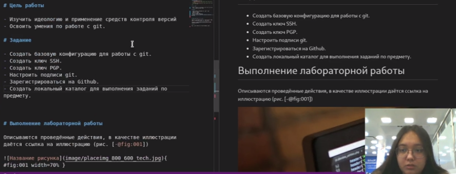
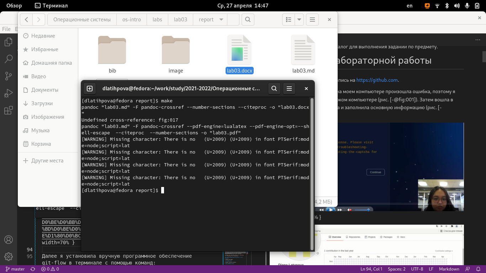

---
## Front matter
title: "Лабораторная работа №3"
subtitle: "Markdown"
author: "Латыпова Диана/НФИбд-02-21"

## Generic otions
lang: ru-RU
toc-title: "Содержание"

## Bibliography
bibliography: bib/cite.bib
csl: pandoc/csl/gost-r-7-0-5-2008-numeric.csl

## Pdf output format
toc: true # Table of contents
toc-depth: 2
lof: true # List of figures
lot: true # List of tables
fontsize: 12pt
linestretch: 1.5
papersize: a4
documentclass: scrreprt
## I18n polyglossia
polyglossia-lang:
  name: russian
  options:
	- spelling=modern
	- babelshorthands=true
polyglossia-otherlangs:
  name: english
## I18n babel
babel-lang: russian
babel-otherlangs: english
## Fonts
mainfont: PT Serif
romanfont: PT Serif
sansfont: PT Sans
monofont: PT Mono
mainfontoptions: Ligatures=TeX
romanfontoptions: Ligatures=TeX
sansfontoptions: Ligatures=TeX,Scale=MatchLowercase
monofontoptions: Scale=MatchLowercase,Scale=0.9
## Biblatex
biblatex: true
biblio-style: "gost-numeric"
biblatexoptions:
  - parentracker=true
  - backend=biber
  - hyperref=auto
  - language=auto
  - autolang=other*
  - citestyle=gost-numeric
## Pandoc-crossref LaTeX customization
figureTitle: "Рис."
tableTitle: "Таблица"
listingTitle: "Листинг"
lofTitle: "Список иллюстраций"
lotTitle: "Список таблиц"
lolTitle: "Листинги"
## Misc options
indent: true
header-includes:
  - \usepackage{indentfirst}
  - \usepackage{float} # keep figures where there are in the text
  - \floatplacement{figure}{H} # keep figures where there are in the text
---

# Цель работы

Научиться оформлять отчёты с помощью легковесного языка разметки Markdown

# Задание

- Сделайте отчёт по предыдущей лабораторной работе в формате Markdown.
- В качестве отчёта просьба предоставить отчёты в 3 форматах: pdf, docx и md (в архиве, поскольку он должен содержать скриншоты, Makefile и т.д.)

# Выполнение лабораторной работы

Весь отчет мы будем делать в, зараннее скачанной программе, Visual Studio Code. Также для обработки файлов в формате Markdown будем использовать Pandoс. Конкретно, нам понадобится программа pandoc, pandoc-citeproc, pandoc-crossref, которые мы также заранее установили. 

Отчет по Лабораторной работе № 2 я делала по своему готовому отчету в формате docx. Поэтому большую часть мы просто копировали и вставляли. 

Для отчетов в Visual Studio Code мы будем использовать готовый шаблон, который есть в каждом репозитории лабораторных работ.

Для начала я создала титульный лист, где указала номер лабораторной работы, ее тему, и автора работы. (рис. [-@fig:001])

{ #fig:001 width=70% }

Далее указала само задание, которое нужно было выполнить в Лабораторной работе №2.(рис. [-@fig:002])

{ #fig:002 width=70% }

В часть "Выполнение лабораторной работы" я полностью копировала и вставляла каждый шаг со своего doxc документа.(рис. [-@fig:003])

{ #fig:003 width=70% }

Перед тем, как делать основную часть, я сохранила все скрины в папку image(рис. [-@fig:004])(рис. [-@fig:005]).

{ #fig:004 width=70% }

{ #fig:005 width=70% }

В процессе выполнения работы я вставляла скрины в отчет, указывала ссылку на них(рис. [-@fig:006])(рис. [-@fig:007]).

{ #fig:006 width=70% }

{ #fig:007 width=70% }

Коды, на которые стоило обратить внимание, я выделяла жирным курсивом, а именно заключала их в **(рис. [-@fig:008]), а неупорядоченный (маркированный) список отформатировала с помощью тире(рис. [-@fig:009])

{ #fig:008 width=70% }

{ #fig:009 width=70% }

После основной части я вставила контрольные вопросы, также красиво оформила(рис. [-@fig:010]).

{ #fig:010 width=70% }

И наконец, записала вывод Лабораторной работы №2(рис. [-@fig:011]).

{ #fig:011 width=70% }

В конце я сохранила md документ, и с помощью команды make в терминале преобразовала его в docx и pdf форматы(рис. [-@fig:012]).

{ #fig:012 width=70% }

# Выводы

Я научилась оформлять отчёты с помощью легковесного языка разметки Markdown.