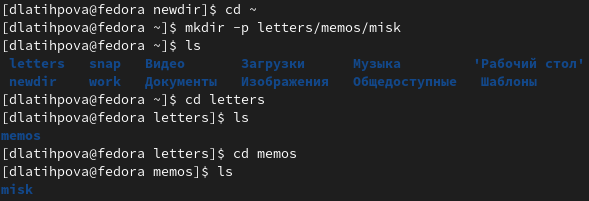
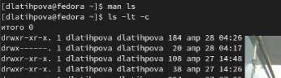

---
## Front matter
lang: ru-RU
title: Лабораторная работа №4. Основы интерфейса взаимодействия пользователя с системой Unix на уровне командной строки.
author: Латыпова Диана/ НФИбд-02-21
institute: |-
	\inst{1}RUDN University, Moscow, Russian Federation

## Formatting
toc: false
slide_level: 2
theme: metropolis
header-includes: 
 - \metroset{progressbar=frametitle,sectionpage=progressbar,numbering=fraction}
 - '\makeatletter'
 - '\beamer@ignorenonframefalse'
 - '\makeatother'
aspectratio: 43
section-titles: true
---

## Цель работы

Приобретение практических навыков взаимодействия пользователя с системой посредством командной строки.

## Командная строка- это...

Командная строка (консоль или Терминал) – это специальная программа, которая позволяет управлять компьютером путем ввода текстовых команд с клавиатуры.

## Основные команды

**man** — manual, получение справки

Для получения полной справочной информации по другой команде. Некоторые пользователи настаивают, что искать в интернете информацию по команде проще и эффективнее. Однако, информация в интернете не всегда является верной, статья в интернете может быть устаревшей, не релевантной для вашей версии ОС и т.д. Использовать man всегда хорошая идея.

Чтобы получить справку по команде, введите man перед ней, например, man bash выдаст руководство по терминалу.

## Основные команды

**Tab** — автозавершение команды

Командная строка Linux может предложить вам доступные варианты завершения команды. Например, если вы хотите узнать, куда можно перейти из текущей папки, наберите cd, затем дважды нажмите Tab. Если хотите узнать, какие папки начинаются с символа точки, введите cd . и завершите двойным нажатием Tab. Работает с любой командой.

## Команды для управления файлами и директориями

**mkdir** — создание директории

**ls** — list, отобразить директории и файлы

**cd** — change directory, сменить директорию

**pwd**- для определения абсолютного пути к текущему каталогу

**rm** — remove, удаление

**cp** — copy, копирование

**mv, move** — перемещение

## Выполнение лабораторной работы

Просмотрела содержимое каталога /tmp с различными опциями:
 **-a**(рис. [-@fig:001]). Отображает имена скрытых файлов.

{ #fig:001 width=50% }

 **-l**(рис. [-@fig:002]). Выводит на экран подробную информацию о файлах и каталогах.

 { #fig:002 width=50% }

## Выполнение лабораторной работы

**-alF**(рис. [-@fig:003]). 

{ #fig:003 width=70% }

## Выполнение лабораторной работы

Используя команду mkdir -p, создала три новых каталога с именами letters, memos, misk(рис. [-@fig:004]). 

{ #fig:004 width=70% }

## 

Используя команду ls -R выводим содержимое для просмотра не только указанного каталога, но и подкаталогов,
входящих в него(рис. [-@fig:005]). 

{ #fig:005 width=70% }

## 

Вводим команду ls -lt -c, позволяющая отсортировать по времени последнего изменения выводимый список содержимого каталога с развёрнутым описанием файлов(рис. [-@fig:006]). 

{ #fig:006 width=70% }

## Опции команды **cd**

  -P - позволяет следовать по символическим ссылкам перед тем, как будут обработаны все переходы "..";

  -L - переходит по символическим ссылкам только после того, как были обработаны "..";

  -e - если папку, в которую нужно перейти не удалось найти - выдает ошибку.

## Опции команды **pwd**

-L, --logical - брать директорию из переменной окружения, даже если она содержит символические ссылки;

   -P - отбрасывать все символические ссылки;

   --help - отобразить справку по утилите;

## Опции команды **mkdir**

-m (--mode=режим) - назначить режим доступа (права).

   -p (--parents) - не показывать ошибки, а также их игнорировать.

   -z (--context=CTX ) принимает контекст SELinux для каталога по умолчанию.

## Опции команды **rmdir**

-можно удалить каталог и все его родительские каталоги с помощью опции -p

## Опции команды **rm**
   
   -чтобы принудительно удалить неважно какой файл, используется опцию -f

   -чтобы удалить целый каталог, используются одновременно две опции -r и -f.

## Команда **history**

 Для вывода на экран списка ранее выполненных команд используется команда **history**. Выводимые на экран команды в списке нумеруются. К любой команде из выведенного на экран списка можно обратиться по её номеру в списке, воспользовавшись конструкцией **!< номер_команды >**

## Вывод

Я приобрела практические навыки взаимодействия пользователя с системой посредством командной строки.
