---
## Front matter
title: "Лабораторная работа No 4."
subtitle: "Основы интерфейса взаимодействия пользователя с системой Unix на уровне командной строки"
author: "Латыпова Диана/НФИбд-02-21"

## Generic otions
lang: ru-RU
toc-title: "Содержание"

## Bibliography
bibliography: bib/cite.bib
csl: pandoc/csl/gost-r-7-0-5-2008-numeric.csl

## Pdf output format
toc: true # Table of contents
toc-depth: 2
lof: true # List of figures
lot: true # List of tables
fontsize: 12pt
linestretch: 1.5
papersize: a4
documentclass: scrreprt
## I18n polyglossia
polyglossia-lang:
  name: russian
  options:
	- spelling=modern
	- babelshorthands=true
polyglossia-otherlangs:
  name: english
## I18n babel
babel-lang: russian
babel-otherlangs: english
## Fonts
mainfont: PT Serif
romanfont: PT Serif
sansfont: PT Sans
monofont: PT Mono
mainfontoptions: Ligatures=TeX
romanfontoptions: Ligatures=TeX
sansfontoptions: Ligatures=TeX,Scale=MatchLowercase
monofontoptions: Scale=MatchLowercase,Scale=0.9
## Biblatex
biblatex: true
biblio-style: "gost-numeric"
biblatexoptions:
  - parentracker=true
  - backend=biber
  - hyperref=auto
  - language=auto
  - autolang=other*
  - citestyle=gost-numeric
## Pandoc-crossref LaTeX customization
figureTitle: "Рис."
tableTitle: "Таблица"
listingTitle: "Листинг"
lofTitle: "Список иллюстраций"
lotTitle: "Список таблиц"
lolTitle: "Листинги"
## Misc options
indent: true
header-includes:
  - \usepackage{indentfirst}
  - \usepackage{float} # keep figures where there are in the text
  - \floatplacement{figure}{H} # keep figures where there are in the text
---

# Цель работы

Приобретение практических навыков взаимодействия пользователя с системой посредством командной строки.

# Задание

1. Определите полное имя вашего домашнего каталога. Далее относительно этого каталога будут выполняться последующие упражнения.
2. Выполните следующие действия:

   2.1. Перейдите в каталог /tmp.

   2.2. Выведите на экран содержимое каталога /tmp. Для этого используйте команду ls с различными опциями. Поясните разницу в выводимой на экран информации.

   2.3. Определите, есть ли в каталоге /var/spool подкаталог с именем cron?

   2.4. Перейдите в Ваш домашний каталог и выведите на экран его содержимое. Определите, кто является владельцем файлов и подкаталогов?
3. Выполните следующие действия:
   3.1. В домашнем каталоге создайте новый каталог с именем newdir.

   3.2. В каталоге ~/newdir создайте новый каталог с именем morefun.

   3.3. В домашнем каталоге создайте одной командой три новых каталога с именами letters, memos, misk. Затем удалите эти каталоги одной командой.

   3.4. Попробуйте удалить ранее созданный каталог ~/newdir командой rm. Проверьте, был ли каталог удалён.

   3.5. Удалите каталог ~/newdir/morefun из домашнего каталога. Проверьте, был ли каталог удалён.

4. С помощью команды man определите, какую опцию команды ls нужно использовать для просмотра содержимое не только указанного каталога, но и подкаталогов, входящих в него.
5. С помощью команды man определите набор опций команды ls, позволяющий отсортировать по времени последнего изменения выводимый список содержимого каталога с развёрнутым описанием файлов.
6. Используйте команду man для просмотра описания следующих команд: cd, pwd, mkdir, rmdir, rm. Поясните основные опции этих команд.
7. Используя информацию, полученную при помощи команды history, выполните модификацию и исполнение нескольких команд из буфера команд.

# Выполнение лабораторной работы

1.Мы уже находимся в домашнем каталоге, для достоверности перешла с помощью команды cd в свой домашний каталог. И с помощью команды pwd определила полное имя моего домашнего каталога. (рис. [-@fig:001])

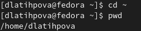{ #fig:001 width=70% }

2.Далее я перешла в каталог /tmp с помощью команды cd и просмотрела  его содержимое с помощью команды ls (рис. [-@fig:002])

{ #fig:002 width=70% }

Просмотрела содержимое каталога /tmp с различными опциями:
 **-a**(рис. [-@fig:003]). Отображает имена скрытых файлов.

{ #fig:003 width=70% }

 **-l**(рис. [-@fig:004]). Выводит на экран подробную информацию о файлах и каталогах.

{ #fig:004 width=70% }

 **-alF**(рис. [-@fig:005]). 

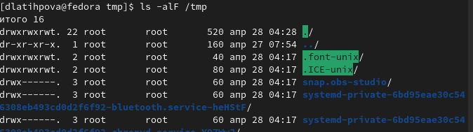{ #fig:005 width=70% }

Теперь нам нужно проверить есть ли в каталоге /var/spool подкаталог с именем cron. Используя команду ls и ls-a, видим, что подкаталога с именем cron нет(рис. [-@fig:006]).

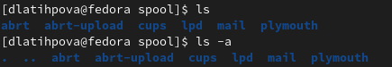{ #fig:006 width=70% }

Далее переходим в домашний каталог и с помощью команды ls выводим его содержимое, а с помощью ее опции -l узнаем владельца файлов и подкаталогов -dlatihpova(рис. [-@fig:007]). 

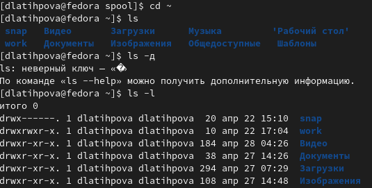{ #fig:007 width=70% }

3.Снова перехожу в домашний каталог и с помощью команды mkdir создаю новый каталог с именем newdir(рис. [-@fig:008]). 

{ #fig:008 width=70% }

Переходим в каталог newdir и в нм создаем каталог с именем morefun(рис. [-@fig:009]). 

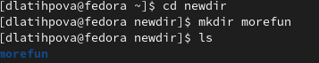{ #fig:009 width=70% }

Перехожу в домашний каталог. Используя команду mkdir -p, создаю три новых каталога с именами
letters, memos, misk(рис. [-@fig:010]). 

{ #fig:010 width=70% }

После чего, удаляю эти же три каталога одной командой rmdir -p (рис. [-@fig:011]).

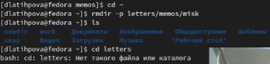{ #fig:011 width=70% }

Далее попробовала с помощью команды rm удалить, раннее созданный, каталог newdir, но ничего не вышло. Лишь с помощью команды rm -r удалось удалить данный каталог(рис. [-@fig:012])

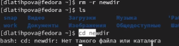{ #fig:012 width=70% }

4.С помощью команды man ls(рис. [-@fig:013]) вывела подробнее об опциях данной команды(рис. [-@fig:014]).

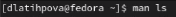{ #fig:013 width=70% }

{ #fig:014 width=70% }

4.Используя команду ls -R выводим содержимое для просмотра не только указанного каталога, но и подкаталогов,
входящих в него(рис. [-@fig:015]). 

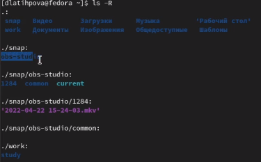{ #fig:015 width=70% }

5.Вводим команду ls -lt -c, позволяющая отсортировать по времени последнего изменения выводимый список содержимого каталога с развёрнутым описанием файлов(рис. [-@fig:016]). 

{ #fig:016 width=70% }

6.Используя команду man, выведем описание следующих команд:
- cd(рис. [-@fig:017])(рис. [-@fig:018])

    -P - позволяет следовать по символическим ссылкам перед тем, как будут обработаны все переходы "..";

    -L - переходит по символическим ссылкам только после того, как были обработаны "..";

    -e - если папку, в которую нужно перейти не удалось найти - выдает ошибку.
 

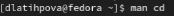{ #fig:017 width=70% }

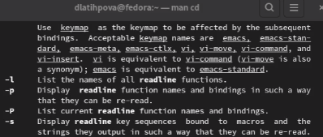{ #fig:018 width=70% }

- pwd(рис. [-@fig:019])(рис. [-@fig:020])

   -L, --logical - брать директорию из переменной окружения, даже если она содержит символические ссылки;

   -P - отбрасывать все символические ссылки;

   --help - отобразить справку по утилите;

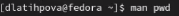{ #fig:019 width=70% }

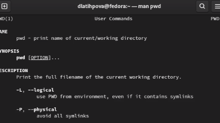{ #fig:020 width=70% }

- mkdir(рис. [-@fig:021])(рис. [-@fig:022])

   -m (--mode=режим) - назначить режим доступа (права).

   -p (--parents) - не показывать ошибки, а также их игнорировать.

   -z (--context=CTX ) принимает контекст SELinux для каталога по умолчанию.

{ #fig:021 width=70% }

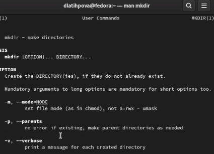{ #fig:022 width=70% }

- rmdir(рис. [-@fig:023])(рис. [-@fig:024])

   -можно удалить каталог и все его родительские каталоги с помощью опции -p

{ #fig:023 width=70% }

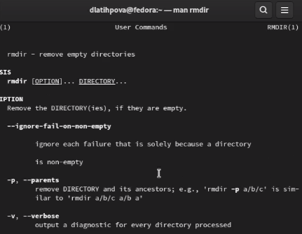{ #fig:024 width=70% }

- rm(рис. [-@fig:025])(рис. [-@fig:026])
   
   -чтобы принудительно удалить неважно какой файл, используется опцию -f

   -чтобы удалить целый каталог, используются одновременно две опции -r и -f.

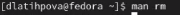{ #fig:025 width=70% }

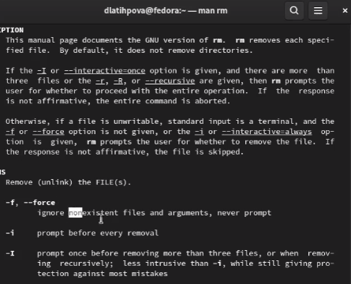{ #fig:026 width=70% }

7.Используя команду history, выводим историю наших команд (рис. [-@fig:027]).

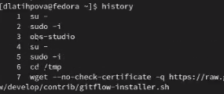{ #fig:027 width=70% }

И наконец, выполним модификацию и исполнение нескольких команд из буфера команд(рис. [-@fig:028]) (рис. [-@fig:029]).
**!<номер_команды>:s/<что_меняем>/<на_что_меняем>**

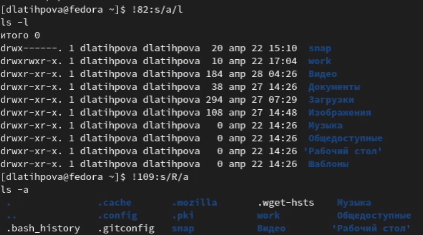{ #fig:028 width=70% }

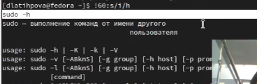{ #fig:029 width=70% }

# Контрольные вопросы

1. Что такое командная строка?

   Командная строка (консоль или Терминал) – это специальная программа, которая позволяет управлять компьютером путем ввода текстовых команд с клавиатуры.

2. При помощи какой команды можно определить абсолютный путь текущего каталога? Приведите пример.

   pwd (аббревиатура от print working directory) возвращает полный путь текущего каталога командной оболочки, естественно, именно той командной оболочки, при помощи которой была выполнена команда pwd .

3. При помощи какой команды и каких опций можно определить только тип файлов и их имена в текущем каталоге? Приведите примеры.

   Можно также получить информацию о типах файлов (каталог, исполняемый файл, ссылка), для чего используется опция F команды ls. При использовании этой опции в поле имени выводится символ, который определяет тип файла 

4. Каким образом отобразить информацию о скрытых файлах? Приведите примеры.

   Некоторые файлы в операционной системе скрыты от просмотра и обычно используются для настройки рабочей среды. Имена таких файлов начинаются с точки. Для того, чтобы отобразить имена скрытых файлов, необходимо использовать команду ls с опцией a

5. При помощи каких команд можно удалить файл и каталог? Можно ли это сделать одной и той же командой? Приведите примеры.

   Команда rm используется для удаления файлов и/или каталогов.

   Если требуется, чтобы выдавался запрос подтверждения на удаление файла, то необходимо использовать опцию i

   Чтобы удалить каталог, содержащий файлы, нужно использовать опцию r. Без указания этой опции команда не будет выполняться.
   
   Если каталог пуст, то можно воспользоваться командой rmdir. 

6. Каким образом можно вывести информацию о последних выполненных пользователем командах? работы?

   Для вывода на экран списка ранее выполненных команд используется команда history. Выводимые на экран команды в списке нумеруются. К любой команде из выведенного на экран списка можно обратиться по её номеру в списке, воспользовавшись конструкцией !<номер_команды>.

7. Как воспользоваться историей команд для их модифицированного выполнения? При-
ведите примеры.

   **!<номер_команды>:s/<что_меняем>/<на_что_меняем>**

   Пример:

   1 ***!3:s/a/F***

   2 ***ls -F***

9. Дайте определение и приведите примера символов экранирования.

   Иногда нам нужно заключить в кавычки только единичный символ. Этот же эффект можно получить, если перед символом поставить обратный слеш, который в этом контексте называется экранирующим символом. Часто это делается внутри двойных кавычек, чтобы выборочно предотвратить раскрытие

10. Охарактеризуйте вывод информации на экран после выполнения команды ls с опцией l.

   Чтобы вывести на экран подробную информацию о файлах и каталогах, необходимо использовать опцию l. При этом о каждом файле и каталоге будет выведена следующая информация:

    – тип файла,

    – право доступа,

    – число ссылок,

    – владелец,

    – размер,

    – дата последней ревизии,

    – имя файла или каталога.

11. Что такое относительный путь к файлу? Приведите примеры использования относи-
тельного и абсолютного пути при выполнении какой-либо команды.

    Относительный путь к файлу от документа — это путь к файлу относительно текущего документа. Такой адрес зависит от расположения файла, в котором он записан.

12. Как получить информацию об интересующей вас команде?
   Команда info. Команда info является некоторой альтернативой команде man.

13. Какая клавиша или комбинация клавиш служит для автоматического дополнения вводимых команд?
 
    Tab лужит для автоматического дополнения вводимых команд.

# Выводы

Я приобрела практические навыки взаимодействия пользователя с системой посредством командной строки.