---
## Front matter
title: "Лабораторная работа №5"
subtitle: "Анализ файловой системы Linux. Команды для работы с файлами и каталогами"
author: "Латыпова Диана. НФИбд-02-21"

## Generic otions
lang: ru-RU
toc-title: "Содержание"

## Bibliography
bibliography: bib/cite.bib
csl: pandoc/csl/gost-r-7-0-5-2008-numeric.csl

## Pdf output format
toc: true # Table of contents
toc-depth: 2
lof: true # List of figures
lot: true # List of tables
fontsize: 12pt
linestretch: 1.5
papersize: a4
documentclass: scrreprt
## I18n polyglossia
polyglossia-lang:
  name: russian
  options:
	- spelling=modern
	- babelshorthands=true
polyglossia-otherlangs:
  name: english
## I18n babel
babel-lang: russian
babel-otherlangs: english
## Fonts
mainfont: PT Serif
romanfont: PT Serif
sansfont: PT Sans
monofont: PT Mono
mainfontoptions: Ligatures=TeX
romanfontoptions: Ligatures=TeX
sansfontoptions: Ligatures=TeX,Scale=MatchLowercase
monofontoptions: Scale=MatchLowercase,Scale=0.9
## Biblatex
biblatex: true
biblio-style: "gost-numeric"
biblatexoptions:
  - parentracker=true
  - backend=biber
  - hyperref=auto
  - language=auto
  - autolang=other*
  - citestyle=gost-numeric
## Pandoc-crossref LaTeX customization
figureTitle: "Рис."
tableTitle: "Таблица"
listingTitle: "Листинг"
lofTitle: "Список иллюстраций"
lotTitle: "Список таблиц"
lolTitle: "Листинги"
## Misc options
indent: true
header-includes:
  - \usepackage{indentfirst}
  - \usepackage{float} # keep figures where there are in the text
  - \floatplacement{figure}{H} # keep figures where there are in the text
---

# Цель работы

Ознакомление с файловой системой Linux, её структурой, именами и содержанием каталогов. Приобретение практических навыков по применению команд для работы с файлами и каталогами, по управлению процессами (и работами), по проверке использования диска и обслуживанию файловой системы

# Задание

1. Выполните все примеры, приведённые в первой части описания лабораторной работы.
2. Выполните следующие действия, зафиксировав в отчёте по лабораторной работе используемые при этом команды и результаты их выполнения:
  
   2.1. Скопируйте файл /usr/include/sys/io.h в домашний каталог и назовите его equipment. Если файла io.h нет, то используйте любой другой файл в каталоге /usr/include/sys/ вместо него.

   2.2. В домашнем каталоге создайте директорию ~/ski.plases.

   2.3. Переместите файл equipment в каталог ~/ski.plases.

   2.4. Переименуйте файл ~/ski.plases/equipment в 
  ~/ski.plases/equiplist.

   2.5. Создайте в домашнем каталоге файл abc1 и скопируйте его в каталог ~/ski.plases, назовите его equiplist2.

   2.6. Создайте каталог с именем equipment в каталоге ~/ski.plases.

   2.7. Переместите файлы ~/ski.plases/equiplist и equiplist2 в каталог 
  ~/ski.plases/equipment.

   2.8. Создайте и переместите каталог ~/newdir в
   каталог ~/ski.plases и назовите
его plans.
3. Определите опции команды chmod, необходимые для того, чтобы присвоить перечисленным ниже файлам выделенные права доступа, считая, что в начале таких прав нет:

   3.1. drwxr--r-- ... australia

   3.2. drwx--x--x ... play

   3.3. -r-xr--r-- ... my_os

   3.4. -rw-rw-r-- ... feathers

   При необходимости создайте нужные файлы.

4. Проделайте приведённые ниже упражнения, записывая в отчёт по лабораторной работе используемые при этом команды:

   4.1. Просмотрите содержимое файла /etc/password.

   4.2. Скопируйте файл ~/feathers в файл 
~/file.old.

   4.3. Переместите файл ~/file.old в каталог 
~/play.

   4.4. Скопируйте каталог ~/play в каталог 
~/fun.

   4.5. Переместите каталог ~/fun в каталог 
~/play и назовите его games.

   4.6. Лишите владельца файла ~/feathers права на чтение.

   4.7. Что произойдёт, если вы попытаетесь просмотреть файл ~/feathers командой cat?

   4.8. Что произойдёт, если вы попытаетесь скопировать файл ~/feathers?

   4.9. Дайте владельцу файла ~/feathers право на чтение.

   4.10. Лишите владельца каталога ~/play права на выполнение.

   4.11. Перейдите в каталог ~/play. Что произошло?

   4.12. Дайте владельцу каталога ~/play право на выполнение.

5. Прочитайте man по командам mount, fsck, mkfs, kill и кратко их охарактеризуйте,
приведя примеры.

# Выполнение лабораторной работы

1.Выполнила все примеры, которые были в первой части описания лабораторной работы 

**Пример 1**:

  1.Копирование файла в текущем каталоге. Скопировать файл ~/abc1 в файл april и в файл may(рис. [-@fig:001]):

    1 cd
    2 touch abc1
    3 cp abc1 april
    4 cp abc1 may

{ #fig:001 width=70% }

  2.Копирование нескольких файлов в каталог. Скопировать файлы april и may в каталог monthly(рис. [-@fig:002]):

    1 mkdir monthly
    2 cp april may monthly

  3.Копирование файлов в произвольном каталоге. Скопировать файл monthly/may в файл с именем june(рис. [-@fig:002]):

    1 cp monthly/may monthly/june
    2 ls monthly

{ #fig:002 width=70% }

**Пример 2**(рис. [-@fig:003]):

 1.Копирование каталогов в текущем каталоге. Скопировать каталог monthly в каталог
monthly.00:

    1 mkdir monthly.00
    2 cp -r monthly monthly.00

 2.Копирование каталогов в произвольном каталоге. Скопировать каталог monthly.00 в каталог /tmp

    1 cp -r monthly.00 /tmp

{ #fig:003 width=70% }

**Пример 3**(рис. [-@fig:004]):

 1.Переименование файлов в текущем каталоге. Изменить название файла april на july в домашнем каталоге:

    1 cd
    2 mv april july

 2.Перемещение файлов в другой каталог. Переместить файл july в каталог monthly.00:

    1 mv july monthly.00
    2 ls monthly.00

Результат:

    1 april july june may

Если необходим запрос подтверждения о перезаписи файла, то нужно использовать
опцию i.

 3.Переименование каталогов в текущем каталоге. Переименовать каталог monthly.00 в monthly.01

    1 mv monthly.00 monthly.01

 4.Перемещение каталога в другой каталог. Переместить каталог monthly.01в каталог
reports:

    1 mkdir reports
    2 mv monthly.01 reports

 5.Переименование каталога, не являющегося текущим. Переименовать каталог reports/monthly.01 в reports/monthly:

    1 mv reports/monthly.01 reports/monthly

{ #fig:004 width=70% }

**Пример 4**:

 1.Требуется создать файл ~/may с правом выполнения для владельца(рис. [-@fig:005]):

    1 cd
    2 touch may
    3 ls -l may
    4 chmod u+x may
    5 ls -l may

 2.Требуется лишить владельца файла ~/may права на выполнение(рис. [-@fig:005]):

    1 chmod u-x may
    2 ls -l may

{ #fig:005 width=70% }

 3.Требуется создать каталог monthly с запретом на чтение для членов группы и всех остальных пользователей(рис. [-@fig:006])(рис. [-@fig:007]):

    1 cd
    2 mkdir monthly
    3 chmod g-r, o-r monthly

 4.Требуется создать файл ~/abc1 с правом записи для членов группы(рис. [-@fig:007]):

    1 cd
    2 touch abc1
    3 chmod g+w abc1

{ #fig:006 width=70% }

{ #fig:007 width=70% }

2.После выполнения примеров, я, собственно, приступила к выполнению практикума по заданию.

2.1 Скопировала с помощью команды cp  /usr/include/sys/io.h в домашний каталог и назвала его equipment(рис. [-@fig:008]).

**cp  /usr/include/sys/io.h ~/equipment**

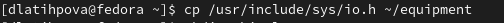{ #fig:008 width=70% }

2.2 В домашнем каталоге создала директорию ski.plases, используя команду mkdir(рис. [-@fig:009]). 

**mkdir ski.plases**

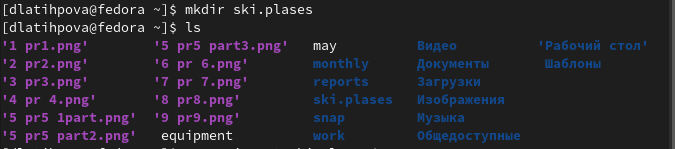{ #fig:009 width=70% }

2.3 Далее с помощью mv переместила файл equipment в каталог ski.plases(рис. [-@fig:010]).

**mv equipment ski.plases**

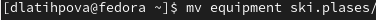{ #fig:010 width=70% }

2.4 Используя все ту же команду mv, переименовала файлs equipment в equiplist(рис. [-@fig:011]).

**mv ~/ski.plases/equipment**
**~/ski.plases/equiplist**

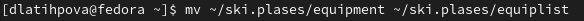{ #fig:011 width=70% }

2.5 С помощью mkdir создала в домашнем каталоге файл abc1 и затем скопировала (cp) его в каталог ski.plases, назвала его equiplist2(рис. [-@fig:012]).

1 **touch abc1**

2 **cp abc1 ski.plases/equiplist2**

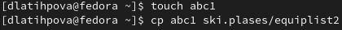{ #fig:012 width=70% }

2.6 Перешла с помощью команды cd в каталог ski.plases и создала в нем с помощью mkdir каталог с именем equipment (рис. [-@fig:013]).
 
1  **cd ski.plases**

2  **mkdir equipment**

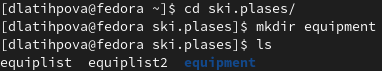{ #fig:013 width=70% }

2.7 Перешла обратно в домащний каталог. Затем поочередно, используя команду mv, переместила  файлы equiplist и equiplist2 в каталог equipment(рис. [-@fig:014]).

1  **cd**

2  **mv ~/ski.places/equiplist**
**~/ski.places/equipment**

3  **mv ~/ski.places/equiplist2**
**~/ski.places/equipment**

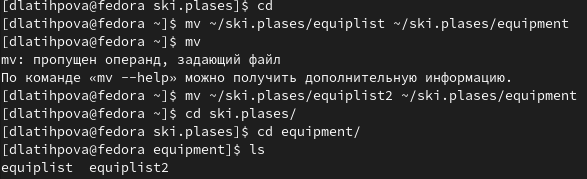{ #fig:014 width=70% }

2.8 И наконец, создала в домашнем каталоге с помощью команды mkdir новый каталог newdir. И переместила с помощью mv  его в каталог ski.plases, назвав его  plans(рис. [-@fig:015]).

1  **mkdir newdir**

2  **mv newdir ski.plases/plans**

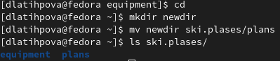{ #fig:015 width=70% }

3.Далее я создала два каталога с помощью команды mkdir (australia и play) и два файла с помощью touch (my_o и feathers) в домашнем каталоге.

И настроила для них права доступа, определив опции комнады chmod. (рис. [-@fig:016]). (рис. [-@fig:017]).А именно:
- для *australia* drwxr--r-- **744**

- для *play* drwx--x--x **711**

- для *my_o* r-xr--r-- **544**

- для *feathers* -rw-rw-r-- **664**

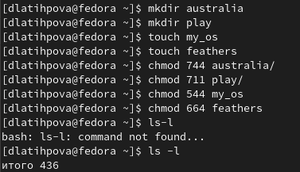{ #fig:016 width=70% }

{ #fig:017 width=70% }

4.Следующей моей задачей было проделать упражнения ниже:

4.1 Для начала просмотрела содержимое файла /etc/passwd(рис. [-@fig:018]).

**cat /etc/passwd**

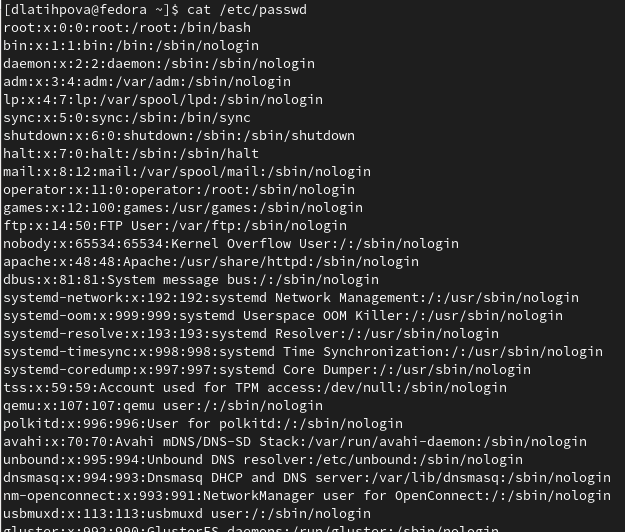{ #fig:018 width=70% }

4.2 Скопировала файл feathers в файл file.old(рис. [-@fig:019]).

**cp feathers file.old**

{ #fig:019 width=70% }

4.3 Переместила файл file.old в каталог play(рис. [-@fig:020]).

**mv file.old play**

{ #fig:020 width=70% }

4.4 Созадала каталог fun. Скопировала в него каталог play(рис. [-@fig:021]).

1  **mkdir fun**

2  **cp -r play fun/**

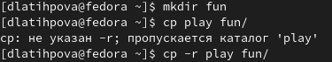{ #fig:021 width=70% }

4.5 Переместила каталог fun в каталог play,назвав его games(рис. [-@fig:022]).

**mv fun play/games**

{ #fig:022 width=70% }

4.6-4.8 Лишила владельца файла feathers права на чтение. После чего, попыталась просмотреть данный файл и скопировать его, однако, как и ожидалось, нам было отказано в доступе(рис. [-@fig:023]).

1  **chmod -r feathers**

2  **cat feathers**

3  **cp feathers fun**

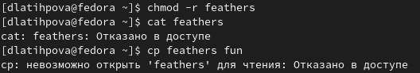{ #fig:023 width=70% }

4.9 Я снова дала валдельцу права на чтение файла feathers(рис. [-@fig:024]).

**chmod +r feathers**

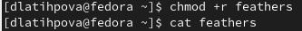{ #fig:024 width=70% }

4.10-4.11 Затем лишила владельца прав на выполнение каталога play. И попробовала перейти в него, как и ожидалось, нам было отказано в доступе(рис. [-@fig:025]).

1  **chmod -x play**

2  **cd play**

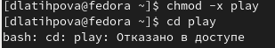{ #fig:025 width=70% }

4.12 И наконец, снова дала владельцу права на выполнение каталога play(рис. [-@fig:026]).

**chmod +x play**

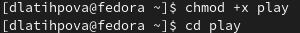{ #fig:026 width=70% }

5.Последним заданием было прочитать каждую из нижеперечисленных команд с помощью man и кратко охарактеризировать(рис. [-@fig:027]).

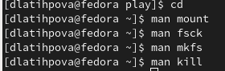{ #fig:027 width=70% }

- mount монтирует файловую систему(рис. [-@fig:028]) 

mount -h выводит на экран помощь-подсказку программы

mount --bind olddir newdir после выполнения этой команды одно и тот же содержимое становится доступным из двух точек.

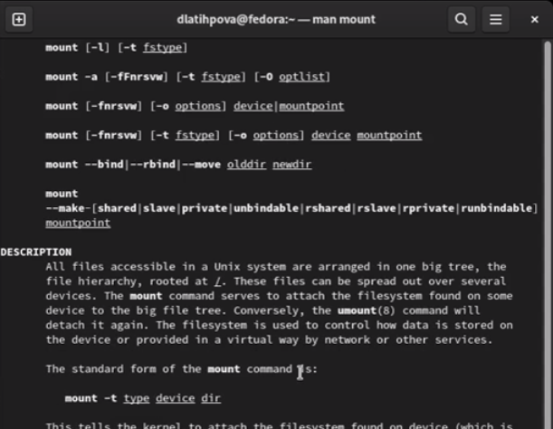{ #fig:028 width=70% }

- fsck предназначена для проверки и исправления ошибок файловой системы Linux. (рис. [-@fig:029])

Perform fsck dry run — это выполнение тестового запуска.

fsck -AR -запуск fsck во всех файловых системах

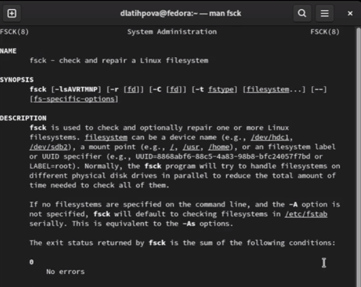{ #fig:029 width=70% }

- mkfs создаёт новую файловую систему Linux  (рис. [-@fig:030])

опция -c перед созданием файловой системы проверяет наличие сбойных блоков на устройстве. 

опция -v подробно комментирует происходящее. 

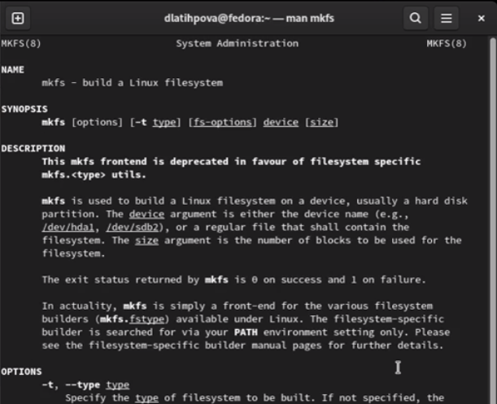{ #fig:030 width=70% }

- kill посылает сигнал процессу. (рис. [-@fig:031])

kill -L в результате получим список сигналов и их числовые значения

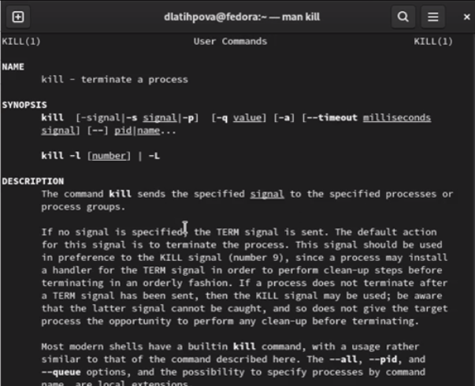{ #fig:031 width=70% }

# Контрольные вопросы

1. Дайте характеристику каждой файловой системе, существующей на жёстком диске компьютера, на котором вы выполняли лабораторную работу.

Если при загрузке чистый бит не установлен, то ОС запускает средство проверки файловой системы.В Linux программа- fsck. Программа проверяют целостность файловой системы.

В ФайловОЙ системЕ Ext2 данные сначала кэшируются и только потом записываются на диск, чем достигается высокая производительность. 

Файловая система Extfs (Extended File System) расширенная файловая система - первая файловая система, разработанная специально для ОС на ядре Linux. Наибольший возможный размер раздела файла  - 2 Гб. Максимальная длина имени файла - 255 символов. Вытеснена файловыми системами Ext2 и Ext3.

2. Приведите общую структуру файловой системы и дайте характеристику каждой директории первого уровня этой структуры.

Файловая система в Linux определяет также организацию расположения файлов, по сути представляя собой иерархическую структуру «дерева»: начинается с корневого каталога «/» и разрастается ветвями в зависимости от работы системы.

ФС также характерно понятие целостности: в такой системе изменения, внесенные в один файл, не приведут к изменению другого файла, не связанного с первым. У всех данных есть собственная физическая память. В Linux целостность ФС проверяется специальной командой — fsck.

Первая группа ФС — Extended Filesystem (Ext2, Ext3, Ext4) — является стандартом для Linux. Как следствие, это самые распространенные системы. Они редко обновляются, но зато стабильны. Ext2 создавалась специально под Linux (изначально Extended Filesystem делали еще под Minix).

Эта группа ФС поддерживает наибольшее количество доступных функций из всех, предложенных на рынке. Ext3 (2001 г.) стала еще более стабильной, чем ее предшественница, за счет использования журналирования, а версия Ext3 (2006 г.) популярна и среди современных пользователей. Среди улучшений: увеличение максимального размера раздела до 1 Эксабайта.

4. Назовите основные причины нарушения целостности файловой системы. 

Содержимое отдельных файлов не вносит существенных нарушений в целостность файловой системы.

Другое дело, когда подобные несоответствия затрагивают метаданные файла или другую управляющую информацию файловой системы, например, суперблок. Многие файловые операции затрагивают сразу несколько объектов файловой системы, и если на диске будут сохранены изменения только для части этих объектов, целостность файловой системы может быть существенно нарушена.

5. Как создаётся файловая система?

В общем виде команда выглядит так:

**mkfs -t ext2 /dev/hda5**

Для создания FAT32 можно воспользоваться такой командой:

**mkfs -t vfat /dev/hda5**

В Debian, чтобы было доступно создание файловых систем FAT и FAT32 требуется установить пакет dosfstools.

6. Дайте характеристику командам для просмотра текстовых файлов.

Cat просто печатает содержимое файла на стандартном экране, т.е. на экране. 

Команда nl почти как команда cat. Разница лишь в том, что она добавляет номера строк при отображении текста в терминале.

Команда Less просматривает файл по одной странице за раз. Лучше всего, чтобы выходить меньше (нажимая q), на экране не отображаются строки. Терминал останется чистым и нетронутым.

7. Приведите основные возможности команды cp в Linux.

cp копирует файлы и директории из одного места в другое.

Опция -p сохраняет время модификации файла и максимально возможные полномочия. Без этой опции для нового файла задаются полномочия, соответствующие полномочиям запустившего команду пользователя 

-d, если задать эту опцию, то символические ссылки будут оставаться ссылками (а иначе вместо ссылки копируется файл, на который дается ссылка) 

-f Перезапись файлов при копировании (если такие уже есть) без дополнительных предупреждений 

8. Приведите основные возможности команды mv в Linux.

mv используется для перемещения одного или нескольких файлов (или директорий) в другую директорию, а также для переименования файлов и директорий.

-f или --force -при перезаписи существующих файлов не спрашивать разрешения пользователя.

-i или --interactive -при перезаписи существующих файлов спрашивать разрешение пользователя на подтверждение операции.

-n или --no-clobber -не перезаписывать существующие файлы.

9. Что такое права доступа? Как они могут быть изменены?
При ответах на вопросы используйте дополнительные источники информации по теме.

Права доступа указывают для других пользователей системы, могут ли они читать, изменять и исполнять файл. Права доступа к файлу могут быть изменены только владельцем файла или пользователем root. Для каждого класса пользователей система устанавливает права доступа в виде набора разрешений.

chmod - это команда для изменения прав доступа к файлам или каталогам в Linux / Unix. Изменяя разрешения, указанный человек может сделать файл читаемым, доступным для записи и запуска, что в значительной степени гарантирует безопасность данных.

# Выводы

Я ознакомилась с файловой системой Linux, её структурой, именами и содержанием каталогов. Кроме того, приобрела практические навыки по применению команд для работы с файлами и каталогами, по управлению процессами (и работами), по проверке использования диска и обслуживанию файловой системы.

