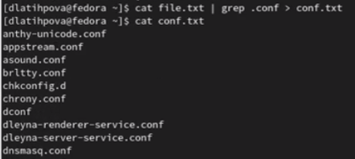
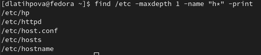
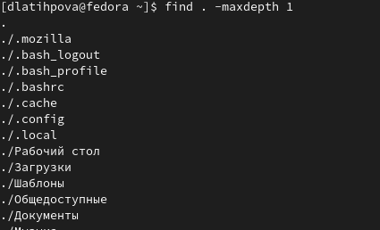

---
## Front matter
lang: ru-RU
title: Лабораторнаяработа №6. Поиск файлов. Перенаправление ввода-вывода. Просмотр запущенных процессов
author: |
	Латыпова Диана. НФИбд-02-21
institute: |
	\inst{1}RUDN University, Moscow, Russian Federation
	
## Formatting
toc: false
slide_level: 2
theme: metropolis
header-includes: 
 - \metroset{progressbar=frametitle,sectionpage=progressbar,numbering=fraction}
 - '\makeatletter'
 - '\beamer@ignorenonframefalse'
 - '\makeatother'
aspectratio: 43
section-titles: true
---

## Цель работы

Ознакомление с инструментами поиска файлов и фильтрации текстовых данных. Приобретение практических навыков: по управлению процессами (и заданиями), по проверке использования диска и обслуживанию файловых систем.

## Выполнение лабораторной работы

Первым заданием было войти в систему, мы уже осуществили вход в нее, поэтому я сразу перешла к выполнению второго задания.

## Задание 2

Я записала в файл file.txt названия файлов, содержащихся в каталоге /etc, а также дописала в этот же файл названия файлов, содержащихся в нашем домашнем каталоге. С помощью команды catпросмотрела содержимое файла file.txt(рис. [-@fig:001]):

1 **ls /etc > file.txt**

2 **ls >> file.txt**

3 **cat file.txt**

## Задание 2

{ #fig:001 width=50% }

## Задание 3

Вывела имена всех файлов из file.txt, имеющих расширение .conf и записала их в новый текстовой файл conf.txt(рис. [-@fig:002]):

1 **cat file.txt | grep .conf > conf.txt**

2 **cat conf .txt**

{ #fig:002 width=70% }

## Задание 4

Следующим заданием нужно было определить, какие файлы в моем домашнем каталоге имеют имена, начинавшиеся с символа c. И предложить несколько вариантов, как это сделать.

Сначала я попробовала команду:

**find ~ -name "c*" -print**

Однако, консоль вывела не только все файлы, каталоги, но и подкаталоги, имеющие имена, начинавшиеся с символа c

## Задание 4

Поэтому я немного изменила команду, добавив maxdepth 1:

**find ~ -maxdepth 1 -name "c * " -print**

После чего нам вывелся лишь один файл conf.txt(рис. [-@fig:003]).

{ #fig:003 width=70% }

Далее я попробовала другой способ вывода файлов, начинающихся с символа c:

**ls | grep c***

## Задаине 5

Я вывела  на экран (по странично) имена файлов, начинающиеся с символа h, только уже из определенного каталога /etc(рис. [-@fig:004]):

**find /etc -maxdepth 1 -name "h * " - print**

{ #fig:004 width=70% }

## Задание 6

С помощью следующей команды, добавив в конце амперсанду, я запустила в фоновом режиме процесс, который записывал в файл logfile файлы, имена которых начинаются с log:

**find / -name "log * " -print >logfile &**

## Задание 6

С помощью команды cat просмотрела содержимое logfile(рис. [-@fig:005]):  **cat logfile**

{ #fig:005 width=70% }

## Задание 7. Задание 8

7.После чего, удалила с помощью команды rm файл logfile^

1 **rm logfile**

2 **ls**

8.Запустила в фоновом режиме с помощью амперсанды редактор gedit:  **gedit &**

## Задание 9

Я определила идентификатор данного процесса gedit, используя команду ps, конвейер и фильтр grep. Кроме них, использовала команды pidof и pstree:

1  **ps**

2  **pgrep gedit**

3  **pidof gedit**

4 **pstree -p | grep gedit**

Идентификатор процесса gedit - **5911**

## Задание 10

С помощью команды man прочла справку команды kill:

**man kill**

После чего завершила процесс gedit:

1 **kill 5911**

2 **ps**

## Задание 11

С помощью man просмотрела информацию о командах df и du. Поочередно выполнила команды df и du.

## Задание 11

df используется для получения полной сводной информации об использовании доступного и используемого дискового пространства файловой системы в системе Linux(рис. [-@fig:006]).

{ #fig:006 width=70% }

## Задание 11

С помощою опции “-h” я вывела статистику дискового пространства файловой системы в удобном формате для чтения человеком, то есть  размеры представлены в байтах, килобайтах, мегабайтах, гигабайтах и т.д. (рис. [-@fig:007]).

{ #fig:007 width=70% }

## Задание 11

du используется для показа суммарной информации об использовании диска файлами и директориями(рис. [-@fig:008]).

{ #fig:008 width=70% }

## Задание 11

И также использовала опцию “-h”(рис. [-@fig:009])

{ #fig:009 width=70% }

## Задание 12

Я просмотрела справку команды find(рис. [-@fig:010])

{ #fig:010 width=70% }

## Задание 12

Введя следующую команду, вывела имена всех директорий, имеющихся в моем домашнем каталоге(рис. [-@fig:011]):

**find / -maxdepth 1**

{ #fig:011 width=70% }

## Вывод

Я ознакомилась с инструментами поиска файлов и фильтрации текстовых данных. А также я приобрела практические навыки: по управлению процессами (и заданиями), по проверке использования диска и обслуживанию файловых систем.