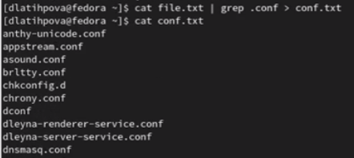
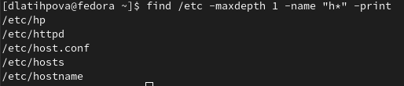
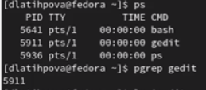
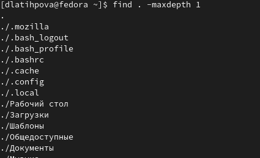

---
## Front matter
title: "Лабораторная работа №6"
subtitle: "Поиск файлов. Перенаправление ввода-вывода. Просмотр запущенных процессов"
author: "Латыпова Диана. НФИбд-02-21"

## Generic otions
lang: ru-RU
toc-title: "Содержание"

## Bibliography
bibliography: bib/cite.bib
csl: pandoc/csl/gost-r-7-0-5-2008-numeric.csl

## Pdf output format
toc: true # Table of contents
toc-depth: 2
lof: true # List of figures
lot: true # List of tables
fontsize: 12pt
linestretch: 1.5
papersize: a4
documentclass: scrreprt
## I18n polyglossia
polyglossia-lang:
  name: russian
  options:
	- spelling=modern
	- babelshorthands=true
polyglossia-otherlangs:
  name: english
## I18n babel
babel-lang: russian
babel-otherlangs: english
## Fonts
mainfont: PT Serif
romanfont: PT Serif
sansfont: PT Sans
monofont: PT Mono
mainfontoptions: Ligatures=TeX
romanfontoptions: Ligatures=TeX
sansfontoptions: Ligatures=TeX,Scale=MatchLowercase
monofontoptions: Scale=MatchLowercase,Scale=0.9
## Biblatex
biblatex: true
biblio-style: "gost-numeric"
biblatexoptions:
  - parentracker=true
  - backend=biber
  - hyperref=auto
  - language=auto
  - autolang=other*
  - citestyle=gost-numeric
## Pandoc-crossref LaTeX customization
figureTitle: "Рис."
tableTitle: "Таблица"
listingTitle: "Листинг"
lofTitle: "Список иллюстраций"
lotTitle: "Список таблиц"
lolTitle: "Листинги"
## Misc options
indent: true
header-includes:
  - \usepackage{indentfirst}
  - \usepackage{float} # keep figures where there are in the text
  - \floatplacement{figure}{H} # keep figures where there are in the text
---

# Цель работы

Ознакомление с инструментами поиска файлов и фильтрации текстовых данных. Приобретение практических навыков: по управлению процессами (и заданиями), по проверке использования диска и обслуживанию файловых систем.

# Задание

1. Осуществите вход в систему, используя соответствующее имя пользователя.
2. Запишите в файл file.txt названия файлов, содержащихся в каталоге /etc. Допишите в этот же файл названия файлов, содержащихся в вашем домашнем каталоге.
3. Выведите имена всех файлов из file.txt, имеющих расширение .conf, после чего запишите их в новый текстовой файл conf.txt.
4. Определите, какие файлы в вашем домашнем каталоге имеют имена, начинавшиеся с символа c? Предложите несколько вариантов, как это сделать.
5. Выведите на экран (по странично) имена файлов из каталога /etc, начинающиеся с символа h.
6. Запустите в фоновом режиме процесс, который будет записывать в файл ~/logfile файлы, имена которых начинаются с log.
7. Удалите файл ~/logfile.
8. Запустите из консоли в фоновом режиме редактор gedit.
9. Определите идентификатор процесса gedit, используя команду ps, конвейер и фильтр grep. Как ещё можно определить идентификатор процесса?
10. Прочтите справку (man) команды kill, после чего используйте её для завершения процесса gedit.
11. Выполните команды df и du, предварительно получив более подробную информацию об этих командах, с помощью команды man.
12. Воспользовавшись справкой команды find, выведите имена всех директорий, имеющихся в вашем домашнем каталоге.

# Выполнение лабораторной работы

Первым заданием было войти в систему, мы уже осуществили вход в нее, поэтому я сразу перешла к выполнению второго задания.

2.Используя команду ls и перенаправления ввода-вывода, я записала в файл file.txt названия файлов, содержащихся в каталоге /etc, а также следующей командой ls и >> дописала в этот же файл названия файлов, содержащихся в нашем домашнем каталоге. С помощью команды catпросмотрела содержимое файла file.txt (рис. [-@fig:001])(рис. [-@fig:002])

1 **ls /etc > file.txt**

2 **ls >> file.txt**

3 **cat file.txt**

{ #fig:001 width=70% }

{ #fig:002 width=70% }

3.Далее с помощью команд cat, grep и конвейера вывела имена всех файлов из file.txt, имеющих расширение .conf и записала их в новый текстовой файл conf.txt(рис. [-@fig:003]).

1 **cat file.txt | grep .conf > conf.txt**

2 **cat conf .txt**

{ #fig:003 width=70% }

4.Следующим заданием нужно было определить, какие файлы в моем домашнем каталоге имеют имена, начинавшиеся с символа c. И предложить несколько вариантов, как это сделать.

Сначала я попробовала команду:

**find ~ -name "c*" -print**

Однако, консоль вывела не только все файлы, каталоги, но и подкаталоги, имеющие имена, начинавшиеся с символа c(рис. [-@fig:004])(рис. [-@fig:005]).

{ #fig:004 width=70% }

{ #fig:005 width=70% }

Поэтому я немного изменила команду, добавив maxdepth 1:

**find ~ -maxdepth 1 -name "c * " -print**

После чего нам вывелся лишь один файл conf.txt(рис. [-@fig:006]).

{ #fig:006 width=70% }

Далее я попробовала другой способ, с помощью команд ls и grep, вывести файлы, начинающиеся с символа c(рис. [-@fig:007]):

**ls | grep c***

{ #fig:007 width=70% }

5.Далее с помощью похожей выше команды я вывела  на экран (по странично) имена файлов, начинающиеся с символа h, только уже из определенного каталога /etc(рис. [-@fig:008]).

**find /etc -maxdepth 1 -name "h * " - print**

{ #fig:008 width=70% }

6.Далее с помощью следующей команды, добавив в конце амперсанду, я запустила в фоновом режиме процесс, который записывал в файл logfile файлы, имена которых начинаются с log(рис. [-@fig:009]).

**find / -name "log * " -print >logfile &**

{ #fig:009 width=70% }

С помощью команды cat просмотрела содержимое logfile(рис. [-@fig:010]).

**cat logfile**

{ #fig:010 width=70% }

7.После чего, удалила с помощью команды rm файл logfile(рис. [-@fig:011]).

1 **rm logfile**

2 **ls**

{ #fig:011 width=70% }

8.Запустила в фоновом режиме с помощью амперсанды редактор gedit(рис. [-@fig:012]).

**gedit &**

{ #fig:012 width=70% }

9.Далее я определила идентификатор данного процесса gedit, используя команду ps, конвейер и фильтр grep(рис. [-@fig:012]). Кроме них, использовала команды pidof и pstree(рис. [-@fig:013])(рис. [-@fig:014]).

1  **ps**

2  **pgrep gedit**

3  **pidof gedit**

4 **pstree -p | grep gedit**

Идентификатор процесса gedit - **5911**

{ #fig:013 width=70% }

{ #fig:014 width=70% }

10.С помощью команды man прочла справку команды kill(рис. [-@fig:015])(рис. [-@fig:016]):

**man kill**

{ #fig:015 width=70% }

{ #fig:016 width=70% }

Я запустила gedit несколько раз, поэтому его иентификатор изменился на 5060

После чего завершила процесс gedit(рис. [-@fig:017]):

1 **kill 5060**

2 **ps**

{ #fig:017 width=70% }

11. Далее с помощью man просмотрела информацию о командах df и du(рис. [-@fig:018])(рис. [-@fig:019]).

{ #fig:018 width=70% }

{ #fig:019 width=70% }

Поочередно выполнила команды df и du.

df используется для получения полной сводной информации об использовании доступного и используемого дискового пространства файловой системы в системе Linux(рис. [-@fig:020]).

{ #fig:020 width=70% }

С помощою опции “-h” я вывела статистику дискового пространства файловой системы в удобном формате для чтения человеком, то есть  размеры представлены в байтах, килобайтах, мегабайтах, гигабайтах и т.д. (рис. [-@fig:021]).

{ #fig:021 width=70% }

du используется для показа суммарной информации об использовании диска файлами и директориями(рис. [-@fig:022]).

{ #fig:022 width=70% }

И также использовала опцию “-h”(рис. [-@fig:023])

{ #fig:023 width=70% }

12.И наконец, я просмотрела справку команды find(рис. [-@fig:024])

{ #fig:024 width=70% }

Введя следующую команду, вывела имена всех директорий, имеющихся в моем домашнем каталоге(рис. [-@fig:025]):

**find / -maxdepth 1**

{ #fig:025 width=70% }

# Контрольные вопросы

1. Какие потоки ввода вывода вы знаете?

Ввод и вывод распределяется между тремя стандартными потоками:

    stdin — стандартный ввод (клавиатура),
    stdout — стандартный вывод (экран),
    stderr — стандартная ошибка (вывод ошибок на экран).

Потоки также пронумерованы:

    stdin — 0,
    stdout — 1,
    stderr — 2.

2. Объясните разницу между операцией > и >>.

«>» – это оператор вывода, который перезаписывает существующий файл, а «>>» также является оператором вывода, но добавляет данные в уже существующий файл. 

3. Что такое конвейер?

Конвейер — некоторое множество процессов, для которых выполнено следующее перенаправление ввода-вывода: то, что выводит на поток стандартного вывода предыдущий процесс, попадает в поток стандартного ввода следующего процесса.

4. Что такое процесс? Чем это понятие отличается от программы?

Процесс - это: программа на стадии выполнения; "объект", которому выделено процессорное время; асинхронная работа. Процесс состоит из адресного пространства памяти и набора структур данных. По сути, процесс это запущенная программа или служба.

5. Что такое PID и GID?

Идентификатор процесса (англ. Process IDentifier, PID) — уникальный номер (идентификатор) процесса в многозадачной операционной системе (ОС).

Кроме идентификационного номера пользователя с учётной записью связан идентификатор группы. Группы пользователей применяются для организации доступа нескольких пользователей к некоторым ресурсам. У группы, так же, как и у пользователя, есть имя и идентификационный номер — GID (Group ID).

6. Что такое задачи и какая команда позволяет ими управлять?

Задача - это истощить чьи-то ресурсы или поручить кому-то выполнение определенной работы.

Команда kill используется для отправки сигнала процессам. Наиболее часто используемым сигналом является SIGKILL или -9, который завершает данные процессы. Ее можно использовать для принудительного завершения работы приложений. 

7. Найдите информацию об утилитах top и htop. Каковы их функции?

top (Table Of Processes) — каждые 2 секунды обновляет активные процессы. Колонка PID указывает на ID процесса, USER на пользователя и т.д. Удобно. Если процесс активен постоянно, но уследить за постоянно обновляющимся списком не всегда получается.

Более продвинутые утилиты командной строки Linux — atop, htop. Отображают не только активные процессы с обновлением в две секунды, но и контроль над загрузкой и т.д. Утилиты полезны для системных администраторов, но для обычного пользователя все-таки перебор.

8. Назовите и дайте характеристику команде поиска файлов. Приведите примеры использования этой команды.

Команда find - это одна из наиболее важных и часто используемых утилит системы Linux. Это команда для поиска файлов и каталогов на основе специальных условий. Ее можно использовать в различных обстоятельствах, например, для поиска файлов по разрешениям, владельцам, группам, типу, размеру и другим подобным критериям.

-P - никогда не открывать символические ссылки.

-L - получает информацию о файлах по символическим ссылкам. Важно для дальнейшей обработки, чтобы обрабатывалась не ссылка, а сам файл.

-maxdepth - максимальная глубина поиска по подкаталогам, для поиска только в текущем каталоге установите 1.

-depth - искать сначала в текущем каталоге, а потом в подкаталогах.

-mount искать файлы только в этой файловой системе.

-version - показать версию утилиты find.

-print - выводить полные имена файлов.

9. Можно ли по контексту (содержанию) найти файл? Если да, то как?

Для поиска файла по содержимому проще всего воспользоваться командой grep (вместо find).

Пример: 

grep -r строка_поиска каталог

10. Как определить объем свободной памяти на жёстком диске?

Проверка свободного места на диске в Linux с помощью команды df (и понимание ее вывода) Когда вы используете команду df для проверки места на диске, она покажет набор «файловых систем» с их размером, используемым пространством и свободным пространством.

11. Как определить объем вашего домашнего каталога?

В операционных системах на базе Linux посмотреть размер папки (директории) можно с помощью команды du. Эта команда, выполняемая в консоли, позволяет оценить используемый объем места на жестком диске отдельно по папкам и файлам, просуммировать результат, узнать общий размер папки.

12. Как удалить зависший процесс?

Когда известен PID процесса, мы можем убить его командой kill. Команда kill принимает в качестве параметра PID процесса.

Вообще команда kill предназначена для посылки сигнала процессу. По умолчанию, если мы не указываем какой сигнал посылать, посылается сигнал SIGTERM (от слова termination — завершение). SIGTERM указывает процессу на то, что необходимо завершиться.

Команда killall в Linux предназначена для «убийства» всех процессов, имеющих одно и то же имя. Это удобно, так как нам не нужно знать PID процесса. 

# Выводы

Я ознакомилась с инструментами поиска файлов и фильтрации текстовых данных. А также я приобрела практические навыки: по управлению процессами (и заданиями), по проверке использования диска и обслуживанию файловых систем.

