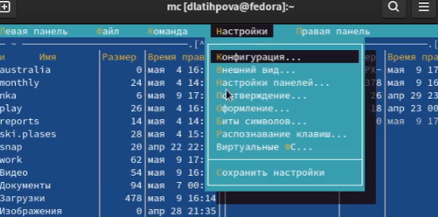
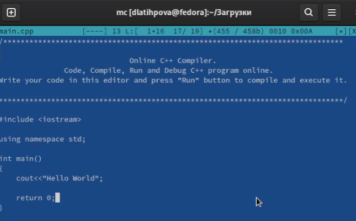
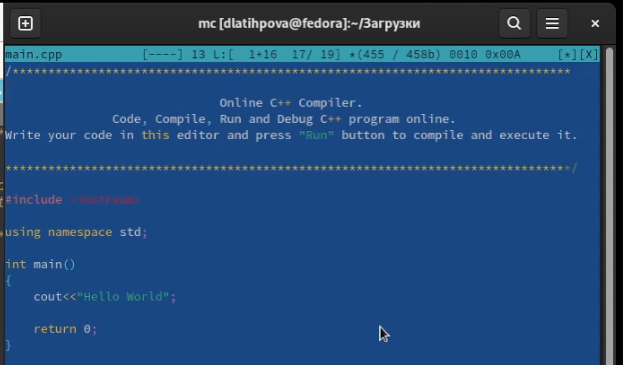

---
## Front matter
lang: ru-RU
title: Лабораторная работа №7. Командная оболочка Midnight Commander.
author: |
	Латыпова Диана. НФИбд-02-21
institute: |
	\inst{1}RUDN University, Moscow, Russian Federation

## Formatting
toc: false
slide_level: 2
theme: metropolis
header-includes: 
 - \metroset{progressbar=frametitle,sectionpage=progressbar,numbering=fraction}
 - '\makeatletter'
 - '\beamer@ignorenonframefalse'
 - '\makeatother'
aspectratio: 43
section-titles: true
---

## Цель работы

Освоение основных возможностей командной оболочки Midnight Commander. Приобретение навыков практической работы по просмотру каталогов и файлов; манипуляций с ними

## Выполнение лабораторной работы

В командной строке ввела man mc

Просмотрела справку о команде mc (рис. [-@fig:001])

{ #fig:001 width=60% }

## Формат списка файлов

3. Просмотрела расширенный формат списка файлов(рис. [-@fig:002])

{ #fig:002 width=60% }

## Манипуляции с файлами

- С помощью клавиши F4 открыла редактирование содержимого текстового файла (без сохранения результатов редактирования)

- Используя возможности подменю Файл, я просмотрела содержимое текстового файла conf.txt, нажав на клавишу F3

- Создала каталог nka, нажав на клавишу F7

- Скопировала созданный файл bhf в созданный каталог nka с помощью F5

## Поиск в файловой системе

С помощью соответствующих средств подменю Команда осуществила поиск в файловой системе файла с расширением .txt(рис. [-@fig:003]):

{ #fig:003 width=70% }

## История командной строки

Просмотрев историю командной строки, повторила предыдущую команду (у меня- touch)(рис. [-@fig:004])(рис. [-@fig:005])

{ #fig:004 width=40% }

{ #fig:005 width=50% }

## Анализ

Проанализировала файл меню (рис. [-@fig:006]) и файл расширений(рис. [-@fig:007]).

{ #fig:006 width=60% }

## Анализ

{ #fig:007 width=70% }

## Подменю Настройки 

Вызвала подменю Настройки. И освоила операции, определяющие структуру экрана mc (Full screen, Double Width, Show Hidden Files и т.д.)(рис. [-@fig:008])

{ #fig:008 width=50% }

## Текстовый файл text.txt  

Создала текстовый файл text.txt 

**touch text.txt**

- Открыла созданный файл с помощью F4

- Вставила (Shift+Ins) в открытый файл небольшой фрагмент текста, скопированный из контрольных вопросов ниже лабораторной работы 7

## Манипуляции с текстовым файлом text.txt  

- Удалила первую строку текста с помощью Ctrl+y

- После чего выделила фрагмент текста и перенесла его на новую строку с помощью F6+Enter

- Сохранила файл. Отменила последнее действие с помощью  Ctrl+u. 

- Перешла в конец файла (нажав Ctrl+End) и написала некоторый текст. Перешла в начало файла (нажав Ctrl+Home) и снова написала некоторый текст

- Сохранила и закрыла редактирование файла

## Подсветка синтаксиса

Сохранила исходный код, открыла его. Сначала подсветка не горела(рис. [-@fig:009]), затем комбинацией клавиш Ctrl+S подсветка синтаксиса включилась(рис. [-@fig:010]):

{ #fig:009 width=60% }

## Подсветка синтаксиса

{ #fig:010 width=70% }

## Выводы

Я освоила основные возможности командной оболочки Midnight Commander, приобрела навыки практической работы по просмотру каталогов и файлов; манипуляций с ними.