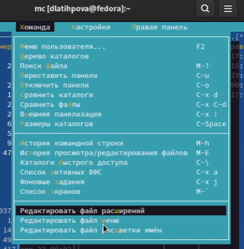
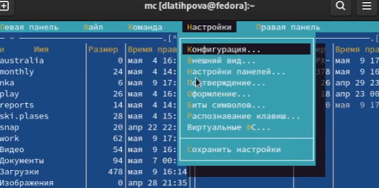
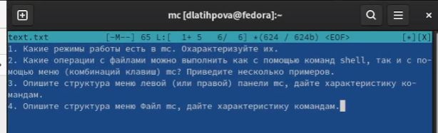
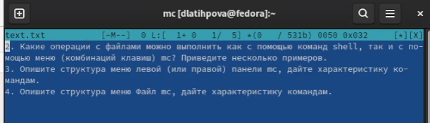
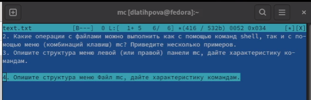
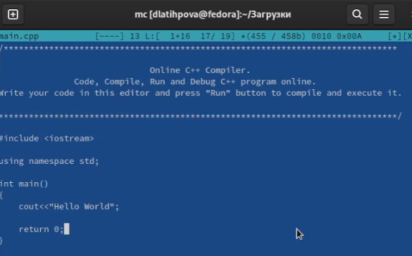
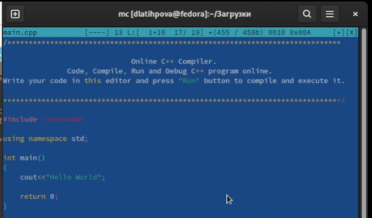

---
## Front matter
title: "Лабораторная работа №7"
subtitle: "Командная оболочка Midnight Commander"
author: "Латыпова Диана. НФИбд-02-21"

## Generic otions
lang: ru-RU
toc-title: "Содержание"

## Bibliography
bibliography: bib/cite.bib
csl: pandoc/csl/gost-r-7-0-5-2008-numeric.csl

## Pdf output format
toc: true # Table of contents
toc-depth: 2
lof: true # List of figures
lot: true # List of tables
fontsize: 12pt
linestretch: 1.5
papersize: a4
documentclass: scrreprt
## I18n polyglossia
polyglossia-lang:
  name: russian
  options:
	- spelling=modern
	- babelshorthands=true
polyglossia-otherlangs:
  name: english
## I18n babel
babel-lang: russian
babel-otherlangs: english
## Fonts
mainfont: PT Serif
romanfont: PT Serif
sansfont: PT Sans
monofont: PT Mono
mainfontoptions: Ligatures=TeX
romanfontoptions: Ligatures=TeX
sansfontoptions: Ligatures=TeX,Scale=MatchLowercase
monofontoptions: Scale=MatchLowercase,Scale=0.9
## Biblatex
biblatex: true
biblio-style: "gost-numeric"
biblatexoptions:
  - parentracker=true
  - backend=biber
  - hyperref=auto
  - language=auto
  - autolang=other*
  - citestyle=gost-numeric
## Pandoc-crossref LaTeX customization
figureTitle: "Рис."
tableTitle: "Таблица"
listingTitle: "Листинг"
lofTitle: "Список иллюстраций"
lotTitle: "Список таблиц"
lolTitle: "Листинги"
## Misc options
indent: true
header-includes:
  - \usepackage{indentfirst}
  - \usepackage{float} # keep figures where there are in the text
  - \floatplacement{figure}{H} # keep figures where there are in the text
---

# Цель работы

Освоение основных возможностей командной оболочки Midnight Commander. Приобретение навыков практической работы по просмотру каталогов и файлов; манипуляций с ними

# Задание

7.3.1. Задание по mc

1. Изучите информацию о mc, вызвав в командной строке man mc.

2. Запустите из командной строки mc, изучите его структуру и меню

3. Выполните несколько операций в mc, используя управляющие клавиши (операции с панелями; выделение/отмена выделения файлов, копирование/перемещение файлов, получение информации о размере и правах доступа на файлы и/или каталоги и т.п.)

4. Выполните основные команды меню левой (или правой) панели. Оцените степень подробности вывода информации о файлах.

5. Используя возможности подменю Файл, выполните:

– просмотр содержимого текстового файла;

– редактирование содержимого текстового файла (без сохранения результатов редактирования);

– создание каталога;

– копирование в файлов в созданный каталог.
 
6. С помощью соответствующих средств подменю Команда осуществите:

– поиск в файловой системе файла с заданными условиями (например, файла с расширением .c или .cpp, содержащего строку main);

– выбор и повторение одной из предыдущих команд;

– переход в домашний каталог;

– анализ файла меню и файла расширений.

7. Вызовите подменю Настройки . Освойте операции, определяющие структуру экрана mc (Full screen, Double Width, Show Hidden Files и т.д.)

7.3.2. Задание по встроенному редактору mc

1. Создайте текстовой файл text.txt.

2. Откройте этот файл с помощью встроенного в mc редактора.

3. Вставьте в открытый файл небольшой фрагмент текста, скопированный из любого другого файла или Интернета.

4. Проделайте с текстом следующие манипуляции, используя горячие клавиши:

4.1. Удалите строку текста.

4.2. Выделите фрагмент текста и скопируйте его на новую строку

4.3. Выделите фрагмент текста и перенесите его на новую строку.

4.4. Сохраните файл.

4.5. Отмените последнее действие.

4.6. Перейдите в конец файла (нажав комбинацию клавиш) и напишите некоторый текст.

4.7. Перейдите в начало файла (нажав комбинацию клавиш) и напишите некоторый текст.

4.8. Сохраните и закройте файл.

5. Откройте файл с исходным текстом на некотором языке программирования (например C или Java)

6. Используя меню редактора, включите подсветку синтаксиса, если она не включена, или выключите, если она включена.

# Выполнение лабораторной работы

**7.3.1. Задание по mc**

1. В командной строке ввела man mc (рис. [-@fig:001])

{ #fig:001 width=70% }

2. Просмотрела справку о команде mc (рис. [-@fig:002])

{ #fig:002 width=70% }

Запустила mc(рис. [-@fig:003])

{ #fig:003 width=70% }

3. Просмотрела расширенный формат списка файлов(рис. [-@fig:004]). 

{ #fig:004 width=70% }

Он выдал нам информацию о размере, владельце, группе, время правки и правах доступа на файлы и/или каталоги (рис. [-@fig:005]):

{ #fig:005 width=70% }

4. Далее выполнила основные команды левой панели (опустим их в отчете). Просмотрела другие форматы списка файлов(рис. [-@fig:006])(рис. [-@fig:007])(рис. [-@fig:008]):

{ #fig:006 width=70% }

{ #fig:007 width=70% }

{ #fig:008 width=70% }

5. Используя возможности подменю Файл, я просмотрела содержимое текстового файла conf.txt, нажав на клавишу F3 (рис. [-@fig:009])(рис. [-@fig:010]):

{ #fig:009 width=70% }

{ #fig:010 width=70% }

С помощью клавиши F4 открыла редактирование содержимого текстового файла (без сохранения результатов редактирования)(рис. [-@fig:011]):

{ #fig:011 width=70% }

Создала каталог nka, нажав на клавишу F7(рис. [-@fig:012]):

{ #fig:012 width=70% }

Скопировала созданный файл bhf в созданный каталог nka с помощью F5(рис. [-@fig:013])(рис. [-@fig:014]):

{ #fig:013 width=70% }

{ #fig:014 width=70% }

6. С помощью соответствующих средств подменю Команда осуществила поиск в файловой системе файла с расширением .txt, затем с содержимым main(рис. [-@fig:015])(рис. [-@fig:016]):

{ #fig:015 width=70% }

{ #fig:016 width=70% }

Просмотрев историю командной строки, повторила предыдущую команду (у меня- touch)(рис. [-@fig:017])(рис. [-@fig:018])

{ #fig:017 width=70% }

{ #fig:018 width=70% }

Проанализировала (рис. [-@fig:020]) файл меню (рис. [-@fig:021]) и файл расширений(рис. [-@fig:019]).

{ #fig:020 width=70% }

{ #fig:019 width=70% }

{ #fig:021 width=70% }

7. Вызвала подменю Настройки . И освоила операции, определяющие структуру экрана mc (Full screen, Double Width, Show Hidden Files и т.д.) (опустим этот момент в отчете, в видео все есть)(рис. [-@fig:022])

{ #fig:022 width=70% }

**7.3.2. Задание по встроенному редактору mc**

1. Создала текстовый файл text.txt(рис. [-@fig:023])

{ #fig:023 width=70% }

2. Открыла созданный файл с помощью F4(рис. [-@fig:024])

{ #fig:024 width=70% }

3. Далее вставила (Shift+Ins) в открытый файл небольшой фрагмент текста, скопированный из контрольных вопросов ниже лабораторной работы 7(рис. [-@fig:025])

{ #fig:025 width=70% }

4. И проделала с текстом следующие манипуляции, используя горячие клавиши:

Удалила первую строку текста с помощью Ctrl+y(рис. [-@fig:026])

{ #fig:026 width=70% }

После чего выделила фрагмент текста и перенесла его на новую строку с помощью F6+Enter(рис. [-@fig:027])

{ #fig:027 width=70% }

Сохранила файл(рис. [-@fig:028])

{ #fig:028 width=70% }

Отменила последнее действие с помощью  Ctrl+u. Чтобы увидеть изменения, несколько раз нажала комбинацию клавиш ctrl+u, как видим, перенесенный текст вернулся на изначальную строку(рис. [-@fig:029])

{ #fig:029 width=70% }

Перешла в конец файла (нажав Ctrl+End) и написала некоторый текст(рис. [-@fig:030]):

{ #fig:030 width=70% }

Перешла в начало файла (нажав Ctrl+Home) и снова написала некоторый текст(рис. [-@fig:031]):

{ #fig:031 width=70% }

Сохранила и закрыла редактирование файла(рис. [-@fig:032]):

{ #fig:032 width=70% }

5-6. Следующим заданием было открыть файл с исходным текстом на некотором языке программирования (например C или Java). И используя меню редактора, включить подсветку синтаксиса, если она не включена, или выключит, если она включена.

Сначала я попробовала скопировать и вставить текст в файл, однако подсветка не включалась комбинацией клавиш.
 
Тогда я попробовала сохранить исходный код, открыла его. Сначала подсветка не горела(рис. [-@fig:033]), затем комбинацией клавиш Ctrl+S подсветка синтаксиса включилась(рис. [-@fig:034]):

{ #fig:033 width=70% }

{ #fig:034 width=70% }

# Контрольные вопросы

1. Какие режимы работы есть в mc. Охарактеризуйте их.

Режим просмотра файлов... Этот режим используется для просмотра списка файлов. Существует четыре таких режима: Full, Brief, Long и User. В режиме Full отображается имя файла, размер файла и время последней модификации.

В режиме Brief список файлов располагается в две колонки и состоит только из имён файлов (поэтому в этом режиме отображается наибольшее количество файлов, по сравнению с другими режимами). Режим Long идентичен результату выполнения команды ls -l. В этом режиме панель занимает весь экран.

При использовании режима User нужно указать параметр формата отображения.

Этот параметр должен начинаться со спецификации размера панели: "half" или "full" (при выборе full панель будет во весь экран, а при half - лишь в половину ).

После спецификации размера панели можно указать режим отображения в две колонки, путём добавления цифры "2" к параметру. 

3. Опишите структура меню левой (или правой) панели mc, дайте характеристику командам.

При обращении к команде меню Дерево каталогов выводится окно, отображающее структуру каталогов файловой системы.

Дерево каталогов может быть вызвано двумя способами: через команду Дерево каталогов из меню Команды и команду Дерево из меню правой или левой панелей.

4. Опишите структура меню Файл mc, дайте характеристику командам.

Команды меню Файл :

– Просмотр ( F3 ) — позволяет посмотреть содержимое текущего (или выделенного) файла без возможности редактирования.
– Просмотр вывода команды ( М + ! ) — функция запроса команды с параметрами (аргумент к текущему выбранному файлу).
– Правка ( F4 ) — открывает текущий (или выделенный) файл для его редактирования.

– Копирование ( F5 ) — осуществляет копирование одного или нескольких файлов или каталогов в указанное пользователем во всплывающем окне место.

– Права доступа ( Ctrl-x c ) — позволяет указать (изменить) права доступа к одному или нескольким файлам или каталогам 

– Жёсткая ссылка ( Ctrl-x l ) — позволяет создать жёсткую ссылку к текущему (или выделенному) файлу1.

– Символическая ссылка ( Ctrl-x s ) — позволяет создать символическую ссылку к текущему (или выделенному) файлу2.

– Владелец/группа ( Ctrl-x o ) — позволяет задать (изменить) владельца и имя группы для одного или нескольких файлов или каталогов.

– Права (расширенные) — позволяет изменить права доступа и владения для одного или нескольких файлов или каталогов.

– Переименование ( F6 ) — позволяет переименовать (или переместить) один или несколько файлов или каталогов.

– Создание каталога ( F7 ) — позволяет создать каталог.

– Удалить ( F8 ) — позволяет удалить один или несколько файлов или каталогов.

– Выход ( F10 ) — завершает работу mc

5. Опишите структура меню Команда mc, дайте характеристику командам.

Команды меню Команда :

– Дерево каталогов — отображает структуру каталогов системы.

– Поиск файла — выполняет поиск файлов по заданным параметрам

– Переставить панели — меняет местами левую и правую панели.

– Сравнить каталоги ( Ctrl-x d ) — сравнивает содержимое двух каталогов.

– Размеры каталогов — отображает размер и время изменения каталога (по умолчанию в mc размер каталога корректно не отображается).

– История командной строки — выводит на экран список ранее выполненных в оболочке команд.

– Каталоги быстрого доступа ( Ctrl-\ ) — пр вызове выполняется быстрая смена текущего каталога на один из заданного списка.

– Восстановление файлов — позволяет восстановить файлы на файловых системах ext2 и ext3.

– Редактировать файл расширений — позволяет задать с помощью определённого синтаксиса действия при запуске файлов с определённым расширением (например, какое
программного обеспечение запускать для открытия или редактирования файлов с расширением doc или docx).

– Редактировать файл меню — позволяет отредактировать контекстное меню пользователя, вызываемое по клавише F2 .

– Редактировать файл расцветки имён — позволяет подобрать оптимальную для пользователя расцветку имён файлов в зависимости от их типа.

6. Опишите структура меню Настройки mc, дайте характеристику командам.

Меню Настройки содержит:

– Конфигурация — позволяет скорректировать настройки работы с панелями.

– Внешний вид и Настройки панелей — определяет элементы (строка меню, командная строка, подсказки и прочее), отображаемые при вызове mc, а также геометрию расположения панелей и цветовыделение.

– Биты символов — задаёт формат обработки информации локальным терминалом.

– Подтверждение — позволяет установить или убрать вывод окна с запросом подтверждения действий при операциях удаления и перезаписи файлов, а также при выходе из программы.

– Распознание клавиш — диалоговое окно используется для тестирования функциональных клавиш, клавиш управления курсором и прочее.

– Виртуальные ФС –– настройки виртуальной файловой системы: тайм-аут, пароль и прочее.

8. Назовите и дайте характеристику командам встроенного редактора mc.

F1 — Помощь

F2 — Сохранить изменения в файл при редактировании

F3 — Просмотр файла

F3 — (Во время редактирования) Начать выделение текста. Повторное нажатие F3 закончит выделение

F4 — Редактирование файла

F5 — Скопировать выделенное

F6 — Переместить выделенное

F8 — Удалить выделенное  

Shift+F1 — вызывается меню быстрого перехода между точками монтирования на левой панели

Shift+F2 — вызывается меню быстрого перехода между точками монтирования на правой панели

Shift+F5 — скопировать файл в этот же каталог

Shift+F6 — переместить/переименовать файл в этот же каталог

ctrl-s — Быстрый поиск файла или каталога

alt-shift-? — Вызывается меню расширенного поиска файлов

# Выводы

Я освоила основные возможности командной оболочки Midnight Commander. Кроме того, приобрела навыки практической работы по просмотру каталогов и файлов; манипуляций с ними.
