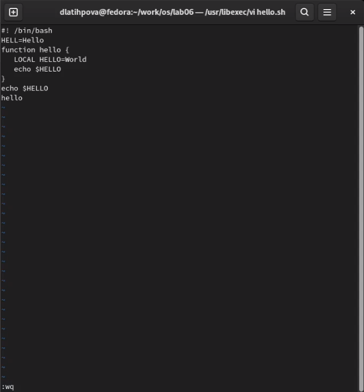

---
## Front matter
lang: ru-RU
title: Лабораторная работа №8. Текстовой редактор vi
author: |
	Латыпова Диана. НФИбд-02-21
institute: |
	\inst{1}RUDN University, Moscow, Russian Federation

## Formatting
toc: false
slide_level: 2
theme: metropolis
header-includes: 
 - \metroset{progressbar=frametitle,sectionpage=progressbar,numbering=fraction}
 - '\makeatletter'
 - '\beamer@ignorenonframefalse'
 - '\makeatother'
aspectratio: 43
section-titles: true
---

## Цель работы

Познакомиться с операционной системой Linux. Получить практические навыки работы с редактором vi, установленным по умолчанию практически во всех дистрибутивах.

## Выполнение лабораторной работы

Создала каталог с именем ~/work/os/lab06 с помощью команды mkdir и перешла в него с помощью cd (рис. [-@fig:001])

{ #fig:001 width=70% }

Вызвала редактор vi и создала файл hello.sh

1 **vi hello.sh**

## Редактор  vi 

Ввела текст ниже:

1 **#!/bin/bash**

2 **HELL=Hello**

3 **function hello {**

4 **LOCAL HELLO=World**

5 **echo $HELLO**

6 **}**

7 **echo $HELLO**

8 **hello**

## Выход из редактора

Нажав Shift+: (переход в режим последней строки), ввела wq (сохранение текста и завершение работы) (рис. [-@fig:002])

{ #fig:002 width=40% }

## Исполняемый файл

После чего, сделала файл исполняемым:

1 **chmod +x hello.sh**

## Запуск редактора vi

Перешла в домашний каталог и снова запустила редактор vi:

1 **vi work/os/lab06/hello.sh**

## Манипуляции в редакторе

1. заменила HELL на HELLO
2. в четвертой строчке стерла слово LOCAL
3. набрала там же слово local
4. в конце вставила текст echo $HELLO

## Удаление последней строчки

Нажав Shift+:, ввела d d (удалить в буфер одну строку;), тем самым удалила последнюю строку(рис. [-@fig:003]).

{ #fig:003 width=35% }

## Отмена изменений

Ввела команду отмены изменений u для отмены последней команды(рис. [-@fig:004]).

{ #fig:004 width=35% }

## Завершение

И наконец, ввела wq (сохранение текста и завершение работы), закрыв редактор vi

## Выводы

Я познакомилась с операционной системой Linux, а также получила практические навыки работы с редактором vi, установленным по умолчанию практически во всех дистрибутивах.