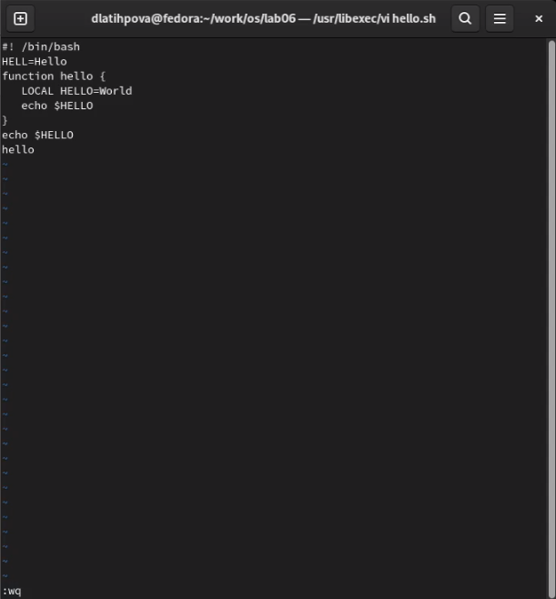
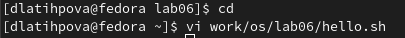

---
## Front matter
title: "Лабораторная работа №8"
subtitle: "Текстовой редактор vi"
author: "Латыпова Диана. НФИбд-02-21"

## Generic otions
lang: ru-RU
toc-title: "Содержание"

## Bibliography
bibliography: bib/cite.bib
csl: pandoc/csl/gost-r-7-0-5-2008-numeric.csl

## Pdf output format
toc: true # Table of contents
toc-depth: 2
lof: true # List of figures
lot: true # List of tables
fontsize: 12pt
linestretch: 1.5
papersize: a4
documentclass: scrreprt
## I18n polyglossia
polyglossia-lang:
  name: russian
  options:
	- spelling=modern
	- babelshorthands=true
polyglossia-otherlangs:
  name: english
## I18n babel
babel-lang: russian
babel-otherlangs: english
## Fonts
mainfont: PT Serif
romanfont: PT Serif
sansfont: PT Sans
monofont: PT Mono
mainfontoptions: Ligatures=TeX
romanfontoptions: Ligatures=TeX
sansfontoptions: Ligatures=TeX,Scale=MatchLowercase
monofontoptions: Scale=MatchLowercase,Scale=0.9
## Biblatex
biblatex: true
biblio-style: "gost-numeric"
biblatexoptions:
  - parentracker=true
  - backend=biber
  - hyperref=auto
  - language=auto
  - autolang=other*
  - citestyle=gost-numeric
## Pandoc-crossref LaTeX customization
figureTitle: "Рис."
tableTitle: "Таблица"
listingTitle: "Листинг"
lofTitle: "Список иллюстраций"
lotTitle: "Список таблиц"
lolTitle: "Листинги"
## Misc options
indent: true
header-includes:
  - \usepackage{indentfirst}
  - \usepackage{float} # keep figures where there are in the text
  - \floatplacement{figure}{H} # keep figures where there are in the text
---

# Цель работы

Познакомиться с операционной системой Linux. Получить практические навыки работы с редактором vi, установленным по умолчанию практически во всех дистрибутивах.

# Задание

1. Ознакомиться с теоретическим материалом.
2. Ознакомиться с редактором vi.
3. Выполнить упражнения, используя команды vi.

# Выполнение лабораторной работы

Для начала я создала каталог с именем ~/work/os/lab06 с помощью команды mkdir и перешла в него с помощью cd (рис. [-@fig:001])

{ #fig:001 width=70% }

Вызвала редактор vi и создала файл hello.sh(рис. [-@fig:002]):

1 **vi hello.sh**

{ #fig:002 width=70% }

Нажав клавишу i (вставка текста перед курсором)(рис. [-@fig:003]), ввела текст ниже:

1 **#!/bin/bash**

2 **HELL=Hello**

3 **function hello {**

4 **LOCAL HELLO=World**

5 **echo $HELLO**

6 **}**

7 **echo $HELLO**

8 **hello**

Нажала клавишу Esc (переход в командный режим) и, нажав Shift+: (переход в режим последней строки), ввела wq (сохранение текста и завершение работы) (рис. [-@fig:004])

{ #fig:003 width=70% }

{ #fig:004 width=70% }

После чего, сделала файл исполняемым(рис. [-@fig:005]):

1 **chmod +x hello.sh**

{ #fig:005 width=70% }

Перешла в домашний каталог и снова запустила редактор vi(рис. [-@fig:006]):

1 **vi work/os/lab06/hello.sh**

{ #fig:006 width=70% }

Перешла в режим вставки(i) и заменила HELL на HELLO, нажала Esc(рис. [-@fig:007]).

{ #fig:007 width=70% }

Нажала i, в четвертой строчке стерла слово LOCAL, нажала Esc(рис. [-@fig:008])

{ #fig:008 width=70% }

Нажала i, набрала там же слово local, нажала Esc(рис. [-@fig:009])

{ #fig:009 width=70% }

Снова нажала i, в конце вставила текст echo $HELLO, нажала Esc(рис. [-@fig:010])

{ #fig:010 width=70% }

Нажав Shift+:, ввела d d (удалить в буфер одну строку;), тем самым удалила последнюю строку(рис. [-@fig:011]).

{ #fig:011 width=70% }

Ввела команду отмены изменений u для отмены последней команды(рис. [-@fig:012])(рис. [-@fig:013]).

{ #fig:012 width=70% }

{ #fig:013 width=70% }

И наконец, ввела wq (сохранение текста и завершение работы), закрыв редактор vi(рис. [-@fig:014])(рис. [-@fig:015]).

{ #fig:014 width=70% }

{ #fig:015 width=70% }

# Контрольные вопросы

1. Дайте краткую характеристику режимам работы редактора vi.

В любой момент при работе в редакторе vi вы находитесь в одном из трёх режимов редактора: командный режим (command mode), режим ввода (insert mode) и режим последней строки (last line mode).

- При запуске редактора vi вы оказываетесь в командном режиме. В этом режиме можно давать команды для редактирования файлов или перейти в другой режим. Например, вводя x в командном режиме мы удаляем символ, на который указывает курсор. Клавиши-стрелки перемещают курсор по редактируемому файлу. Как правило, команды, используемые в командном режиме, состоят из одного или двух символов.

- Основной ввод и редактирование текста осуществляется в режиме ввода. При использовании редактора vi основное время, скорее всего, будет проводиться именно в этом режиме. Переход в режим ввода из командного режима осуществляется командой i (от слова insert). Находясь в режиме ввода, можно вводить текст в то место, куда указывает курсор. Выход из режима ввода в командный режим осуществляется клавишей Esc.

- Режим последней строки — это специальный режим, в котором редактору даются сложные команды. При вводе этих команд они отображаются в последней строке экрана (отсюда пошло название режима). Например, если ввести в командном режиме команду :, то осуществится переход в режим последней строки, и можно будет вводить такие команды, как wq (записать файл и покинуть редактор vi) или q! (выйти из редактора vi без сохранения изменений). В режиме последней строки обычно вводятся команды, название которых состоит из нескольких символов. В этом режиме в последнюю строку вводится команда, после чего нажимается клавиша Enter, и команда исполняется.

2. Как выйти из редактора, не сохраняя произведённые изменения?

Чтобы выйти из редактора, не сохраняя изменения, перейдите в обычный режим, нажав Esc , введите :q! и нажмите Enter .

3. Назовите и дайте краткую характеристику командам позиционирования.

**Позиционирование на символ**

h 	-Перемещает курсор на один символ влево

l 	-Перемещает курсор на один символ вправо

BACKSPACE 	-Перемещает курсор на один символ влево

SPACEBAR 	-Перемещает курсор на один символ вправо

fx 	-Осуществляет поиск указанного символа x справа от текущей позиции курсора

Fx 	-Осуществляет поиск указанного символа x слева от текущей позиции курсора

tx 	-Осуществляет перемещение курсора вправо на символ до указанного символа x

Tx 	-Осуществляет перемещение курсора влево на символ до указанного символа x

; 	-Повторяет предыдущий поиск символа. Команда ; запоминает символ и ищет следующее появление символа в текущей строке

, 	-Повторяет предыдущий поиск символа, но в обратном направлении

j 	-Перемещает курсор вниз на одну строку

k 	-Перемещает курсор вверх на одну строку

<CR> 	-Перемещает курсор вниз на одну строку и позиционирует на первый непустой символ

**Позиционирование на строку**

$ 	-Переместить курсор на последний символ в строке

0(ноль) 	Переместить курсор на первый символ в строке

^ 	-Переместить курсор на первый ненулевой символ в строке

**Позиционирование на слово**

w 	-Перемещает курсор к началу следующего слова

W 	-Игнорирует все знаки пунктуации и перемещает курсор на следующее после пробела слово

e 	-Перемещает курсор на последний символ в следующем слове

E 	-Перемещает курсор на последний символ в слове. Игнорирует все символы пунктуации за исключением пробела

b 	-Перемещает курсор к первому символу предыдущего слова

B 	-Используется подобно команде b, за исключением того, что слова разделяются только символами пробел и новая строка

**Позиционирование на предложение**

( 	-Перемещает курсор в начало текущего предложения

) 	-Перемещает курсор в начало следующего предложения
Позиционирование на параграф

{ 	-Переместить курсор в начало текущего параграфа, который ограничивается пустой строкой

} 	-Переместить курсор в начало следующего параграфа

**Позиционирование в окне**

H 	-Переместить курсор к первой строке экрана

M 	-Переместить курсор к средней строке экрана

L 	-Переместить курсор к последней строке экрана

4. Что для редактора vi является словом?

При осуществлении перемещения по тексту при помощи команд w, e, b, следует отметить, что, например, «слово» /dev/sda3 редактор определит как 4 различных слова. Чтобы это слово считалось как одно «большое слово», необходимо вводить команды заглавными буквами: W, E, B.

5. Каким образом из любого места редактируемого файла перейти в начало (конец) файла?

gg - перейти в начало файла;
G - перейти в конец файла;

8. Как отменить некорректное действие, связанное с процессом редактирования?

u - отменить последнее действие;

10. Как определить, не перемещая курсора, позицию, в которой заканчивается строка?

Предложение кончается либо на пустой строке, либо точкой или вопросительным/восклицательным знаком, после которых идут два пробела, или на конце строки. Точка или восклицательный знак с пробелом после них, не заканчивают предложение; это корректное поведение, основанное на классических правилах составления печатных документов, хотя оно часто кажется неправильным людям, которые никогда не изучали правила набора

12. Как определить режим работы редактора vi?

Внизу написано любой из режимов: командный режим (command mode), режим ввода (insert mode) и режим последней строки (last line mode).

# Выводы

Я познакомилась с операционной системой Linux, получила практические навыки работы с редактором vi, установленным по умолчанию практически во всех дистрибутивах.

