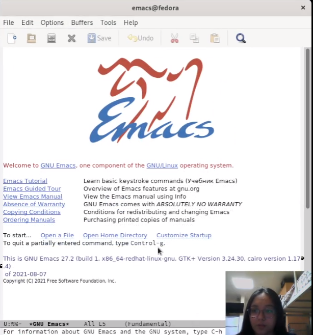
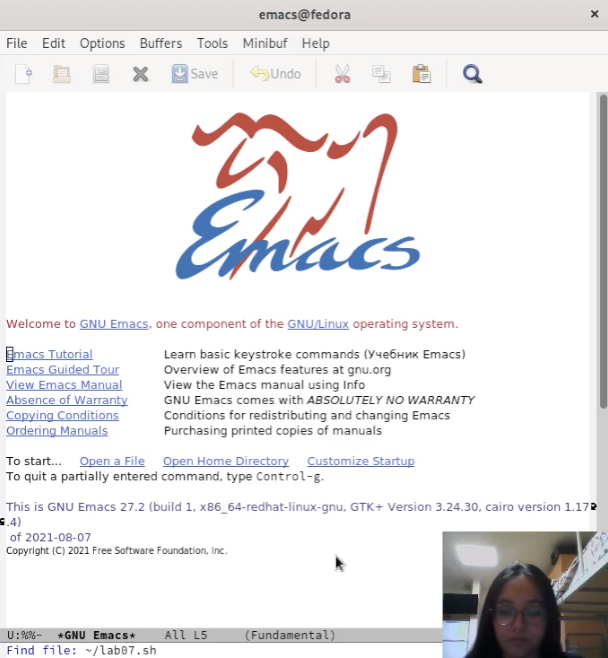
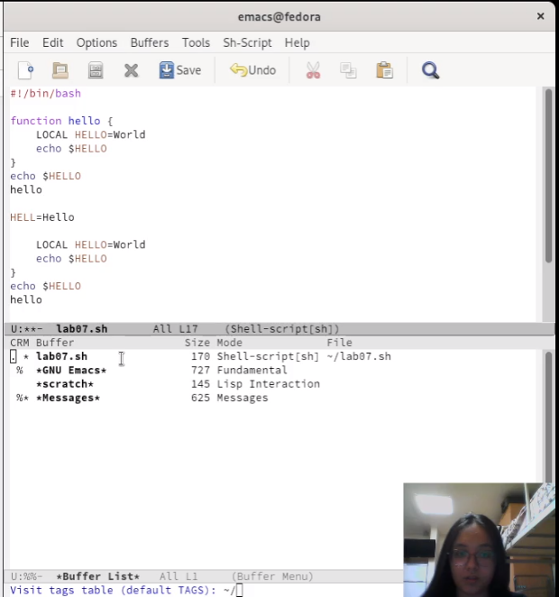
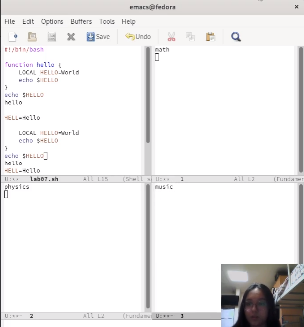
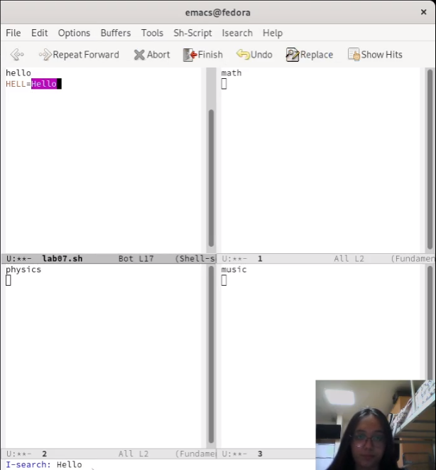
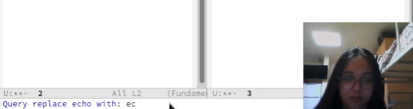
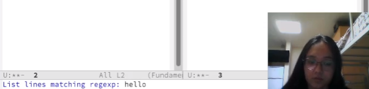

---
## Front matter
lang: ru-RU
title: Лабораторная работа №9. Текстовой редактор emacs
author: |
	Латыпова Диана. НФИбд-02-21
institute: |
	\inst{1}RUDN University, Moscow, Russian Federation

## Formatting
toc: false
slide_level: 2
theme: metropolis
header-includes: 
 - \metroset{progressbar=frametitle,sectionpage=progressbar,numbering=fraction}
 - '\makeatletter'
 - '\beamer@ignorenonframefalse'
 - '\makeatother'
aspectratio: 43
section-titles: true
---

## Цель работы

Познакомиться с операционной системой Linux. Получить практические навыки работы с редактором Emacs.

## Выполнение лабораторной работы

Для начала я открыла редактор emacs (рис. [-@fig:001]):

**emacs**

{ #fig:001 width=50% }

## Выполнение лабораторной работы

С помощью комбинации Ctrl-x Ctrl-f создала файл lab07.sh(рис. [-@fig:002])

{ #fig:002 width=50% }

## Текст

Набрала текст:

1 **#!/bin/bash**

2 **HELL=Hello**

3 **function hello {**

4 **LOCAL HELLO=World**

5 **echo $HELLO**

6 **}**

7 **echo $HELLO**

8 **hello**

После чего, сохранила файл с помощью комбинации Ctrl-x Ctrl-s

## Стандартные процедуры редактирования с помощью комбинаций клавиш

- Вырезала с помощью команды С-k целую строку

- Нажав C-y, вставила эту строку в конец файла

- Выделила область текста (C-space) и скопировала ее в буфер обмена (M-w)

- Вставила с помощью C-y эту область в конец файла

- Снова выделила эту область (C-space) и вырезала её (C-w)

- И отменила последнее действие с помощью C-/

## Использование команд по перемещению курсора

- Переместила курсор в начало строки (C-a)

- С помощью C-e переместила курсор в конец строки

- Переместила курсор в начало (M-<) и конец буфера (M->)

## Управление буферами

-  Вывела список активных буферов на экран (C-x C-b)(рис. [-@fig:003]):

{ #fig:003 width=50% }

## Управление буферами

- Переключилась на другие буферы:

-- GNU Emacs(рис. [-@fig:004])(рис. [-@fig:005]):

{ #fig:004 width=40% }

{ #fig:005 width=40% }

## Управление буферами

-- Scratch(рис. [-@fig:006])(рис. [-@fig:007]):

{ #fig:006 width=50% }

{ #fig:007 width=40% }

## Управление буферами

- Затем закрыла это окно (C-x 0)

- Снова переключилась между буферами, но уже без вывода их списка на экран (C-x b)

## Управление окнами

- Сначала поделила фрейм на 2 части по вертикали (C-x 3)

- А затем каждое из этих окон еще на две части по горизонтали (C-x 2)(рис. [-@fig:008]):

.png){ #fig:008 width=40% }

## Управление окнами

Итого у нас 4 фрейма.

- В каждом из четырёх созданных окон открыла новый буфер (файл)(C-x C-f) и ввела несколько строк текста(рис. [-@fig:009]):

{ #fig:009 width=40% }

## Режим поиска

- Переключилась с помощью C-s в режим поиска и нашла, к примеру, слово Hello(рис. [-@fig:010]):

{ #fig:010 width=50% }

## Режим поиска

- Переключилась между результатами поиска, нажимая C-s. На примере слова echo

- Затем вышла из режима поиска, нажав C-g

- Далее задание заключалось в переходе в режим поиска и замены (M-%), введя текст, который следует найти и заменить, нажать Enter , затем ввести текст для замены. После того как будут подсвечены результаты поиска, нажать ! для подтверждения замены.

## Режим поиска

Однако M-% у меня не зажималось, пооэтому я выполнила все то же самое, только замену сделала через меню(рис. [-@fig:011])(рис. [-@fig:012]):

{ #fig:011 width=50% }

## Режим поиска

{ #fig:012 width=50% }

## Режим поиска

- Испробовала другой режим поиска, нажав M-s o. Он отличается от обычного поиска тем,что переводит курсор на конец найденного слова, а не выделяет его.(рис. [-@fig:013])(рис. [-@fig:014]): 

{ #fig:013 width=50% }

## Режим поиска

{ #fig:014 width=50% }

## Выводы

Я познакомилась с ОС Linux, а также получила практические навыки работы с редактором Emacs.