---
## Front matter
title: "Лабораторная работа  №9"
subtitle: "Текстовой редактор emacs"
author: "Латыпова Диана. НФИбд-02-21"

## Generic otions
lang: ru-RU
toc-title: "Содержание"

## Bibliography
bibliography: bib/cite.bib
csl: pandoc/csl/gost-r-7-0-5-2008-numeric.csl

## Pdf output format
toc: true # Table of contents
toc-depth: 2
lof: true # List of figures
lot: true # List of tables
fontsize: 12pt
linestretch: 1.5
papersize: a4
documentclass: scrreprt
## I18n polyglossia
polyglossia-lang:
  name: russian
  options:
	- spelling=modern
	- babelshorthands=true
polyglossia-otherlangs:
  name: english
## I18n babel
babel-lang: russian
babel-otherlangs: english
## Fonts
mainfont: PT Serif
romanfont: PT Serif
sansfont: PT Sans
monofont: PT Mono
mainfontoptions: Ligatures=TeX
romanfontoptions: Ligatures=TeX
sansfontoptions: Ligatures=TeX,Scale=MatchLowercase
monofontoptions: Scale=MatchLowercase,Scale=0.9
## Biblatex
biblatex: true
biblio-style: "gost-numeric"
biblatexoptions:
  - parentracker=true
  - backend=biber
  - hyperref=auto
  - language=auto
  - autolang=other*
  - citestyle=gost-numeric
## Pandoc-crossref LaTeX customization
figureTitle: "Рис."
tableTitle: "Таблица"
listingTitle: "Листинг"
lofTitle: "Список иллюстраций"
lotTitle: "Список таблиц"
lolTitle: "Листинги"
## Misc options
indent: true
header-includes:
  - \usepackage{indentfirst}
  - \usepackage{float} # keep figures where there are in the text
  - \floatplacement{figure}{H} # keep figures where there are in the text
---

# Цель работы

Познакомиться с операционной системой Linux. Получить практические навыки работы с редактором Emacs.

# Задание

1. Открыть emacs.
2. Создать файл lab07.sh с помощью комбинации Ctrl-x Ctrl-f (C-x C-f).
3. Наберите текст.
4. Сохранить файл с помощью комбинации Ctrl-x Ctrl-s (C-x C-s).
5. Проделать с текстом стандартные процедуры редактирования, каждое действие долж-
но осуществляться комбинацией клавиш.

      5.1. Вырезать одной командой целую строку (С-k).

      5.2. Вставить эту строку в конец файла (C-y).

      5.3. Выделить область текста (C-space).

      5.4. Скопировать область в буфер обмена (M-w).

      5.5. Вставить область в конец файла.

      5.6. Вновь выделить эту область и на этот раз вырезать её (C-w).

      5.7. Отмените последнее действие (C-/).

6. Научитесь использовать команды по перемещению курсора.

      6.1. Переместите курсор в начало строки (C-a).

      6.2. Переместите курсор в конец строки (C-e).

      6.3. Переместите курсор в начало буфера (M-<).

      6.4. Переместите курсор в конец буфера (M->).

7. Управление буферами.

      7.1. Вывести список активных буферов на экран (C-x C-b).

      7.2. Переместитесь во вновь открытое окно (C-x) o со списком открытых буферов и переключитесь на другой буфер.

      7.3. Закройте это окно (C-x 0).

      7.4. Теперь вновь переключайтесь между буферами, но уже без вывода их списка на экран (C-x b).

8. Управление окнами.

      8.1. Поделите фрейм на 4 части: разделите фрейм на два окна по вертикали (C-x 3), а затем каждое из этих окон на две части по горизонтали (C-x 2)

      8.2. В каждом из четырёх созданных окон откройте новый буфер (файл) и введите несколько строк текста.

9. Режим поиска

      9.1. Переключитесь в режим поиска (C-s) и найдите несколько слов, присутствующих в тексте.

      9.2. Переключайтесь между результатами поиска, нажимая C-s.

      9.3. Выйдите из режима поиска, нажав C-g.

      9.4. Перейдите в режим поиска и замены (M-%), введите текст, который следует найти и заменить, нажмите Enter , затем введите текст для замены. После того как будут подсвечены результаты поиска, нажмите ! для подтверждения замены.

      9.5. Испробуйте другой режим поиска, нажав M-s o. Объясните, чем он отличается от обычного режима?

# Выполнение лабораторной работы

Для начала я открыла редактор emacs (рис. [-@fig:001])(рис. [-@fig:002]):

**emacs**

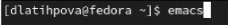{ #fig:001 width=70% }

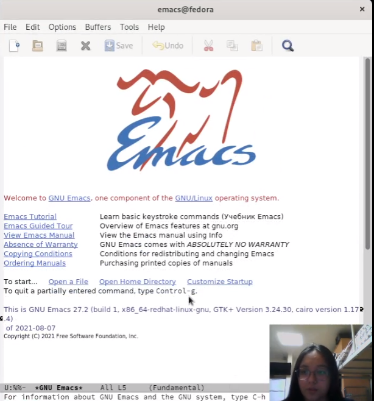{ #fig:002 width=70% }

С помощью комбинации Ctrl-x Ctrl-f создала файл lab07.sh(рис. [-@fig:003])

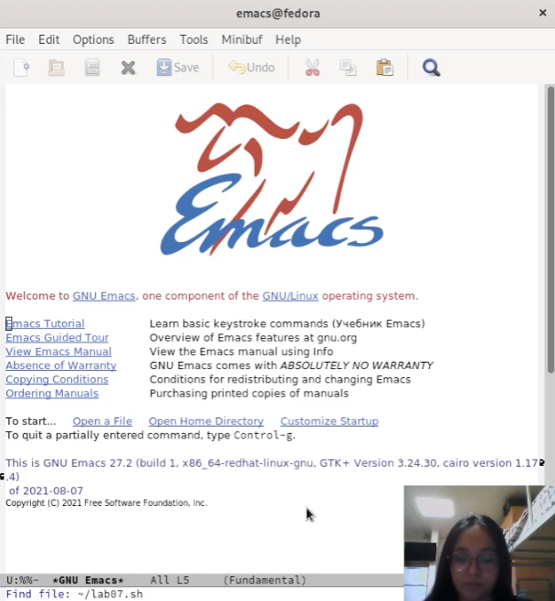{ #fig:003 width=70% }

Набрала текст (рис. [-@fig:004]):

1 **#!/bin/bash**

2 **HELL=Hello**

3 **function hello {**

4 **LOCAL HELLO=World**

5 **echo $HELLO**

6 **}**

7 **echo $HELLO**

8 **hello**

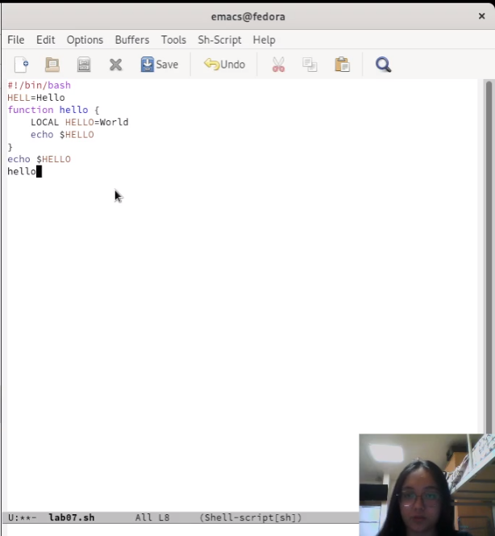{ #fig:004 width=70% }

После чего, сохранила файл с помощью комбинации Ctrl-x Ctrl-s(рис. [-@fig:005])

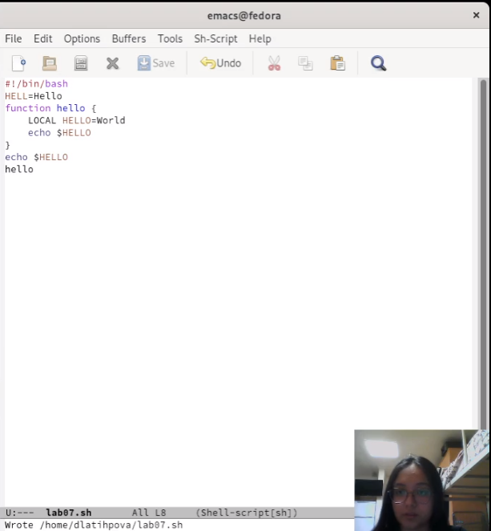{ #fig:005 width=70% }

По заданию проделала с текстом стандартные процедуры редактирования с помощью комбинаций клавиш:

- Вырезала с помощью команды С-k целую строку(рис. [-@fig:006]):

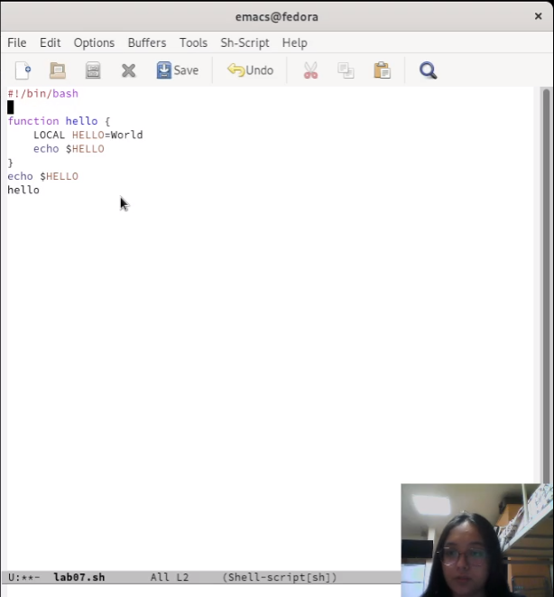{ #fig:006 width=70% }

- Нажав C-y, вставила эту строку в конец файла(рис. [-@fig:007]):

{ #fig:007 width=70% }

- Выделила область текста (C-space) и скопировала ее в буфер обмена (M-w)(рис. [-@fig:008]):

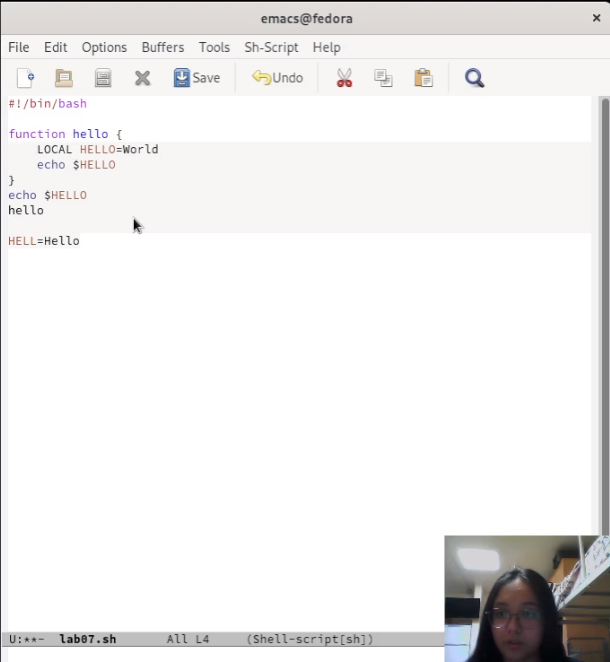{ #fig:008 width=70% }

- Вставила с помощью C-y эту область в конец файла(рис. [-@fig:009]):

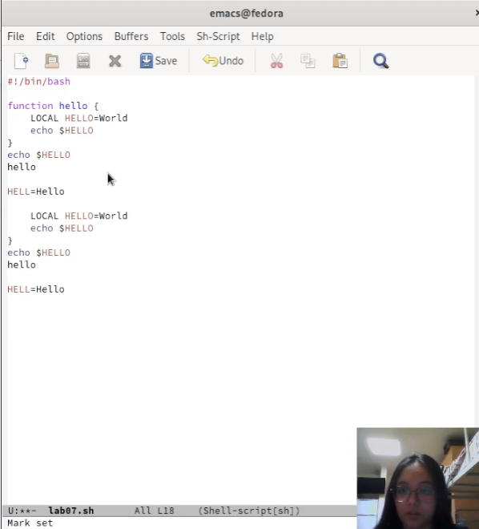{ #fig:009 width=70% }

- Снова выделила эту область (C-space) и вырезала её (C-w)(рис. [-@fig:010])(рис. [-@fig:011]):

.png){ #fig:010 width=70% }

.png){ #fig:011 width=70% }

- И отменила последнее действие с помощью C-/ (рис. [-@fig:012]):

{ #fig:012 width=70% }

Далее я научилась использовать команды по перемещению курсора:

- Переместила курсор в начало строки (C-a)(рис. [-@fig:013]).

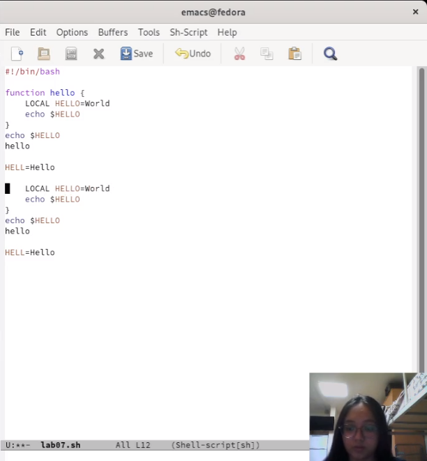{ #fig:013 width=70% }

- С помощью C-e переместила курсор в конец строки(рис. [-@fig:014]):

{ #fig:014 width=70% }

- Переместила курсор в начало (M-<) и конец буфера (M->)(рис. [-@fig:015]).

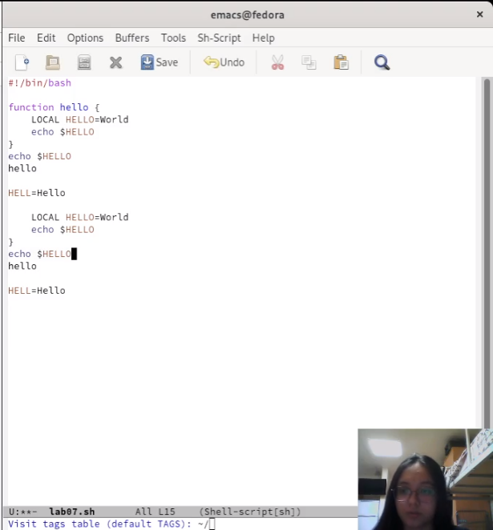{ #fig:015 width=70% }

Попрактиковалась в управлении буферами:

-  Вывела список активных буферов на экран (C-x C-b)(рис. [-@fig:016]):

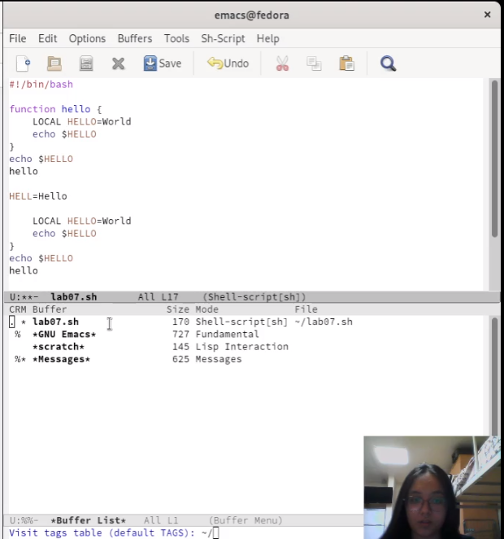{ #fig:016 width=70% }

- Переключилась на другие буферы:

-- GNU Emacs(рис. [-@fig:017])(рис. [-@fig:018]):

{ #fig:017 width=70% }

{ #fig:018 width=70% }

-- Scratch(рис. [-@fig:019])(рис. [-@fig:020]):

{ #fig:019 width=70% }

{ #fig:020 width=70% }

- Затем закрыла это окно (C-x 0)(рис. [-@fig:021]):
     
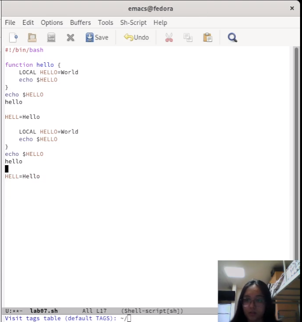{ #fig:021 width=70% }

- Снова переключилась между буферами, но уже без вывода их списка на экран (C-x b)(рис. [-@fig:022]):

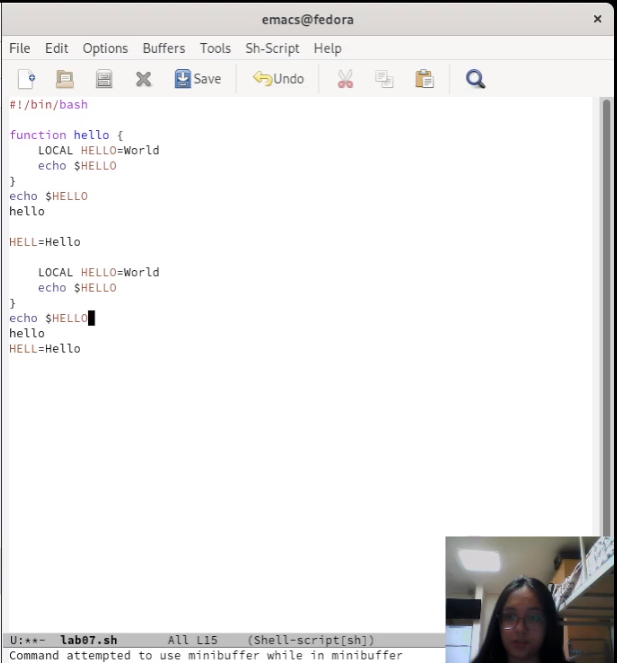{ #fig:022 width=70% }

Научилась управлять окнами:

- Сначала поделила фрейм на 2 части по вертикали (C-x 3)(рис. [-@fig:023]):
    
.png){ #fig:023 width=70% }

- А затем каждое из этих окон еще на две части по горизонтали (C-x 2)(рис. [-@fig:024]):

.png){ #fig:024 width=70% }

Итого у нас 4 фрейма.

- В каждом из четырёх созданных окон открыла новый буфер (файл)(C-x C-f) и ввела несколько строк текста(рис. [-@fig:025]):

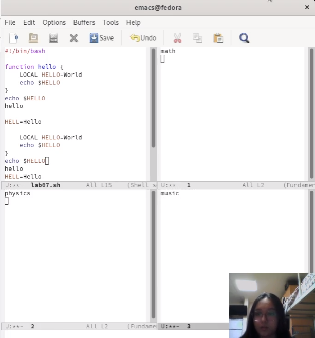{ #fig:025 width=70% }

И наконец, поработала с режимом поиска:

- Переключилась с помощью C-s в режим поиска и нашла, к примеру, слово Hello(рис. [-@fig:026]):

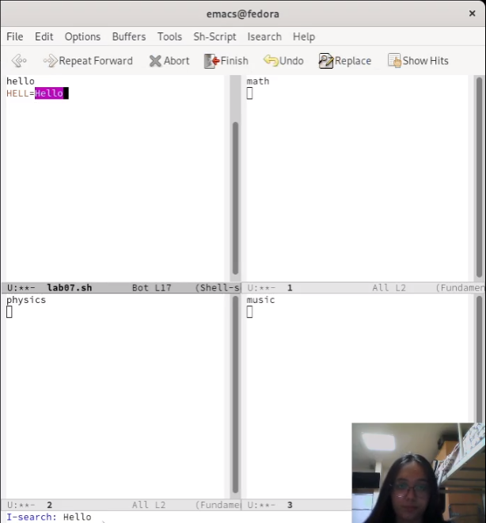{ #fig:026 width=70% }

- Переключилась между результатами поиска, нажимая C-s. На примере слова echo(рис. [-@fig:027])(рис. [-@fig:028]):

.png){ #fig:027 width=70% }

.png){ #fig:028 width=70% }

- Затем вышла из режима поиска, нажав C-g(рис. [-@fig:029]):

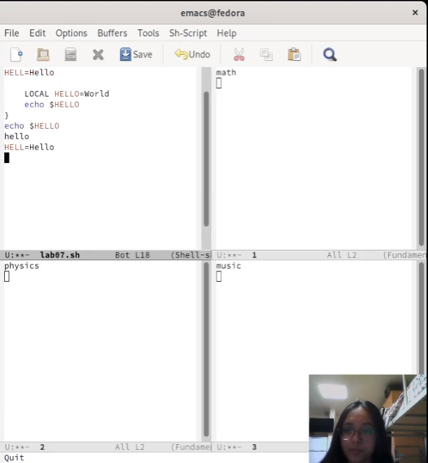{ #fig:029 width=70% }

- Далее задание заключалось в переходе в режим поиска и замены (M-%), введя текст, который следует найти и заменить, нажать Enter , затем ввести текст для замены. После того как будут подсвечены результаты поиска, нажать ! для подтверждения замены.

Однако M-% у меня не зажималось, пооэтому я выполнила все то же самое, только замену сделала через меню(рис. [-@fig:030])(рис. [-@fig:031]):

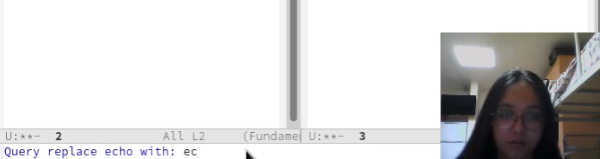{ #fig:030 width=70% }

{ #fig:031 width=70% }

- Испробовала другой режим поиска, нажав M-s o. Он отличается от обычного поиска тем,что переводит курсор на конец найденного слова, а не выделяет его.(рис. [-@fig:032])(рис. [-@fig:033]): 

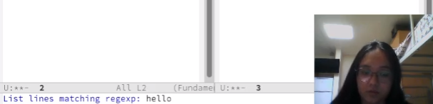{ #fig:032 width=70% }

{ #fig:033 width=70% }

# Контрольные вопросы

1. Кратко охарактеризуйте редактор emacs.

Предоставляет средства, которые дают “нечто большее, чем простая вставка или удаление”, а именно: Просмотр и редактирование 2-х или более файлов (с возможностью перемещения текста между файлами).

2. Какие особенности данного редактора могут сделать его сложным для освоения новичком?

Для работы с emacs используется система меню и комбинаций клавиш. Используются сочетания c клавишами и . Сложности могут возникнуть так как на клавиатуре для IBM PC совместимых ПК клавиши нет, то вместо нее можно использовать или \verb . Для доступа к системе меню используйте клавишу F10.

3. Своими словами опишите, что такое буфер и окно в терминологии emacs’а.

Буфер — это основная единица редактирования; один буфер соответствует одному куску редактируемого текста. 

Окно в emacs — это область экрана, в которой отображается буфер. 

4. Можно ли открыть больше 10 буферов в одном окне?

Можно.

5. Какие буферы создаются по умолчанию при запуске emacs?

Только что запущенный Emacs несет буфера с именем *scratch*, *GNU Emacs*, *Messages*.

6. Какие клавиши вы нажмёте, чтобы ввести следующую комбинацию C-c | и C-c C-|?

Клавиши: Ctrl,C,Shift,,] и ,Ctrl,C Ctrl,Shift,,]

7. Как поделить текущее окно на две части?

по вертикали (C-x 3)

по горизонтали (C-x 2)

8. В каком файле хранятся настройки редактора emacs?

В файле Emacs 

9. Какую функцию выполняет клавиша <- и можно ли её переназначить?

Kнопка backspace( стереть букву ) = функции C-k и ее можно переназначить.

10. Какой редактор вам показался удобнее в работе vi или emacs? Поясните почему.

На мой взгляд, emacs оказался удобнее. Он более ммощный, чем любой другой редактор, интегрируется с большинством инструментов для разработки открытого ПО.

# Выводы

Я познакомилась с ОС Linux, а также получила практические навыки работы с редактором Emacs.

