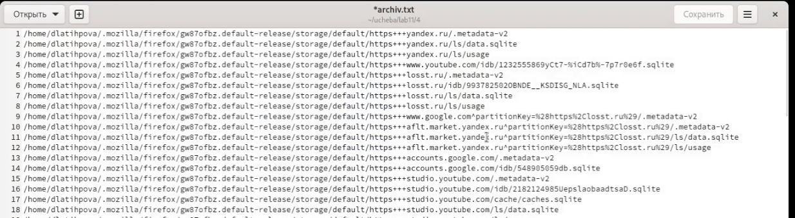

---
## Front matter
lang: ru-RU
title: Лабораторная работа №11. Программирование в командном процессоре ОС UNIX. Ветвления и циклы.
author: |
	Латыпова Диана. НФИбд-02-21
institute: |
	\inst{1}RUDN University, Moscow, Russian Federation

## Formatting
toc: false
slide_level: 2
theme: metropolis
header-includes: 
 - \metroset{progressbar=frametitle,sectionpage=progressbar,numbering=fraction}
 - '\makeatletter'
 - '\beamer@ignorenonframefalse'
 - '\makeatother'
aspectratio: 43
section-titles: true
---

# Цель работы

## Цель работы

Изучить основы программирования в оболочке ОС UNIX. Научится писать более сложные командные файлы с использованием логических управляющих конструкций и циклов.

# Выполнение лабораторной работы

## 1 Задание

 Используя команды getopts grep, написать командный файл, который анализирует командную строку с ключами:

- -iinputfile — прочитать данные из указанного файла;
- -ooutputfile — вывести данные в указанный файл;
- -pшаблон — указать шаблон для поиска;
- -C — различать большие и малые буквы;
- -n — выдавать номера строк.

а затем ищет в указанном файле нужные строки, определяемые ключом -p.

## Скрипт 1 задания

#!/bin/bash

while getopts "i:o:p:cn" opt

do

	case $opt in
	     i)inputfile="$OPTARG";;
	     o)outputfile="$OPTARG";;
	     p)sample="$OPTARG";;
	     c)reg="";;
	     n)line="";;
	esac
  
done

    grep -n "$sample" "$inputfile" > "$outputfile"

## 1 Задание
 
Результат 1 скрипта (рис. [-@fig:001]):

{ #fig:001 width=70% }

## 2 Задание

Написать на языке Си программу, которая вводит число и определяет, является ли оно больше нуля, меньше нуля или равно нулю. Затем программа завершается с помощью функции exit(n), передавая информацию в о коде завершения в оболочку. Командный файл должен вызывать эту программу и, проанализировав с помощью команды $?, выдать сообщение о том, какое число было введено.

## Скрипт 2 задания

#!/bin/bash

RES=result

SRC=main.cpp

    if [ "$SRC" -nt "$RES" ]

    then

	   echo "Creating $RES ..."

	  g++ -o $RES $SRC

fi

## Скрипт 2 задания

./$ RES $1

ec=$?

     if [ "$ec" == "1" ]

     then

	  echo "input > 0"

fi

## Скрипт 2 задания

    if [ "$ec" == "2" ]

    then

	echo "input = 0"

fi

    if [ "$ec" == "3" ]

    then

	echo "input < 0"

fi

## 2 Задание

**Код С++:**

#include <iostream>

using namespace std;

int main(int argc,char *argc[])

{

    if (atoi(argv[1]>0) exit(1);
    else if (atoi(argv[1]==0) exit(2);
    else exit(3);
    return 0;
}

## 2 Задание

Результат 2 скрипта(рис. [-@fig:002]):

{ #fig:002 width=70% }

## 3 Задание

Написать командный файл, создающий указанное число файлов, пронумерованных последовательно от 1 до 𝑁 (например 1.tmp, 2.tmp, 3.tmp,4.tmp и т.д.). Число файлов, которые необходимо создать, передаётся в аргументы командной строки. Этот же командный файл должен уметь удалять все созданные им файлы (если они существуют).

## Скрипт 3 задания

#!/bin/bash

while getopts c:r opt 

do 

	case $opt in
	     c)n="$OPTARG"; for i in $(seq 1 $n); 
         do touch "$i.tmp"; done;;
	     r)for i in $(find -name "*.tmp"); do rm $i; done;;
	esac

done

## 3 Задание

Результат 3 скрипта(рис. [-@fig:003]):

{ #fig:003 width=70% }

## 4 Задание

Написать командный файл, который с помощью команды tar запаковывает в архив все файлы в указанной директории. Модифицировать его так, чтобы запаковывались только те файлы, которые были изменены менее недели тому назад (использовать команду find).

## Скрипт 4 задани z

#!/bin/bash

while getopts :p: opt

do
	case $opt in
	      p)dir="$OPTARG";;
	esac
done

find $dir -mtime -7 -mtime +0 -type f > archiv.txt

tar -cf result.tar -T archiv.txt

## 4 Задание

Результат 3 скрипта(рис. [-@fig:004])(рис. [-@fig:005]):

{ #fig:004 width=70% }

## 4 Задание

{ #fig:005 width=70% }

# Выводы

## Выводы

Я изучила основы программирования в оболочке ОС UNIX и научилась писать более сложные командные файлы с использованием логических управляющих конструкций и циклов.