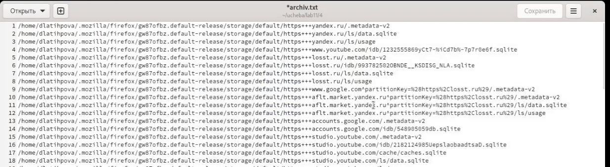

---
## Front matter
title: "Лабораторная работа №11"
subtitle: "Программирование в командном процессоре ОС UNIX. Ветвления и циклы."
author: "Латыпова Диана. НФИбд-02-21"

## Generic otions
lang: ru-RU
toc-title: "Содержание"

## Bibliography
bibliography: bib/cite.bib
csl: pandoc/csl/gost-r-7-0-5-2008-numeric.csl

## Pdf output format
toc: true # Table of contents
toc-depth: 2
lof: true # List of figures
lot: true # List of tables
fontsize: 12pt
linestretch: 1.5
papersize: a4
documentclass: scrreprt
## I18n polyglossia
polyglossia-lang:
  name: russian
  options:
	- spelling=modern
	- babelshorthands=true
polyglossia-otherlangs:
  name: english
## I18n babel
babel-lang: russian
babel-otherlangs: english
## Fonts
mainfont: PT Serif
romanfont: PT Serif
sansfont: PT Sans
monofont: PT Mono
mainfontoptions: Ligatures=TeX
romanfontoptions: Ligatures=TeX
sansfontoptions: Ligatures=TeX,Scale=MatchLowercase
monofontoptions: Scale=MatchLowercase,Scale=0.9
## Biblatex
biblatex: true
biblio-style: "gost-numeric"
biblatexoptions:
  - parentracker=true
  - backend=biber
  - hyperref=auto
  - language=auto
  - autolang=other*
  - citestyle=gost-numeric
## Pandoc-crossref LaTeX customization
figureTitle: "Рис."
tableTitle: "Таблица"
listingTitle: "Листинг"
lofTitle: "Список иллюстраций"
lotTitle: "Список таблиц"
lolTitle: "Листинги"
## Misc options
indent: true
header-includes:
  - \usepackage{indentfirst}
  - \usepackage{float} # keep figures where there are in the text
  - \floatplacement{figure}{H} # keep figures where there are in the text
---

# Цель работы

Изучить основы программирования в оболочке ОС UNIX. Научится писать более сложные командные файлы с использованием логических управляющих конструкций и циклов.

# Задание

1. Используя команды getopts grep, написать командный файл, который анализирует командную строку с ключами:

- -iinputfile — прочитать данные из указанного файла;
- -ooutputfile — вывести данные в указанный файл;
- -pшаблон — указать шаблон для поиска;
- -C — различать большие и малые буквы;
- -n — выдавать номера строк.

а затем ищет в указанном файле нужные строки, определяемые ключом -p.

2. Написать на языке Си программу, которая вводит число и определяет, является ли оно больше нуля, меньше нуля или равно нулю. Затем программа завершается с помощью функции exit(n), передавая информацию в о коде завершения в оболочку. Командный файл должен вызывать эту программу и, проанализировав с помощью команды $?, выдать сообщение о том, какое число было введено.

3. Написать командный файл, создающий указанное число файлов, пронумерованных последовательно от 1 до 𝑁 (например 1.tmp, 2.tmp, 3.tmp,4.tmp и т.д.). Число файлов, которые необходимо создать, передаётся в аргументы командной строки. Этот же командный файл должен уметь удалять все созданные им файлы (если они существуют).

4. Написать командный файл, который с помощью команды tar запаковывает в архив все файлы в указанной директории. Модифицировать его так, чтобы запаковывались только те файлы, которые были изменены менее недели тому назад (использовать команду find).

# Выполнение лабораторной работы

Для начале я перешла в папку lab11:

**cd ucheba/lab11**

1. Запустила редактор emacs 11_1. Здесь написала скрипт 1 задания (рис. [-@fig:001])

**Скрипт 1 задания:**

#!/bin/bash

while getopts "i:o:p:cn" opt

do

	case $opt in
	     i)inputfile="$OPTARG";;
	     o)outputfile="$OPTARG";;
	     p)sample="$OPTARG";;
	     c)reg="";;
	     n)line="";;

	esac
  
done

grep -n "$sample" "$inputfile" > "$outputfile"

{ #fig:001 width=70% }

Сначала предоставила права на выполнение файла 11_1. И запустила файл(рис. [-@fig:002]):

1 **chmod +x 11_1**

2 **./11_1 -i conf.txt -o result.txt -p n etconf -c -n**

3 **ls**

4 **cat result.txt**

{ #fig:002 width=70% }

Все корректно работает.

2. Запустила редактор emacs 11_2. Здесь написала скрипт 2 задания (рис. [-@fig:003])

**Скрипт 2 задания:**

#!/bin/bash

RES=result

SRC=main.cpp

if [ "$SRC" -nt "$RES" ]

then

	echo "Creating $RES ..."

	g++ -o $RES $SRC

fi

./$RES $1

ec=$?

if [ "$ec" == "1" ]

then

	echo "input > 0"

fi

if [ "$ec" == "2" ]

then

	echo "input = 0"

fi

if [ "$ec" == "3" ]

then

	echo "input < 0"

fi

{ #fig:003 width=70% }

Код С++(рис. [-@fig:004]):

#include <iostream>

using namespace std;

int main(int argc,char *argc[])

{
    if (atoi(argv[1]>0) exit(1);

    else if (atoi(argv[1]==0) exit(2);

    else exit(3);

    return 0;
}

{ #fig:004 width=70% }

Снова сначала предоставила права на выполнение файла 11_2. И запустила файл(рис. [-@fig:005]):

1 **chmod +x 11_2**

2 **./11_2 1**

3 **./11_2 0**

4 **./11_2 -2**

{ #fig:005 width=70% }

3. Приступила к написанию 3 скрипта(рис. [-@fig:006]):

**emacs 11_3**

**Скрипт 3 задания:** 

#!/bin/bash

while getopts c:r opt 

do 

	case $opt in
	     c)n="$OPTARG"; for i in $(seq 1 $n); do touch "$i.tmp"; done;;
	     r)for i in $(find -name "*.tmp"); do rm $i; done;;

	esac

done

{ #fig:006 width=70% }

Снова предоставила права на выполнение файла 11_3. И запустила файл(рис. [-@fig:007]):

1 **chmod +x 11_3**

2 **./11_3 -c 5**

3 **ls**

4 **./11_3 -r**

3 **ls**

{ #fig:007 width=70% }

Скрипт корректно работает.

4. Запустила редактор emacs 11_4. Здесь написала скрипт 4 задания (рис. [-@fig:008])

**Скрипт 4 задания:**

#!/bin/bash

while getopts :p: opt

do

	case $opt in
	      p)dir="$OPTARG";;
	esac
done

find $dir -mtime -7 -mtime +0 -type f > archiv.txt

tar -cf result.tar -T archiv.txt

{ #fig:008 width=70% }

Снова предоставила права на выполнение файла 11_3. И запустила файл(рис. [-@fig:009])(рис. [-@fig:010]):

1 **chmod +x 11_4**

2 **./11_4 -p /home/dlatihpova/**

{ #fig:009 width=70% }

{ #fig:010 width=70% }

# Контрольные вопросы

1. Каково предназначение команды getopts?

Команда getopts является встроенной командой командной оболочки bash, предназначенной для разбора параметров сценариев. Она обрабатывает исключительно однобуквенные параметры как с аргументами, так и без них и этого вполне достаточно для передачи сценариям любых входных данных.

2. Какое отношение метасимволы имеют к генерации имён файлов?

При перечислении имен файлов текущего каталога можно использовать следующие символы: · * — соответствует произвольной, в том числе и пустой строке; · ? — соответствует любому одному символу; · [c1-c1] — соответствует любому символу, лексикографически на ходящемуся между символами c1 и с2. · echo * — выведет имена всех файлов текущего каталога, что представляет собой простейший аналог команды ls; · ls .c — выведет все файлы с последними двумя символами, равными .c. · echo prog.? — выдаст все файлы, состоящие из пяти или шести символов, первыми пятью символами которых являются prog. . · [a-z] — соответствует произвольному имени файла в текущем каталоге, начинающемуся с любой строчной буквы латинского алфавита.

3. Какие операторы управления действиями вы знаете?

Часто бывает необходимо обеспечить проведение каких-либо действий циклически и управление дальнейшими действиями в зависимости от результатов проверки некоторого условия. Для решения подобных задач язык программирования bash предоставляет Вам возможность использовать такие управляющие конструкции, как for, case, if и while. С точки зрения командного процессора эти управляющие конструкции являются обычными командами и могут использоваться как при создании командных файлов, так и при работе в интерактивном режиме. Команды, реализующие подобные конструкции, по сути дела являются операторами языка программирования bash. Поэтому при описании языка программирования bash термин оператор будет использоваться наравне с термином команда.

4. Какие операторы используются для прерывания цикла?

Прерывание цикла: операторы break, Continue, return и функция Abort.

5. Для чего нужны команды false и true?

true,: - всегда возвращает 0 в качестве кода выхода. false - всегда возвращает 1 в качестве кода выхода.

6. Что означает строка if test -f man$s/$i.$s, встреченная в командном файле?

Введенная строка означает условие существования файла man$s/$i.$s

7. Объясните различия между конструкциями while и until.

Если речь идет о 2-х параллельных действиях, то это while. когда мы показываем, что сначала делается 1-е действие. потом оно заканчивается при наступлении 2-го действия, применяем until.

# Выводы

Я изучила основы программирования в оболочке ОС UNIX и научилась писать более сложные командные файлы с использованием логических управляющих конструкций и циклов.

