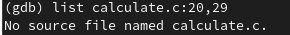
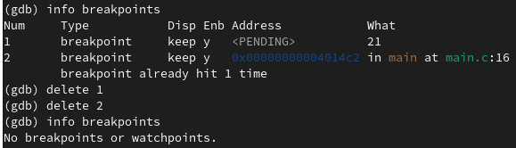

---
## Front matter
lang: ru-RU
title: Лабораторная работа №13. Средства, применяемые при разработке программного обеспечения в ОС типа UNIX/Linux
author: |
	Латыпова Диана. НФИбд-02-21
institute: |
	\inst{1}RUDN University, Moscow, Russian Federation

## Formatting
toc: false
slide_level: 2
theme: metropolis
header-includes: 
 - \metroset{progressbar=frametitle,sectionpage=progressbar,numbering=fraction}
 - '\makeatletter'
 - '\beamer@ignorenonframefalse'
 - '\makeatother'
aspectratio: 43
section-titles: true
---

# Цель работы

## Цель работы

Приобрести простейшие навыки разработки, анализа, тестирования и отладки приложений в ОС типа UNIX/Linux на примере создания на языке программирования С калькулятора с простейшими функциями.

# Задание

## Задание

1. В домашнем каталоге создайте подкаталог ~/work/os/lab_prog.

2. Создайте в нём файлы: calculate.h, calculate.c, main.c.

Это будет примитивнейший калькулятор, способный складывать, вычитать, умножать и делить, возводить число в степень, брать квадратный корень, вычислять sin, cos, tan. При запуске он будет запрашивать первое число, операцию, второе число. После этого программа выведет результат и остановится.

3. Выполните компиляцию программы посредством gcc.

4. При необходимости исправьте синтаксические ошибки.

## Задание

5. Создайте Makefile с содержанием...

6. С помощью gdb выполните отладку программы calcul (перед использованием gdb исправьте Makefile).

7. С помощью утилиты splint попробуйте проанализировать коды файлов calculate.c и main.c.

# Выполнение лабораторной работы

## Выполнение лабораторной работы

Я создала в домашнем каталоге каталог lab_prog:

**mkdir  ~/work/os/lab_prog**

В созданном каталоге создала еще 3 файла: calculate.h, calculate.c, main.c:

1 **touch calculate.h**

2 **touch calculate.c**

3 **touch main.c**

## Файлы

После чего открыла каждый файл в редакторе emacs и вписала содержимое(рис. [-@fig:001]):

{ #fig:001 width=60% }

## Листинг файла calculate.c

      ////////////////////////////////////
      // calculate.c

      #include <stdio.h>
    
      #include <math.h>
      #include <string.h>
      #include "calculate.h"

      float
      Calculate(float Numeral, char Operation[4])
      {
        float SecondNumeral;
        if(strncmp(Operation, "+", 1) == 0)
         {

## Листинг файла calculate.c

           printf("Второе слагаемое: ");
           scanf("%f",&SecondNumeral);
            return(Numeral + SecondNumeral);
          }
        else if(strncmp(Operation, "-", 1) == 0)
          {
      printf("Вычитаемое: ");
      scanf("%f",&SecondNumeral);
      return(Numeral - SecondNumeral);
          }
        else if(strncmp(Operation, "*", 1) == 0)
          {
      printf("Множитель: ");
      scanf("%f",&SecondNumeral);

## Листинг файла calculate.c

      return(Numeral * SecondNumeral);
          }
       else if(strncmp(Operation, "/", 1) == 0)
          {
      printf("Делитель: ");
      scanf("%f",&SecondNumeral);
      if(SecondNumeral == 0)
	      {
	    printf("Ошибка: деление на ноль! ");
	    return(HUGE_VAL);
	      }

## Листинг файла calculate.c

      else
	      return(Numeral / SecondNumeral);
         }
       else if(strncmp(Operation, "pow", 3) == 0)
          {
      printf("Степень: ");
      scanf("%f",&SecondNumeral);
      return(pow(Numeral, SecondNumeral));
         }

## Листинг файла calculate.c

       else if(strncmp(Operation, "sqrt", 4) == 0)
          return(sqrt(Numeral));
        else if(strncmp(Operation, "sin", 3) == 0)
         return(sin(Numeral));
       else if(strncmp(Operation, "cos", 3) == 0)
          return(cos(Numeral));
        else if(strncmp(Operation, "tan", 3) == 0)
         return(tan(Numeral));
       else
         {
           printf("Неправильно введено действие ");
           return(HUGE_VAL);
         }
      }

## Листинг файла calculate.h

        ///////////////////////////////////////
      // calculate.h

      #ifndef CALCULATE_H_
      #define CALCULATE_H_

      float Calculate(float Numeral, char Operation[4]);

      #endif /*CALCULATE_H_*/

## Листинг файла main.c

      #include <stdio.h>
      #include "calculate.h"

      int
      main (void)
      {
        float Numeral;
        char Operation[4];
        float Result;
        printf("Число: ");

## Листинг файла main.c

        scanf("%f",&Numeral);
        printf("Операция (+,-,*,/,pow,sqrt,sin,cos,tan): ");
        scanf("%s",&Operation);
        Result = Calculate(Numeral, Operation);
        printf("%6.2f\n",Result);
        return 0;
      }

## Компиляция программы

Далее я выполнила компиляцию программы посредством gcс:

1 **gcc -c calculate.c**

2 **gcc -c -g main.c**

3 **gcc calculate.o main.o -o calcul -lm**

## Компиляция программы

И просмотрели, что создался исполняемый файл calcul(рис. [-@fig:002]):

{ #fig:002 width=70% }

## Листинг файла Makefile

    CC = gcc
    CFLAGS = 
    LIBS = -lm

    calcul: calculate.o main.o
	    gcc calculate.o main.o -o calcul $(LIBS)

    calculate.o: calculate.c calculate.h
      gcc -c calculate.c $(CFLAGS)

    main.o: main.c calculate.h
	    gcc -c main.c $(CFLAGS)

    clean:
	    -rm calcul *.o *~

## Листинг исправленного файла Makefile

    CC = gcc
    CFLAGS = -g
    LIBS = -lm

    calcul: calculate.o main.o
	    gcc calculate.o main.o -o calcul $(LIBS)

    calculate.o: calculate.c calculate.h
      gcc -c calculate.c $(CFLAGS)

    main.o: main.c calculate.h
	    gcc -c main.c $(CFLAGS)

    clean:
	    -rm calcul *.o 

## Отладка программы calcul

С помощью gdb выполнила отладку программы calcul:

**gdb ./calcul**

## Запуск программы внутри отладчика

Запустила внутри отладчика программу(рис. [-@fig:003]):

**run**

{ #fig:003 width=60% }

## Просмотр кода

Сначала постранично просмотрела код, затем с 12 по 15 строку(рис. [-@fig:004]):

1 **list**

2 **list 12,15**

{ #fig:004 width=60% }

## Просмотр кода

Затем попробовала просмотреть определённые строки не основного файла. Но не вышло(рис. [-@fig:005]):

**list calculate.c:20,29**

{ #fig:005 width=70% }

## Точки останова

Попробовала поставить точку останова на строке номер 21, однако такой строки нет:

**break 21**

Поэтому поставила точку останова на 16 строке(рис. [-@fig:006]):

**break 16**

{ #fig:006 width=40% }

## Запуск программы внутри отладчика

Запустила программу внутри отладчика и убедилась, что программа остановливается в момент прохождения точки останова. Команда backtrace показала нам весь стек вызываемых функций от начала программы до текущего места(рис. [-@fig:007]):

## Запуск программы внутри отладчика

{ #fig:007 width=60% }

## Просмотр значения переменной Numeral

Далее посмотрела, чему равно на этом этапе значение переменной Numeral и сравнила с результатом вывода на экран после использования команды(рис. [-@fig:008]):

1 **print Numeral**

2 **display Numeral**

## Просмотр значения переменной Numeral

{ #fig:008 width=70% }

## Удаление точек останова

Удалила точки останова(рис. [-@fig:009]):

1 **info breakpoints**

2 **delete 1**

3 **delete 2**

4 **info breakpoints**

## Удаление точек останова

{ #fig:009 width=70% }

## Анализ кодов

И наконец, с помощью утилиты splint проанализировала коды файлов calculate.c и main.c(рис. [-@fig:010])(рис. [-@fig:011]):

1 **splint calculate.c**

2 **splint main.c**

## Анализ кода файла calculate.c

{ #fig:010 width=70% }

## Анализ кода файла main.c

{ #fig:011 width=70% }

# Выводы

## Выводы

Я приобрела простейшие навыки разработки, анализа, тестирования и отладки приложений в ОС типа UNIX/Linux на примере создания на языке программирования С калькулятора с простейшими функциями.