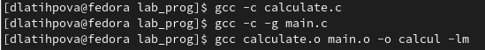
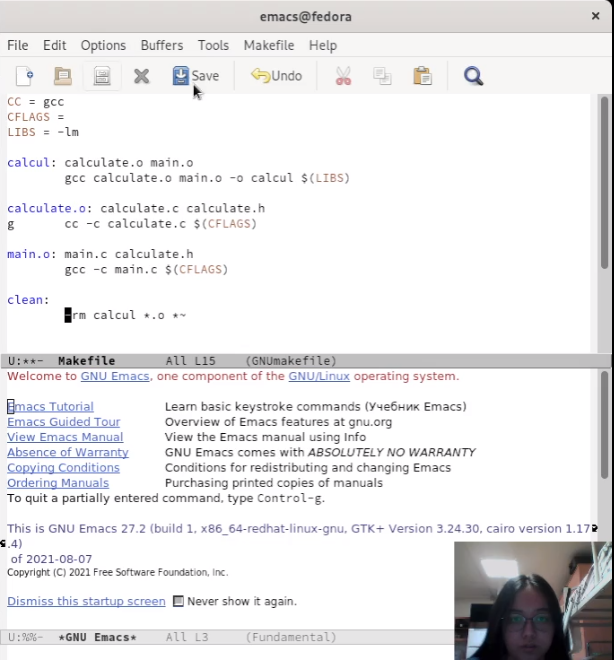
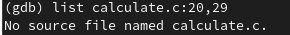
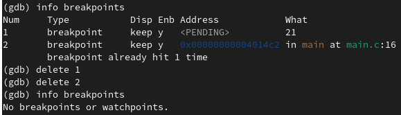

---
## Front matter
title: "Лабораторная работа №13"
subtitle: "Средства, применяемые при разработке программного обеспечения в ОС типа UNIX/Linux"
author: "Латыпова Диана. НФИбд-02-21"

## Generic otions
lang: ru-RU
toc-title: "Содержание"

## Bibliography
bibliography: bib/cite.bib
csl: pandoc/csl/gost-r-7-0-5-2008-numeric.csl

## Pdf output format
toc: true # Table of contents
toc-depth: 2
lof: true # List of figures
lot: true # List of tables
fontsize: 12pt
linestretch: 1.5
papersize: a4
documentclass: scrreprt
## I18n polyglossia
polyglossia-lang:
  name: russian
  options:
	- spelling=modern
	- babelshorthands=true
polyglossia-otherlangs:
  name: english
## I18n babel
babel-lang: russian
babel-otherlangs: english
## Fonts
mainfont: PT Serif
romanfont: PT Serif
sansfont: PT Sans
monofont: PT Mono
mainfontoptions: Ligatures=TeX
romanfontoptions: Ligatures=TeX
sansfontoptions: Ligatures=TeX,Scale=MatchLowercase
monofontoptions: Scale=MatchLowercase,Scale=0.9
## Biblatex
biblatex: true
biblio-style: "gost-numeric"
biblatexoptions:
  - parentracker=true
  - backend=biber
  - hyperref=auto
  - language=auto
  - autolang=other*
  - citestyle=gost-numeric
## Pandoc-crossref LaTeX customization
figureTitle: "Рис."
tableTitle: "Таблица"
listingTitle: "Листинг"
lofTitle: "Список иллюстраций"
lotTitle: "Список таблиц"
lolTitle: "Листинги"
## Misc options
indent: true
header-includes:
  - \usepackage{indentfirst}
  - \usepackage{float} # keep figures where there are in the text
  - \floatplacement{figure}{H} # keep figures where there are in the text
---

# Цель работы

Приобрести простейшие навыки разработки, анализа, тестирования и отладки приложений в ОС типа UNIX/Linux на примере создания на языке программирования С калькулятора с простейшими функциями.

# Задание

1. В домашнем каталоге создайте подкаталог ~/work/os/lab_prog.

2. Создайте в нём файлы: calculate.h, calculate.c, main.c.

Это будет примитивнейший калькулятор, способный складывать, вычитать, умножать и делить, возводить число в степень, брать квадратный корень, вычислять sin, cos, tan. При запуске он будет запрашивать первое число, операцию, второе число. После этого программа выведет результат и остановится.

3. Выполните компиляцию программы посредством gcc.

4. При необходимости исправьте синтаксические ошибки.

5. Создайте Makefile с содержанием...

6. С помощью gdb выполните отладку программы calcul (перед использованием gdb исправьте Makefile).

7. С помощью утилиты splint попробуйте проанализировать коды файлов calculate.c и main.c.

# Выполнение лабораторной работы

Я создала в домашнем каталоге каталог lab_prog(рис. [-@fig:001]):

**mkdir  ~/work/os/lab_prog**

В созданном каталоге создала еще 3 файла: calculate.h, calculate.c, main.c(рис. [-@fig:001]):

1 **touch calculate.h**

2 **touch calculate.c**

3 **touch main.c**

{ #fig:001 width=70% }

После чего открыла каждый файл в редакторе emacs и вписала содержимое(рис. [-@fig:002]):

{ #fig:002 width=70% }

- Листинг файла calculate.c(рис. [-@fig:003]):

      ////////////////////////////////////
      // calculate.c

      #include <stdio.h>
    
      #include <math.h>
      #include <string.h>
      #include "calculate.h"

      float
      Calculate(float Numeral, char Operation[4])
      {
        float SecondNumeral;
        if(strncmp(Operation, "+", 1) == 0)
         {
           printf("Второе слагаемое: ");
           scanf("%f",&SecondNumeral);
            return(Numeral + SecondNumeral);
          }
        else if(strncmp(Operation, "-", 1) == 0)
          {
      printf("Вычитаемое: ");
      scanf("%f",&SecondNumeral);
      return(Numeral - SecondNumeral);
          }
        else if(strncmp(Operation, "*", 1) == 0)
          {
      printf("Множитель: ");
      scanf("%f",&SecondNumeral);
      return(Numeral * SecondNumeral);
          }
       else if(strncmp(Operation, "/", 1) == 0)
          {
      printf("Делитель: ");
      scanf("%f",&SecondNumeral);
      if(SecondNumeral == 0)
	      {
	    printf("Ошибка: деление на ноль! ");
	    return(HUGE_VAL);
	      }
      else
	      return(Numeral / SecondNumeral);
         }
       else if(strncmp(Operation, "pow", 3) == 0)
          {
      printf("Степень: ");
      scanf("%f",&SecondNumeral);
      return(pow(Numeral, SecondNumeral));
         }
       else if(strncmp(Operation, "sqrt", 4) == 0)
          return(sqrt(Numeral));
        else if(strncmp(Operation, "sin", 3) == 0)
         return(sin(Numeral));
       else if(strncmp(Operation, "cos", 3) == 0)
          return(cos(Numeral));
        else if(strncmp(Operation, "tan", 3) == 0)
         return(tan(Numeral));
       else
         {
           printf("Неправильно введено действие ");
           return(HUGE_VAL);
         }
      }

{ #fig:003 width=70% }

- Листинг файла calculate.h(рис. [-@fig:004]):

        ///////////////////////////////////////
      // calculate.h

      #ifndef CALCULATE_H_
      #define CALCULATE_H_

      float Calculate(float Numeral, char Operation[4]);

      #endif /*CALCULATE_H_*/

{ #fig:004 width=70% }

- Листинг файла main.c(рис. [-@fig:005]):

      ////////////////////////////////////////
      // main.c

      #include <stdio.h>
      #include "calculate.h"

      int
      main (void)
      {
        float Numeral;
        char Operation[4];
        float Result;
        printf("Число: ");
        scanf("%f",&Numeral);
        printf("Операция (+,-,*,/,pow,sqrt,sin,cos,tan): ");
        scanf("%s",&Operation);
        Result = Calculate(Numeral, Operation);
        printf("%6.2f\n",Result);
        return 0;
      }

{ #fig:005 width=70% }

Далее я выполнила компиляцию программы посредством gcc(рис. [-@fig:006]):

1 **gcc -c calculate.c**

2 **gcc -c -g main.c**

3 **gcc calculate.o main.o -o calcul -lm**

{ #fig:006 width=70% }

И просмотрели, что создался исполняемый файл calcul(рис. [-@fig:007]):

{ #fig:007 width=70% }

Синтаксических ошибок не оказалось, поэтому перешла к следующему заданию.

С помощью touch создала Makefile и вписала следующее содержимое(рис. [-@fig:008]):

    CC = gcc
    CFLAGS = 
    LIBS = -lm

    calcul: calculate.o main.o
	    gcc calculate.o main.o -o calcul $(LIBS)

    calculate.o: calculate.c calculate.h
      gcc -c calculate.c $(CFLAGS)

    main.o: main.c calculate.h
	    gcc -c main.c $(CFLAGS)

    clean:
	    -rm calcul *.o *~

{ #fig:008 width=70% }

Перед использованием gdb исправила Makefile(рис. [-@fig:009]):

    CC = gcc
    CFLAGS = -g
    LIBS = -lm

    calcul: calculate.o main.o
	    gcc calculate.o main.o -o calcul $(LIBS)

    calculate.o: calculate.c calculate.h
      gcc -c calculate.c $(CFLAGS)

    main.o: main.c calculate.h
	    gcc -c main.c $(CFLAGS)

    clean:
	    -rm calcul *.o 

{ #fig:009 width=70% }

С помощью gdb выполнила отладку программы calcul(рис. [-@fig:010]):

**gdb ./calcul**

{ #fig:010 width=70% }

Запустила внутри отладчика программу(рис. [-@fig:011]):

**run**

{ #fig:011 width=70% }

Сначала постранично просмотрела код, затем с 12 по 15 строку(рис. [-@fig:012]):

1 **list**

2 **list 12,15**

{ #fig:012 width=70% }

Затем попробовала просмотреть определённые строки не основного файла. Но не вышло(рис. [-@fig:013]):

**list calculate.c:20,29**

{ #fig:013 width=70% }

Попробовала поставить точку останова на строке номер 21, однако такой строки нет(рис. [-@fig:014]):

**break 21**

{ #fig:014 width=70% }

Поэтому поставила точку останова на 16 строке(рис. [-@fig:015]):

**break 16**

{ #fig:015 width=70% }

Запустила программу внутри отладчика и убедилась, что программа остановливается в момент прохождения точки останова. Команда backtrace показала нам весь стек вызываемых функций от начала программы до текущего места(рис. [-@fig:016]):

1 **run**

2 **5**

3 **backtrace**

{ #fig:016 width=70% }

Далее посмотрела, чему равно на этом этапе значение переменной Numeral и сравнила с результатом вывода на экран после использования команды(рис. [-@fig:017]):

1 **print Numeral**

2 **display Numeral**

{ #fig:017 width=70% }

Удалила точки останова(рис. [-@fig:018]):

1 **info breakpoints**

2 **delete 1**

3 **delete 2**

4 **info breakpoints**

{ #fig:018 width=70% }

И наконец, с помощью утилиты splint проанализировала коды файлов calculate.c и main.c(рис. [-@fig:019])(рис. [-@fig:020]):

1 **splint calculate.c**

2 **splint main.c**

{ #fig:019 width=70% }

{ #fig:020 width=70% }

# Контрольные вопросы

1. Как получить информацию о возможностях программ gcc, make, gdb и др.?

Дополнительную информацию о этих программах можно получить с помощью функций info и man.

2. Назовите и дайте краткую характеристику основным этапам разработки приложений в UNIX.

- создание исходного кода программы;

- представляется в виде файла;

- сохранение различных вариантов исходного текста;

- анализ исходного текста; Необходимо отслеживать изменения исходного кода, а также при работе более двух программистов над проектом программы нужно, чтобы они не делали изменений кода в одно время.

- компиляция исходного текста и построение исполняемого модуля;

- тестирование и отладка;

- проверка кода на наличие ошибок

- сохранение всех изменений, выполняемых при тестировании и отладке.

3. Что такое суффикс в контексте языка программирования? Приведите примеры использования.

Суффикс это составная часть имени файла. Система сборки каких-либо программ (например язык java) требует, чтобы имена файлов исходного кода заканчивались на .java.

Компиляторы C и компилятор C++ одинаково относятся к суффиксам, но каждый раз давать файлам заголовков имена с .h (расширение) настолько общепринято, что надоедает. Есть недостаток строгих правил, это к примеру несколько стилей именования файлов реализации в языке C++, например стандартные суффиксы .C, .cpp, .cxx, .c++, и .cc. Иногда встречаются файлы заголовков C++ с суффиксом .hpp.  

Главное — это соблюдать единообразие при выборе суффикса.

4. Каково основное назначение компилятора языка С в UNIX?

Основное назначение компиляторов – служить для разработки новых прикладных и системных программ с помощью языков высокого уровня.

5. Для чего предназначена утилита make?

make — утилита, автоматизирующая процесс преобразования файлов из одной формы в другую. Чаще всего это компиляция исходного кода в объектные файлы и последующая компоновка в исполняемые файлы или библиотеки.

6. Приведите пример структуры Makefile. Дайте характеристику основным элементам этого файла.

Makefile для программы abcd.c мог бы иметь вид:

      #
      #
      Makefile
      #
      CC = gcc
      CFLAGS =
      LIBS = -lm
      calcul: calculate.o main.o gcc calculate.o main.o -o calcul $(LIBS) calculate.o: calculate.c calculate.h gcc -c calculate.c $(CFLAGS) main.o: main.c calculate.h gcc -c main.c $(CFLAGS) clean: -rm calcul *.o *~
      #End Makefile 

В общем случае make-файл содержит последовательность записей (строк), определяющих зависимости между файлами. Первая строка записи представляет собой список целевых (зависимых) файлов, разделенных пробелами, за которыми следует двоеточие и список файлов, от которых зависят целевые. Текст, следующий за точкой с запятой, и все последующие строки, начинающиеся с литеры табуляции, являются командами OC UNIX, которые необходимо выполнить для обновления целевого файла.

7. Назовите основное свойство, присущее всем программам отладки. Что необходимо сделать, чтобы его можно было использовать?

Отладка программы — это процесс устранения ошибок из текста программы. Все ошибки делятся на синтаксические и логические. При наличии синтаксических ошибок (ошибок в написании операторов) программа не запускается. Подобные ошибки исправляются проще всего. Логические ошибки — это ошибки, при которых программа работает, но неправильно. В этом случае программа выдаёт не те результаты, которые ожидает разработчик или пользователь.

8. Назовите и дайте основную характеристику основным командам отладчика gdb.

Основные команды gdb:

- break или b - создание точки останова;
- info или i - вывести информацию, доступные значения: break, registers, frame, locals, args;
- run или r - запустить программу;
- continue или c - продолжить выполнение программы после точки останова;
- step или s - выполнить следующую строчку программы с заходом в функцию;
- next или n - выполнить следующую строчку без захода в функцию;
- print или p - вывести значение переменной;
- backtrace или bt - вывести стек вызовов;
- x - просмотр содержимого памяти по адресу;
- ptype - просмотр типа переменной;
- h или help - просмотр справки по команде;
- q или quit - выход из программы.

9. Опишите по шагам схему отладки программы, которую Вы использовали при выполнении лабораторной работы.

- Выполнили компиляцию программы
- Увидели ошибки в программе
- Открыли редактор и исправили программу
- Загрузили программу в отладчик gdb
- run — отладчик выполнил программу, мы ввели требуемые значения.
- программа завершена, gdb не видит ошибок.

10. Прокомментируйте реакцию компилятора на синтаксические ошибки в программе при его первом запуске.

Отладчику не понравился формат %s для &Operation, т.к %s — символьный формат, а значит необходим только Operation.

11. Назовите основные средства, повышающие понимание исходного кода программы.

Если вы работаете с исходным кодом, который не вами разрабатывался, то назначение различных конструкций может быть не совсем понятным. Система разработки приложений UNIX предоставляет различные средства, повышающие понимание исходного кода. 

К ним относятся: 
- cscope - исследование функций, содержащихся в программе; 
- splint — критическая проверка программ, написанных на языке С.

12. Каковы основные задачи, решаемые программой splint?

- Проверка корректности задания аргументов всех использованных в программе функций, а также типов возвращаемых ими значений;

- Поиск фрагментов исходного текста, корректных с точки зрения синтаксиса языка Си, но малоэффективных с точки зрения их реализации или содержащих в себе семантические ошибки;

- Общая оценка мобильности пользовательской программы.

# Выводы

Я приобрела простейшие навыки разработки, анализа, тестирования и отладки приложений в ОС типа UNIX/Linux на примере создания на языке программирования С калькулятора с простейшими функциями.