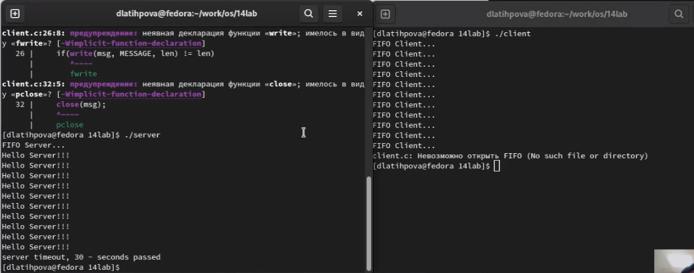

---
## Front matter
lang: ru-RU
title: Лабораторная работа №14. Именованные каналы
author: |
	Латыпова Диана. НФИбд-02-21
institute: |
	\inst{1}RUDN University, Moscow, Russian Federation

## Formatting
toc: false
slide_level: 2
theme: metropolis
header-includes: 
 - \metroset{progressbar=frametitle,sectionpage=progressbar,numbering=fraction}
 - '\makeatletter'
 - '\beamer@ignorenonframefalse'
 - '\makeatother'
aspectratio: 43
section-titles: true
---

# Цель работы

## Цель работы

Приобретение практических навыков работы с именованными каналами.

# Задание

## Задание

Изучите приведённые в тексте программы server.c и client.c. Взяв данные примеры за образец, напишите аналогичные программы, внеся следующие изменения:

1. Работает не 1 клиент, а несколько (например, два).
2. Клиенты передают текущее время с некоторой периодичностью (например, раз в пять секунд). Используйте функцию sleep() для приостановки работы клиента.
3. Сервер работает не бесконечно, а прекращает работу через некоторое время (например, 30 сек). Используйте функцию clock() для определения времени работы сервера. 
Что будет в случае, если сервер завершит работу, не закрыв канал?

# Выполнение лабораторной работы

## Выполнение лабораторной работы

Для начала я создала 5 файлов: server.c, client.c, client2.c, common.h, makefile.

После чего, написала коды для каждого файла, используя примеры в работе.

## Листинг файла client.c

      #include "common.h"

      #define MESSAGE "Hello Server!!!\n"

      int
      main()
      {
      int msg, len, i;
      long int t;

      for(i=0; i<20; i++)
      {
          sleep(3);

## Листинг файла client.c

          t=time(NULL);
          printf("FIFO Client...\n");

          if((msg = open(FIFO_NAME, O_WRONLY)) < 0)
          {
             fprintf(stderr,"%s: Невозможно открыть FIFO (%s)\n",
            __FILE__, strerror(errno));
             exit(-1);
         }

         len = strlen(MESSAGE);

          if(write(msg, MESSAGE, len) != len)

## Листинг файла client.c

         {
             fprintf(stderr,"%s: Ошибка записи  в FIFO (%s)\n",
              __FILE__, strerror(errno));
              exit(-2);
          }
         close(msg);
      }
         exit(0);
      }

## Листинг файла client2.c

      #include "common.h"

      #define MESSAGE "Hello Server!!!\n"

      int
      main()
      {
      int writefd, msglen, count;
      long long int t;
      char message[10];

      for(count=0; count<-5; ++count)

## Листинг файла client2.c

      {
         sleep(5);
         t=(long long int) time(0);
         sprintf(message, "%lli", t);
         if((writefd = open(FIFO_NAME, O_WRONLY)) < 0)
         {
              fprintf(stderr,"%s: Невозможно открыть FIFO (%s)  \n",
                 __FILE__, strerror(errno));
             exit(-1);
          }

         msglen = strlen(MESSAGE);

## Листинг файла client2.c

          if(write(writefd, MESSAGE, msglen) != msglen)
          {
              fprintf(stderr,"%s: Ошибка записи  в FIFO (%s)\n",
             __FILE__, strerror(errno));
            exit(-2);
         }

      }
          close(writefd);
          exit(0);
      }

## Листинг файла common.h

      #ifndef __COMMON_H__
      #define __COMMON_H__

      #include <stdio.h>
      #include <stdlib.h>
      #include <string.h>
      #include <errno.h>
      #include <sys/types.h>
      #include <sys/stat.h>
      #include <fcntl.h>

      #define FIFO_NAME "/tmp/fifo"
      #define MAX_BUFF 80

      #endif /* __COMMON_H__ */

## Листинг файла makefile

      all: server client

      server: server.c common.h
      		gcc server.c -o server

      client: client.c common.h
      		gcc client.c -o client

      clean:
      		-rm server client *.o

## Листинг файла server.c

      #include "common.h"
      int
      main()
      {
        int readfd;
        int n;
        char buff[MAX_BUFF];
        printf("FIFO Server...\n");

        if(mknod(FIFO_NAME, S_IFIFO | 0666, 0) < 0)
         {
           fprintf(stderr, "%s: Невозможно создать FIFO (%s)\n",
	           __FILE__, strerror(errno));

## Листинг файла server.c

            exit(-1);
         }

       if((readfd = open(FIFO_NAME, O_RDONLY)) < 0)
          {
           fprintf(stderr, "%s: Невозможно открыть FIFO (%s)\n",
	           __FILE__, strerror(errno));
            exit(-2);
         }
       clock_t now=time(NULL), start=time(NULL);
       while(now-start<30)
         {
            while((n = read(readfd, buff, MAX_BUFF)) > 0)

## Листинг файла server.c

	     {
	       if(write(1, buff, n) != n)
	         {
	           fprintf(stderr, "%s: Ошибка вывода (%s)\n",
		           __FILE__, strerror(errno));
	         }
	      }
            now=time(NULL);
         }
        printf("server timeout, %li - seconds passed\n",(now-start));
        close(readfd);

## Листинг файла server.c

        if(unlink(FIFO_NAME) < 0)
          {
            fprintf(stderr, "%s: Невозможно удалить FIFO (%s)\n",
	           __FILE__, strerror(errno));
           exit(-4);
         }
        exit(0);
        }

## Запуск программы

Запустила 2 терминала в папке с данными файлами. Выполнила команду make, создалось 2 командных файла(рис. [-@fig:001]):

**make**

{ #fig:001 width=60% }

## Запуск программы

Затем в первом терминале запустила server, а во втором- client(рис. [-@fig:002])

## Запуск программы

{ #fig:002 width=95% }

# Выводы

## Выводы

Я приобрела практические навыки работы с именованными каналами.