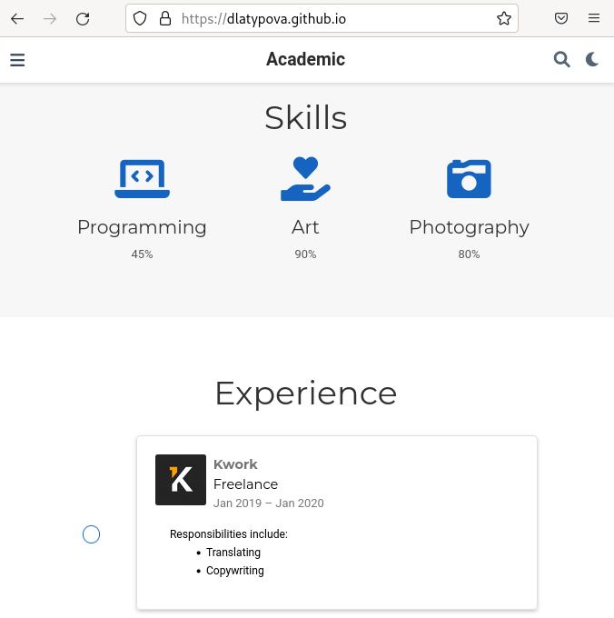
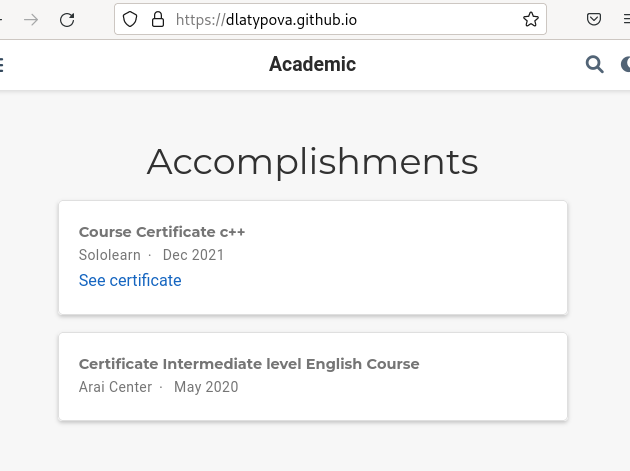
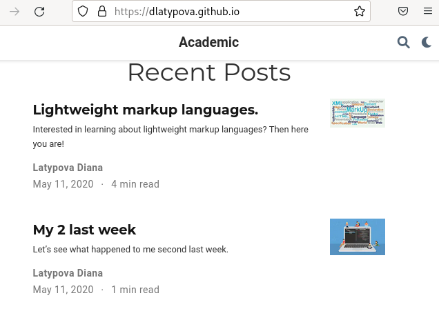

---
## Front matter
lang: ru-RU
title: Индивидуальный проект. 3 этап.
author: |
	Латыпова Диана. НФИбд-02-21
institute: |
	\inst{1}RUDN University, Moscow, Russian Federation

## Formatting
toc: false
slide_level: 2
theme: metropolis
header-includes: 
 - \metroset{progressbar=frametitle,sectionpage=progressbar,numbering=fraction}
 - '\makeatletter'
 - '\beamer@ignorenonframefalse'
 - '\makeatother'
aspectratio: 43
section-titles: true
---

## Цель работы

Добавить к своему сайту достижения.

## Задание

Список достижений:
    
- Добавить информацию о навыках (Skills).

- Добавить информацию об опыте (Experience).

- Добавить информацию о достижениях (Accomplishments).

Сделать пост по прошедшей неделе.

Добавить пост на тему по выбору:

- Легковесные языки разметки.

- Языки разметки. LaTeX.

- Язык разметки Markdown.

## Выполнение индивидуального проекта

Работаем в Visual Studio Code. 

- Чтобы добавить информацию о навыках, я открыла файл skills.md. Внесла свои навыки, добавила соответствующие иконки(рис. [-@fig:001]):

{ #fig:001 width=50% }

## Выполнение индивидуального проекта

- В файл experience.md внесла информацию о своем опыте, в папку ~/work/didi/assets/media/icons/brands добавила нужный мне логотип 

- В файл accomplishments.md добавила информацию о своих достижениях

## Посты

Далее приступила к написанию постов

## Моя прошлая неделя

Создала каталог My_last_week2, вставила в файл index.md, заранне подготовленный мною, текст(рис. [-@fig:002]). Сохранила нужную картинку в каталог My_last_week2(рис. [-@fig:003]):

{ #fig:002 width=50% }

{ #fig:003 width=40% }

## Легковесные языки разметки

Все тоже самое сделала с постом "Легковесные языки разметки"

## Занесение изменений

После всех изменений в каталоге didi я открыла терминал, запустила hugo:

**hugo**

В каталоге public, а затем в didi открыла терминал и добавила все в гит с помощью гит команд:

1  **git add .**

2  **git commit -am "3stage"**

3  **git push origin main**

## Сайт

Далее осталось лишь обновить мой сайт(рис. [-@fig:004])(рис. [-@fig:005])(рис. [-@fig:006]):

## Сайт

{ #fig:004 width=60% }

## Сайт

{ #fig:005 width=60% }

## Сайт

{ #fig:006 width=60% }

## Выводы

Я добавила достижения на свой сайт: информацию о навыках (Skills), об опыте (Experience) и достижениях (Accomplishments). А также сделала 2 поста: по прошедшей неделе и "Легковесные языки разметки".
