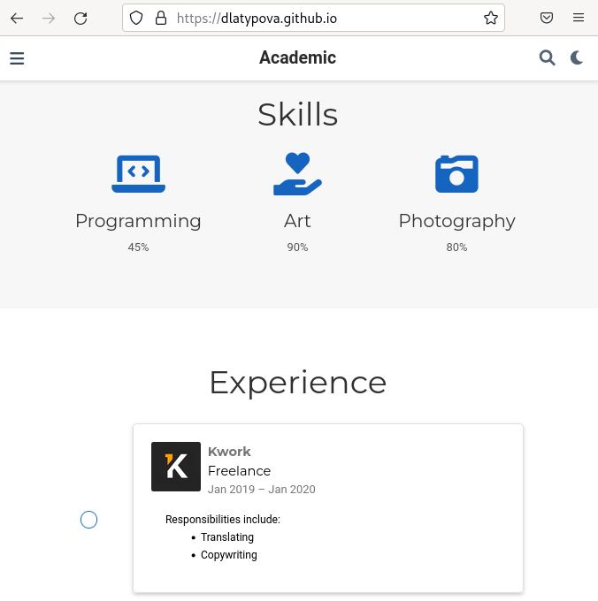
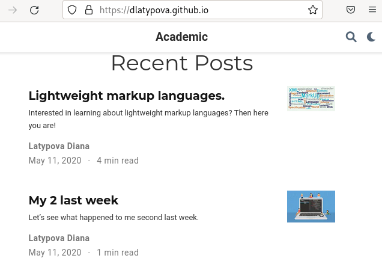

---
## Front matter
title: "Индивидуальный проект"
subtitle: "3 этап"
author: "Латыпова Диана. НФИбд-02-21"

## Generic otions
lang: ru-RU
toc-title: "Содержание"

## Bibliography
bibliography: bib/cite.bib
csl: pandoc/csl/gost-r-7-0-5-2008-numeric.csl

## Pdf output format
toc: true # Table of contents
toc-depth: 2
lof: true # List of figures
lot: true # List of tables
fontsize: 12pt
linestretch: 1.5
papersize: a4
documentclass: scrreprt
## I18n polyglossia
polyglossia-lang:
  name: russian
  options:
	- spelling=modern
	- babelshorthands=true
polyglossia-otherlangs:
  name: english
## I18n babel
babel-lang: russian
babel-otherlangs: english
## Fonts
mainfont: PT Serif
romanfont: PT Serif
sansfont: PT Sans
monofont: PT Mono
mainfontoptions: Ligatures=TeX
romanfontoptions: Ligatures=TeX
sansfontoptions: Ligatures=TeX,Scale=MatchLowercase
monofontoptions: Scale=MatchLowercase,Scale=0.9
## Biblatex
biblatex: true
biblio-style: "gost-numeric"
biblatexoptions:
  - parentracker=true
  - backend=biber
  - hyperref=auto
  - language=auto
  - autolang=other*
  - citestyle=gost-numeric
## Pandoc-crossref LaTeX customization
figureTitle: "Рис."
tableTitle: "Таблица"
listingTitle: "Листинг"
lofTitle: "Список иллюстраций"
lotTitle: "Список таблиц"
lolTitle: "Листинги"
## Misc options
indent: true
header-includes:
  - \usepackage{indentfirst}
  - \usepackage{float} # keep figures where there are in the text
  - \floatplacement{figure}{H} # keep figures where there are in the text
---

# Цель работы

Добавить к своему сайту достижения.

# Задание

Список достижений:
    
- Добавить информацию о навыках (Skills).

- Добавить информацию об опыте (Experience).

- Добавить информацию о достижениях (Accomplishments).

Сделать пост по прошедшей неделе.

Добавить пост на тему по выбору:

- Легковесные языки разметки.

- Языки разметки. LaTeX.

- Язык разметки Markdown.

# Выполнение индивидуального проекта

Работаем в Visual Studio Code. Чтобы добавить информацию о навыках, я открыла файл skills.md. Внесла свои навыки, добавила соответствующие иконки (рис. [-@fig:001]):

{ #fig:001 width=70% }

В файл experience.md внесла информацию о своем опыте(рис. [-@fig:002]), в папку ~/work/didi/assets/media/icons/brands добавила логотип Kwork(рис. [-@fig:003]):

{ #fig:002 width=70% }

{ #fig:003 width=70% }

В файл accomplishments.md добавила информацию о своих достижениях(рис. [-@fig:004]):

{ #fig:004 width=70% }

Далее приступила к написанию постов: 

- моя прошлая неделя:

Создала каталог My_last_week2(рис. [-@fig:005]), вставила в файл index.md, заранне подготовленный мною, текст(рис. [-@fig:006]). Сохранила нужную картинку в каталог My_last_week2(рис. [-@fig:007]):

{ #fig:005 width=70% }

{ #fig:006 width=70% }

{ #fig:007 width=70% }

- легковесные языки разметки:

Также создала каталог, только с именем markup_languages(рис. [-@fig:008]), также вставила в файл index.md, заранне подготовленный мною, текст(рис. [-@fig:009]). Сохранила нужную картинку в каталог markup_languages(рис. [-@fig:010]):

{ #fig:008 width=70% }

{ #fig:009 width=70% }

{ #fig:010 width=70% }

После всех изменений в каталоге didi я открыла терминал, запустила hugo:

**hugo**

В каталоге public, а затем в didi открыла терминал и добавила все в гит с помощью гит команд:

1  **git add .**

2  **git commit -am "3stage"**

3  **git push origin main**

Далее осталось лишь обновить мой сайт(рис. [-@fig:011])(рис. [-@fig:012])(рис. [-@fig:013]):

{ #fig:011 width=70% }

{ #fig:012 width=70% }

{ #fig:013 width=70% }

# Выводы

Я добавила достижения на свой сайт: информацию о навыках (Skills), об опыте (Experience) и достижениях (Accomplishments). А также сделала 2 поста: по прошедшей неделе и "Легковесные языки разметки".