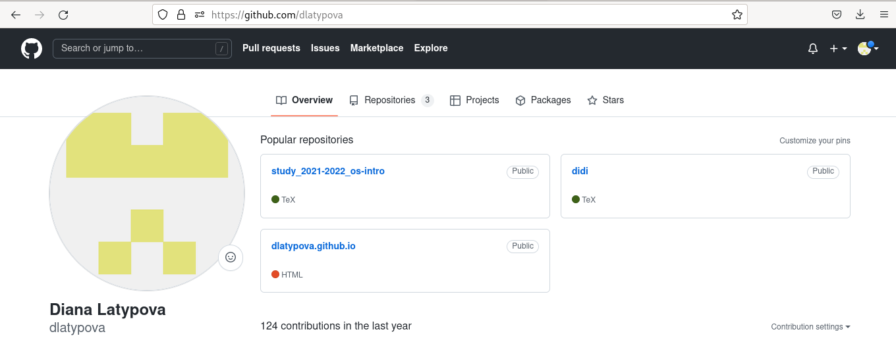
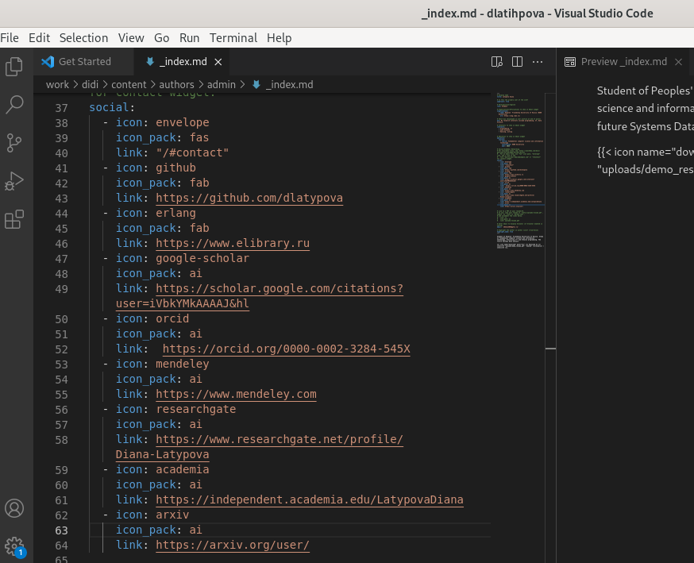
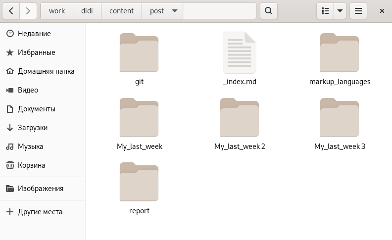

---
## Front matter
lang: ru-RU
title: Индивидуальный проект. 4 этап.
author: |
	Латыпова Диана. НФИбд-02-21
institute: |
	\inst{1}RUDN University, Moscow, Russian Federation

## Formatting
toc: false
slide_level: 2
theme: metropolis
header-includes: 
 - \metroset{progressbar=frametitle,sectionpage=progressbar,numbering=fraction}
 - '\makeatletter'
 - '\beamer@ignorenonframefalse'
 - '\makeatother'
aspectratio: 43
section-titles: true
---

# Цель работы

## Цель работы

Добавить к сайту ссылки на научные и библиометрические ресурсы.

# Задание

## Задание

1. Зарегистрироваться на соответствующих ресурсах и разместить на них ссылки на сайте:

        eLibrary : https://elibrary.ru/;

        Google Scholar : https://scholar.google.com/;

        ORCID : https://orcid.org/;

        Mendeley : https://www.mendeley.com/;

        ResearchGate : https://www.researchgate.net/;

## Задание

        Academia.edu : https://www.academia.edu/;

        arXiv : https://arxiv.org/;

        github : https://github.com/.

2. Сделать пост по прошедшей неделе.

3. Добавить пост на тему по выбору:

  - Оформление отчёта.

  - Создание презентаций.

  - Работа с библиографией.

# Выполнение индивидульного проекта

## Выполнение индивидульного проекта

Я зараннее зарегистрировалась на сайтах, которые предоставлены в задании. Ниже приложила скрин страницы профиля одного из них(рис. [-@fig:001])

{ #fig:001 width=55% }

## Добавление ссылок

В Virtual Studio Code открыли файл index.md, находящийся в ~/work/didi/content/authors/admin/ и добавила ссылки на профили, зарегистрированных на сайтах. Также добавила иконки сайтов(рис. [-@fig:002])

## Добавление ссылок

{ #fig:002 width=70% }

## Написание постов

Для начала создала каталоги, где будут находится наши картинки и текст для постов. Создала каталоги My_last_week 3 и report(рис. [-@fig:003])

{ #fig:003 width=55% }

## Пост по прошедшей неделе

Открыла в Virtual Studio Code файл index.md, находящийся в ~/work/didi/content/post/My_last_week 3 и вставила, зараннее написанный мной, текст и картинку для поста по прошедшей неделе(рис. [-@fig:004]). Тоже самое проделала со вторым постом "Оформление отчета".

## Пост по прошедшей неделе

{ #fig:004 width=70% }

## Обновление

После чего, выполнила команду в терминале в didi:

**hugo**

В каталоге public, а затем в didi открыла терминал и добавила все в гит с помощью гит команд:

1  **git add .**

2  **git commit -am "4stage"**

3  **git push origin main**

## Проверка обновлений

Далее осталось лишь обновить мой сайт.(рис. [-@fig:005])(рис. [-@fig:006])

## Проверка обновлений

{ #fig:005 width=70% }

## Проверка обновлений

{ #fig:006 width=70% }

# Выводы

## Выводы

Я добавила к сайту ссылки на научные и библиометрические ресурсы, а также выложила 2 поста: по прошедшей неделе и "Оформление отчета".