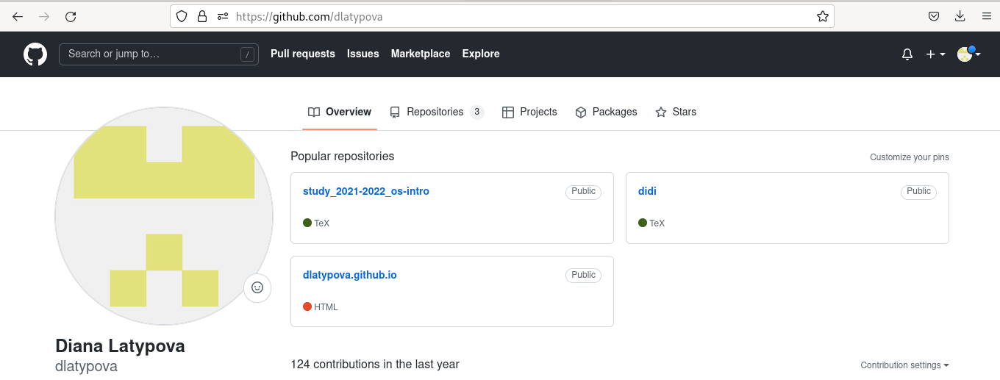

---
## Front matter
title: "Индивидуальный проект"
subtitle: "4 этап"
author: "Латыпова Диана. НФИбд-02-21"

## Generic otions
lang: ru-RU
toc-title: "Содержание"

## Bibliography
bibliography: bib/cite.bib
csl: pandoc/csl/gost-r-7-0-5-2008-numeric.csl

## Pdf output format
toc: true # Table of contents
toc-depth: 2
lof: true # List of figures
lot: true # List of tables
fontsize: 12pt
linestretch: 1.5
papersize: a4
documentclass: scrreprt
## I18n polyglossia
polyglossia-lang:
  name: russian
  options:
	- spelling=modern
	- babelshorthands=true
polyglossia-otherlangs:
  name: english
## I18n babel
babel-lang: russian
babel-otherlangs: english
## Fonts
mainfont: PT Serif
romanfont: PT Serif
sansfont: PT Sans
monofont: PT Mono
mainfontoptions: Ligatures=TeX
romanfontoptions: Ligatures=TeX
sansfontoptions: Ligatures=TeX,Scale=MatchLowercase
monofontoptions: Scale=MatchLowercase,Scale=0.9
## Biblatex
biblatex: true
biblio-style: "gost-numeric"
biblatexoptions:
  - parentracker=true
  - backend=biber
  - hyperref=auto
  - language=auto
  - autolang=other*
  - citestyle=gost-numeric
## Pandoc-crossref LaTeX customization
figureTitle: "Рис."
tableTitle: "Таблица"
listingTitle: "Листинг"
lofTitle: "Список иллюстраций"
lotTitle: "Список таблиц"
lolTitle: "Листинги"
## Misc options
indent: true
header-includes:
  - \usepackage{indentfirst}
  - \usepackage{float} # keep figures where there are in the text
  - \floatplacement{figure}{H} # keep figures where there are in the text
---

# Цель работы

Добавить к сайту ссылки на научные и библиометрические ресурсы.

# Задание

1. Зарегистрироваться на соответствующих ресурсах и разместить на них ссылки на сайте:

        eLibrary : https://elibrary.ru/;

        Google Scholar : https://scholar.google.com/;

        ORCID : https://orcid.org/;

        Mendeley : https://www.mendeley.com/;

        ResearchGate : https://www.researchgate.net/;

        Academia.edu : https://www.academia.edu/;

        arXiv : https://arxiv.org/;

        github : https://github.com/.

2. Сделать пост по прошедшей неделе.

3. Добавить пост на тему по выбору:

  - Оформление отчёта.

  - Создание презентаций.

  - Работа с библиографией.

# Выполнение индивидуального проекта

Я зараннее зарегистрировалась на сайтах, которые предоставлены в задании. Ниже приложила скрины страниц профиля нескольких из них(рис. [-@fig:001])(рис. [-@fig:002])(рис. [-@fig:003])

{ #fig:001 width=70% }

{ #fig:002 width=70% }

{ #fig:003 width=70% }

Я открыла в Virtual Studio Code файл index.md, находящийся в ~/work/didi/content/authors/admin/ и добавила ссылки на профили, зарегистрированных на сайтах. Также добавила иконки сайтов(рис. [-@fig:004])

{ #fig:004 width=70% }

После размещения ссылок на сайт, я занялась созданием постов.

Для начала создала каталоги, где будут находится наши картинки и текст для постов. Создала каталоги My_last_week 3 и report(рис. [-@fig:005])

{ #fig:005 width=70% }

Открыла в Virtual Studio Code файл index.md, находящийся в ~/work/didi/content/post/My_last_week 3 и вставила, зараннее написанный мной, текст и картинку для поста по прошедшей неделе(рис. [-@fig:006])

{ #fig:006 width=70% }

Тоже самое проделала со вторым постом. Я выбрала тему первую тему "Оформление отчёта"(рис. [-@fig:007])

{ #fig:007 width=70% }

После чего, выполнила команду в терминале в didi:

**hugo**

В каталоге public, а затем в didi открыла терминал и добавила все в гит с помощью гит команд:

1  **git add .**

2  **git commit -am "4stage"**

3  **git push origin main**

Далее осталось лишь обновить мой сайт. Мы видим, что наши ссылки на профили и 2 поста добавились на мой сайт(рис. [-@fig:008])(рис. [-@fig:009])

{ #fig:008 width=70% }

{ #fig:009 width=70% }

# Выводы

Я добавила к сайту ссылки на научные и библиометрические ресурсы, а также выложила 2 поста: по прошедшей неделе и "Оформление отчета".
