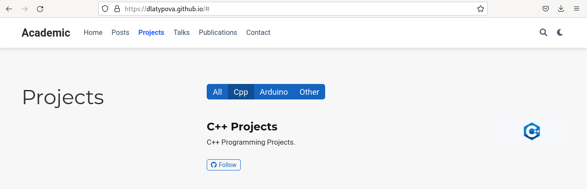
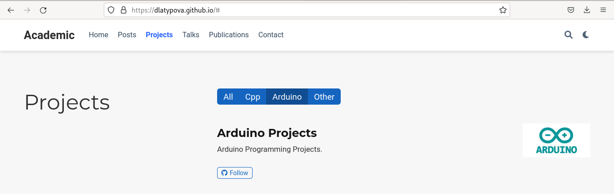

---
## Front matter
lang: ru-RU
title: Индивидуальный проект. 5 этап
author: |
	Латыпова Диана. НФИбд-02-21
institute: |
	\inst{1}RUDN University, Moscow, Russian Federation

## Formatting
toc: false
slide_level: 2
theme: metropolis
header-includes: 
 - \metroset{progressbar=frametitle,sectionpage=progressbar,numbering=fraction}
 - '\makeatletter'
 - '\beamer@ignorenonframefalse'
 - '\makeatother'
aspectratio: 43
section-titles: true
---

# Цель работы

## Цель работы

Дополнить информацию на сайте.

## Задание

- Сделать записи для персональных проектов.
- Сделать пост по прошедшей неделе.
- Добавить пост на тему по выбору.

    --Языки научного программирования.

# Выполнение индивидуального проекта

## Выполнение индивидуального проекта

Для начала я запустила в папке didi hugo server, чтобы сразу наблюдать обновления на моем сайте:

**hugo server** 

Открыла в Visual Studio Code файл project.md и добавила имена и теги проектов: Arduino и C++ (рис. [-@fig:001]):

## Персональные проекты

{ #fig:001 width=60% }

## Персональные проекты

Затем открыла файл index.md в папке projects и добавила информацию с картинкой о проекте С++(рис. [-@fig:002])(рис. [-@fig:003]). Тоже самое проделала с проектом Arduino

## Персональные проекты

{ #fig:002 width=50% }

{ #fig:003 width=50% }

## Посты

Начала с поста по прошедшей неделе(рис. [-@fig:004])(рис. [-@fig:005]), я зараннее подготовила содержимое постов. Поэтому просто добавила в нужные файлы заголовки, картинки и текст. Все, что было проделано с постов по прошедшей неделе, я проделала с постом по теме "Языки научного программирования".

## Посты

{ #fig:004 width=60% }

{ #fig:005 width=50% }

## Гит команды

Завершила в терминале hugo server с помощью комбинации клавиш С-С. В didi запустила терминал, выполнила команду: **hugo**

Затем в каталоге public, а затем в didi открыла терминал и добавила все в гит с помощью гит команд:

1  **git add .**

2  **git commit -am "4stage"**

3  **git push origin main**

Далее осталось лишь обновить мой сайт.

## Обновление сайта

- Добавились наши проекты(рис. [-@fig:006]):

{ #fig:006 width=70% }

## Обновление сайта

- Работают теги по Cpp(рис. [-@fig:007]) и Arduino(рис. [-@fig:008]):

{ #fig:007 width=50% }

{ #fig:008 width=50% }

## Обновление сайта

- Добавились наши новые посты(рис. [-@fig:009]):

{ #fig:009 width=80% }

# Выводы

## Выводы

Я дополнила информацию на моем сайте. А именно: сделала записи для персональных проектов, написала пост по прошедшей неделе и пост на тему "Языки научного программирования"

