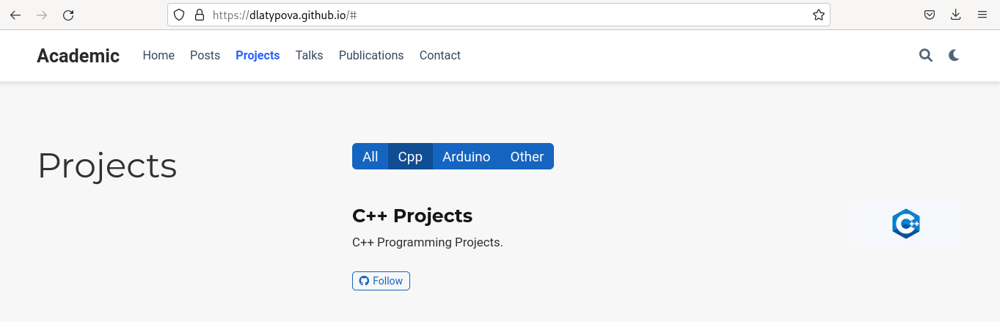
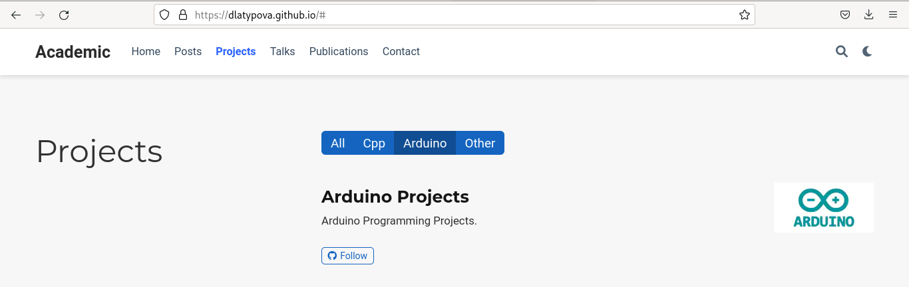

---
## Front matter
title: "Индивидуальный проект"
subtitle: "5 этап"
author: "Латыпова Диана. НФИбд-02-21"

## Generic otions
lang: ru-RU
toc-title: "Содержание"

## Bibliography
bibliography: bib/cite.bib
csl: pandoc/csl/gost-r-7-0-5-2008-numeric.csl

## Pdf output format
toc: true # Table of contents
toc-depth: 2
lof: true # List of figures
lot: true # List of tables
fontsize: 12pt
linestretch: 1.5
papersize: a4
documentclass: scrreprt
## I18n polyglossia
polyglossia-lang:
  name: russian
  options:
	- spelling=modern
	- babelshorthands=true
polyglossia-otherlangs:
  name: english
## I18n babel
babel-lang: russian
babel-otherlangs: english
## Fonts
mainfont: PT Serif
romanfont: PT Serif
sansfont: PT Sans
monofont: PT Mono
mainfontoptions: Ligatures=TeX
romanfontoptions: Ligatures=TeX
sansfontoptions: Ligatures=TeX,Scale=MatchLowercase
monofontoptions: Scale=MatchLowercase,Scale=0.9
## Biblatex
biblatex: true
biblio-style: "gost-numeric"
biblatexoptions:
  - parentracker=true
  - backend=biber
  - hyperref=auto
  - language=auto
  - autolang=other*
  - citestyle=gost-numeric
## Pandoc-crossref LaTeX customization
figureTitle: "Рис."
tableTitle: "Таблица"
listingTitle: "Листинг"
lofTitle: "Список иллюстраций"
lotTitle: "Список таблиц"
lolTitle: "Листинги"
## Misc options
indent: true
header-includes:
  - \usepackage{indentfirst}
  - \usepackage{float} # keep figures where there are in the text
  - \floatplacement{figure}{H} # keep figures where there are in the text
---

# Цель работы

Дополнить информацию на сайте.

# Задание

- Сделать записи для персональных проектов.
- Сделать пост по прошедшей неделе.
- Добавить пост на тему по выбору.

    --Языки научного программирования.

# Выполнение индивидуального проекта

Для начала я запустила в папке didi hugo server, чтобы сразу наблюдать обновления на моем сайте:

**hugo server** 

Открыла в Visual Studio Code файл project.md и добавила имена и теги проектов: Arduino и C++ (рис. [-@fig:001]):

{ #fig:001 width=70% }

Затем открыла файл index.md в папке projects и добавила информацию с картинкой о проекте С++(рис. [-@fig:002])(рис. [-@fig:003]):

{ #fig:002 width=70% }

{ #fig:003 width=70% }

Тоже самое проделала с проектом Arduino(рис. [-@fig:004]):

{ #fig:004 width=70% }

После добавления информации о своих проектах я приступила к написанию постов.

Начала с поста по прошедшей неделе(рис. [-@fig:005])(рис. [-@fig:006]), я зараннее подготовила содержимое постов. Поэтому просто добавила в нужные файлы заголовки, картинки и текст.

{ #fig:005 width=70% }

{ #fig:006 width=70% }

Все, что было проделано с постов по прошедшей неделе, я проделала с постом по теме "Языки научного программирования".

Завершила в терминале hugo server с помощью комбинации клавиш С-С. 

В didi запустила терминал, выполнила команду:

**hugo**

Затем в каталоге public, а затем в didi открыла терминал и добавила все в гит с помощью гит команд:

1  **git add .**

2  **git commit -am "4stage"**

3  **git push origin main**

Далее осталось лишь обновить мой сайт.

Мы видим, что:

- Добавились наши проекты(рис. [-@fig:007]):

{ #fig:007 width=70% }

- Работают теги по Cpp(рис. [-@fig:008]) и Arduino(рис. [-@fig:009]):

{ #fig:008 width=70% }

{ #fig:009 width=70% }

- Добавились наши новые посты(рис. [-@fig:010]):

{ #fig:010 width=70% }

Все добавилось. Ура!

# Выводы

Я дополнила информацию на моем сайте. А именно: сделала записи для персональных проектов, написала пост по прошедшей неделе и пост на тему "Языки научного программирования"

