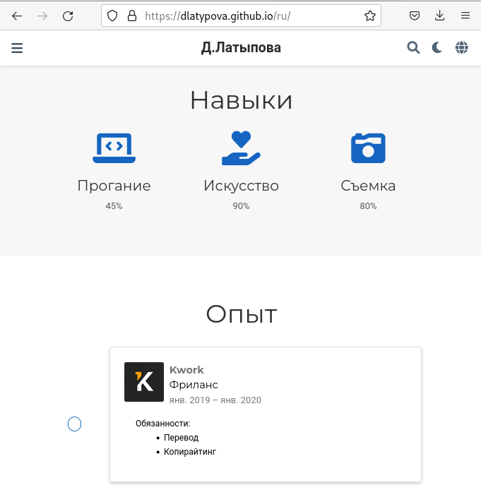
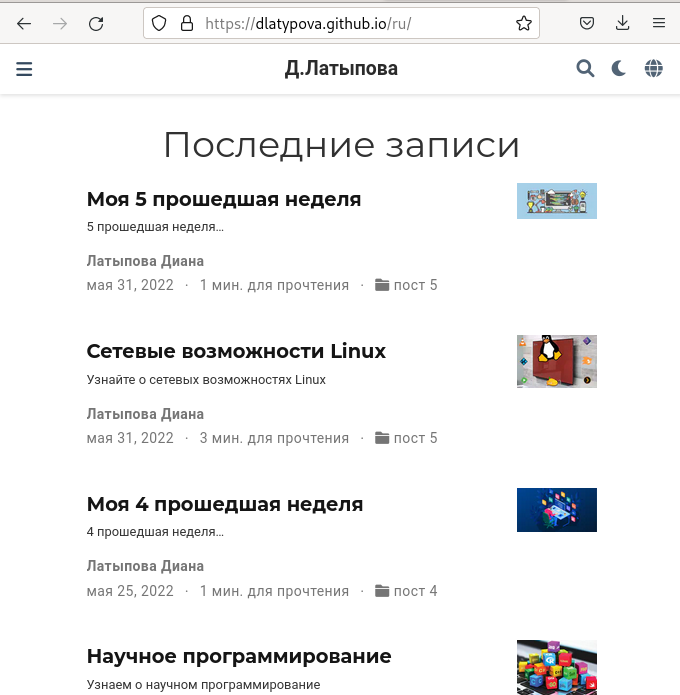
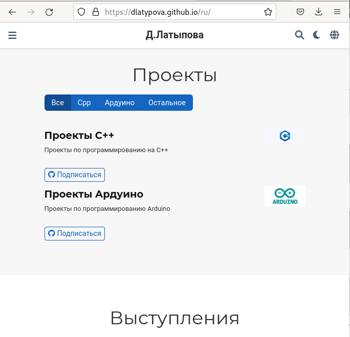
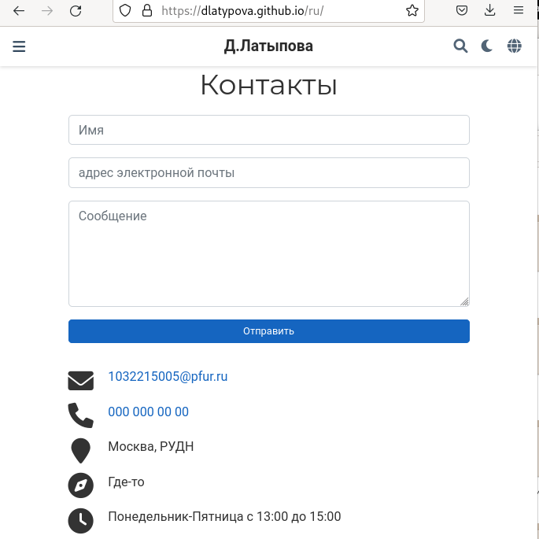

---
## Front matter
lang: ru-RU
title: Индивидуальный проект. 6 этап
author: |
	Латыпова Диана. НФИбд-02-21
institute: |
	\inst{1}RUDN University, Moscow, Russian Federation

## Formatting
toc: false
slide_level: 2
theme: metropolis
header-includes: 
 - \metroset{progressbar=frametitle,sectionpage=progressbar,numbering=fraction}
 - '\makeatletter'
 - '\beamer@ignorenonframefalse'
 - '\makeatother'
aspectratio: 43
section-titles: true
---

# Цель работы

## Цель работы

Разместить двуязычный сайт на Github.

# Задание

## Задание

- Сделать поддержку английского и русского языков.
- Разместить элементы сайта на обоих языках.
- Разместить контент на обоих языках.
- Сделать пост по прошедшей неделе.
- Добавить пост на тему по выбору (на двух языках).

# Выполнение индивидуального проекта

## Выполнение индивидуального проекта

Для начала я запустила в папке didi hugo server, чтобы сразу наблюдать обновления на моем сайте:

**hugo server** 

Я скачала два файла: en.yaml и ru.yaml, добавила их в папку i18n(рис. [-@fig:001])

{ #fig:001 width=50% }

## Папки для перевода

Далее в папке content я создала две папки en и ru, где будут находится все папки с информацией(рис. [-@fig:002])

{ #fig:002 width=50% }

## Два языка

После чего, в файл languages.yaml добавила ссылки на английский и русский языки, изменила название сайта на свое имя и фамилию(рис. [-@fig:002])

{ #fig:003 width=50% }

## Перевод компонентов сайта

Далее я стала переводить все на русский язык в папке ru, ниже представлю несколько скриншотов для примера(рис. [-@fig:004])(рис. [-@fig:005])(рис. [-@fig:006]):

## Перевод компонентов сайта

{ #fig:004 width=70% }

## Перевод компонентов сайта

{ #fig:005 width=70% }

## Перевод компонентов сайта

{ #fig:006 width=70% }

## Посты

Далее приступила к написанию постов по 5 прошедшей неделе и на тему по выбору ( я выбрала тему "Сетевые возможности Linux"). Создала две папки для будущих постов. Вставила, раннее подготовленный мной, текст по прошедшей неделе(рис. [-@fig:007]), затем текст на тему по выбору:

{ #fig:007 width=50% }

## Перевод постов

Оба текста перевела на русский язык(рис. [-@fig:008])

{ #fig:008 width=50% }

## Завершение

Завершила в терминале hugo server с помощью комбинации клавиш С-С. 

В didi запустила терминал, выполнила команду:

**hugo**

## Гит команды

Затем в каталоге public, а затем в didi открыла терминал и добавила все в гит с помощью гит команд:

1  **git add .**

2  **git commit -am "4stage"**

3  **git push origin main**

## Обновление сайта

Далее осталось лишь обновить мой сайт(рис. [-@fig:009])(рис. [-@fig:010])(рис. [-@fig:011])(рис. [-@fig:012])(рис. [-@fig:013])(рис. [-@fig:014]):

{ #fig:009 width=50% }

## Обновление сайта

{ #fig:010 width=60% }

## Обновление сайта

{ #fig:011 width=60% }

## Обновление сайта

{ #fig:012 width=60% }

## Обновление сайта

{ #fig:013 width=60% }

## Обновление сайта

{ #fig:014 width=60% }

# Выводы

## Выводы

Я разместила двуязычный сайт на Github. Сделала поддержку английского и русского языков, разместила элементы сайта на обоих языках, разместила контент на обоих языках, сделала пост по прошедшей неделе, добавила пост на тему по выбору (на двух языках).

