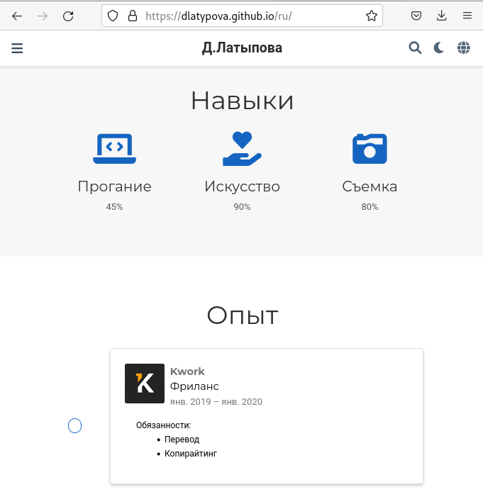
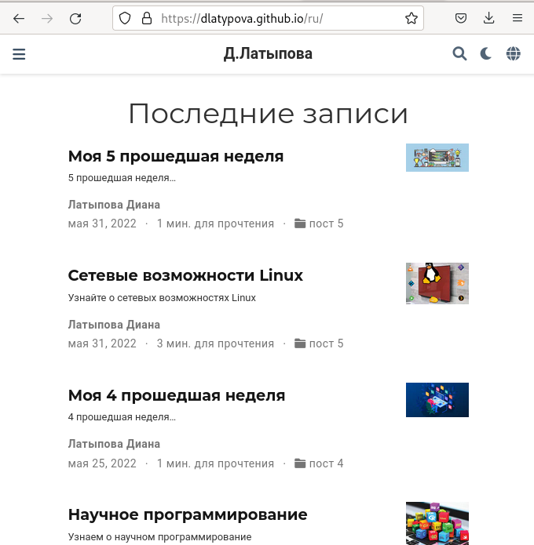
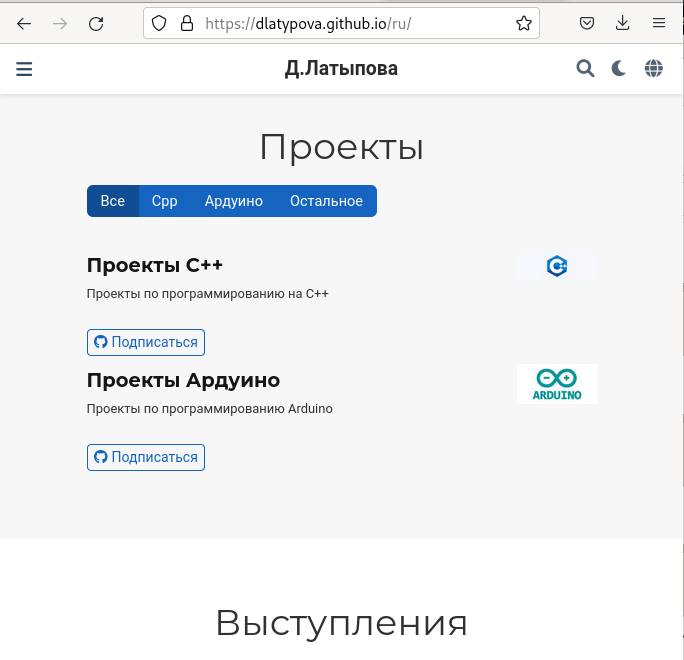
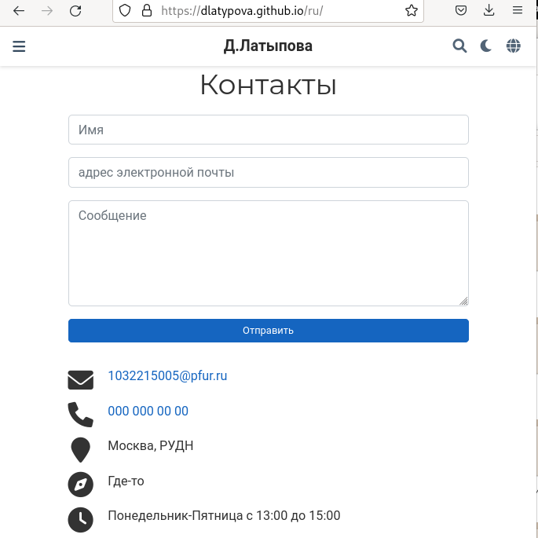

---
## Front matter
title: "Индивидуальный проект"
subtitle: "6 этап"
author: "Латыпова Диана. НФИбд-02-21"

## Generic otions
lang: ru-RU
toc-title: "Содержание"

## Bibliography
bibliography: bib/cite.bib
csl: pandoc/csl/gost-r-7-0-5-2008-numeric.csl

## Pdf output format
toc: true # Table of contents
toc-depth: 2
lof: true # List of figures
lot: true # List of tables
fontsize: 12pt
linestretch: 1.5
papersize: a4
documentclass: scrreprt
## I18n polyglossia
polyglossia-lang:
  name: russian
  options:
	- spelling=modern
	- babelshorthands=true
polyglossia-otherlangs:
  name: english
## I18n babel
babel-lang: russian
babel-otherlangs: english
## Fonts
mainfont: PT Serif
romanfont: PT Serif
sansfont: PT Sans
monofont: PT Mono
mainfontoptions: Ligatures=TeX
romanfontoptions: Ligatures=TeX
sansfontoptions: Ligatures=TeX,Scale=MatchLowercase
monofontoptions: Scale=MatchLowercase,Scale=0.9
## Biblatex
biblatex: true
biblio-style: "gost-numeric"
biblatexoptions:
  - parentracker=true
  - backend=biber
  - hyperref=auto
  - language=auto
  - autolang=other*
  - citestyle=gost-numeric
## Pandoc-crossref LaTeX customization
figureTitle: "Рис."
tableTitle: "Таблица"
listingTitle: "Листинг"
lofTitle: "Список иллюстраций"
lotTitle: "Список таблиц"
lolTitle: "Листинги"
## Misc options
indent: true
header-includes:
  - \usepackage{indentfirst}
  - \usepackage{float} # keep figures where there are in the text
  - \floatplacement{figure}{H} # keep figures where there are in the text
---

# Цель работы

Разместить двуязычный сайт на Github.

# Задание

- Сделать поддержку английского и русского языков.
- Разместить элементы сайта на обоих языках.
- Разместить контент на обоих языках.
- Сделать пост по прошедшей неделе.
- Добавить пост на тему по выбору (на двух языках).

# Выполнение индвидуального проекта

Для начала я запустила в папке didi hugo server, чтобы сразу наблюдать обновления на моем сайте:

**hugo server** 

Я скачала два файла: en.yaml и ru.yaml, добавила их в папку i18n(рис. [-@fig:001])

{ #fig:001 width=70% }

Далее в папке content я создала две папки en и ru, где будут находится все папки с информацией(рис. [-@fig:002])

{ #fig:002 width=70% }

После чего, в файл languages.yaml добавила ссылки на английский и русский языки, изменила название сайта на свое имя и фамилию(рис. [-@fig:002])

{ #fig:003 width=70% }

Далее я стала переводить все на русский язык в папке ru, ниже представлю несколько скриншотов для примера(рис. [-@fig:004])(рис. [-@fig:005])(рис. [-@fig:006])(рис. [-@fig:007])(рис. [-@fig:008]):

{ #fig:004 width=70% }

{ #fig:005 width=70% }

{ #fig:006 width=70% }

{ #fig:007 width=70% }

{ #fig:008 width=70% }

Далее приступила к написанию постов по 5 прошедшей неделе и на тему по выбору ( я выбрала тему "Сетевые возможности Linux"). Создала две папки для будущих постов(рис. [-@fig:009]):

{ #fig:009 width=70% }

Вставила, раннее подготовленный мной, текст по прошедшей неделе(рис. [-@fig:010]), затем текст на тему по выбору:

{ #fig:010 width=70% }

Оба текста перевела на русский язык(рис. [-@fig:011])

{ #fig:011 width=70% }

Завершила в терминале hugo server с помощью комбинации клавиш С-С. 

В didi запустила терминал, выполнила команду:

**hugo**

Затем в каталоге public, а затем в didi открыла терминал и добавила все в гит с помощью гит команд:

1  **git add .**

2  **git commit -am "4stage"**

3  **git push origin main**

Далее осталось лишь обновить мой сайт(рис. [-@fig:012])(рис. [-@fig:013])(рис. [-@fig:014])(рис. [-@fig:015])(рис. [-@fig:016])(рис. [-@fig:017]):

{ #fig:012 width=70% }

{ #fig:013 width=70% }

{ #fig:014 width=70% }

{ #fig:015 width=70% }

{ #fig:016 width=70% }

{ #fig:017 width=70% }

# Выводы

Я разместила двуязычный сайт на Github. Сделала поддержку английского и русского языков, разместила элементы сайта на обоих языках, разместила контент на обоих языках, сделала пост по прошедшей неделе, добавила пост на тему по выбору (на двух языках).
